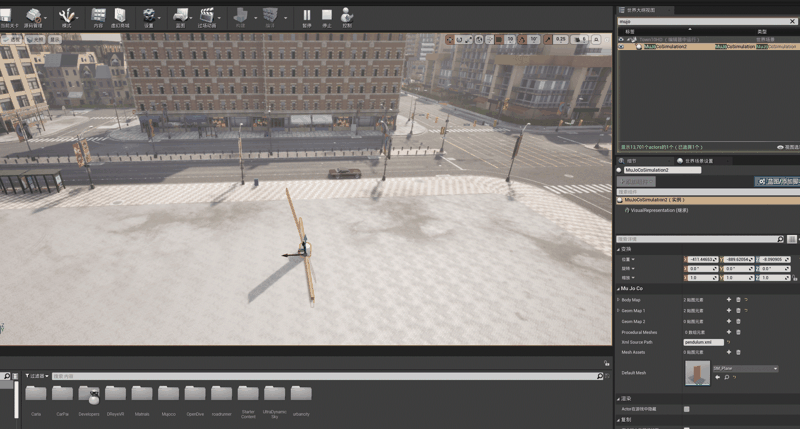

# Mujoco 插件

该插件将 Mujoco 物理引擎与[引擎](https://github.com/OpenHUTB/engine)集成在一起，使您可以将 Mujoco XML 文件直接加载到引擎中并运行高级物理模拟。

## 特性

- 将 Mujoco XML 文件加载到引擎中
- 运行Mujoco模拟并显示实时结果
- 支持非主要 MuJoCo 形状的程序化网格生成
- 从 MuJoCo 模型导入对象的颜色
- 支持多个同时模拟实例

## 演示

**具身人**：

**摆锤**：

## 安装

1. 克隆此存储库到您的引擎项目的插件`Plugins`文件夹
2. 重新构建您的项目
3. 在项目设置中启用 Mujoco 插件

## 用法

### 基本设置

1. 在您的关卡中放置一个`MuJoCoSimulation`参与者
2. 在参与者属性中设置 XML 文件路径，比如具身人`mujoco/humanoid/humanoid100.xml`、无人车`mujoco/car/car.xml`、摆锤：
`mujoco/pendulum.xml`。默认在`Default Mesh`中选择的是`SM_Plane`。
3. 开始播放模式以查看模拟

### 控制

- **Z 键**: 保持则运行模拟，释放则暂停
- **R 键**: 重置模拟到初始状态
- **C 键**: 测试 Mujoco 执行器的控制（将执行器 0 设置为一个小值，可用于诸如 car.xml 之类的测试模型）

## 当前的限制

- 尚未实现纹理的支持（仅导入颜色）
- 它仍然很粗糙，并且没有针对性能进行优化

### 移植到 HUTB 模拟器

参考[迁移细节](./docs/transfer_hutb.md)

## 参考

* [MuJoCo-Unreal-Engine-Plugin](https://github.com/oneclicklabs/MuJoCo-Unreal-Engine-Plugin)
* [Unreal_Mujoco](https://github.com/miaobeihai/Unreal_Mujoco)
* [mujoco-unreal-plugin](https://github.com/carTloyal123/mujoco-unreal-plugin)
* [无人机模型](https://github.com/google-deepmind/mujoco_menagerie) - [Skydio X2](https://github.com/google-deepmind/mujoco_menagerie/tree/main/skydio_x2) 、[Crazyflie 2](https://github.com/google-deepmind/mujoco_menagerie/tree/main/bitcraze_crazyflie_2)
* [Unity 的 Mujoco 插件](./docs/unity.md)
* [UnrealRoboticsLab](https://github.com/URLab-Sim/UnrealRoboticsLab)