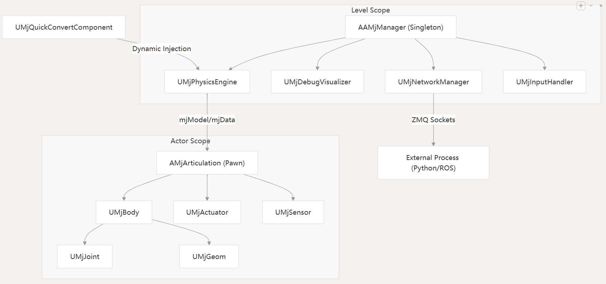
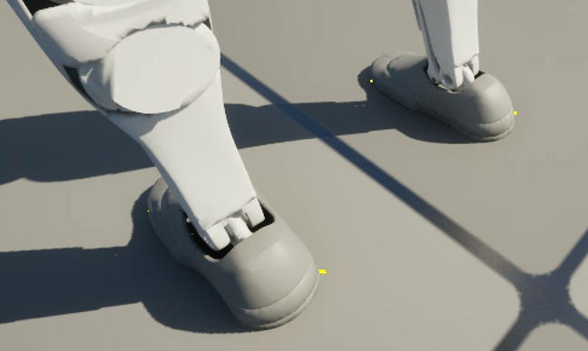
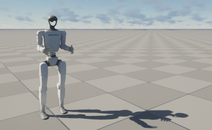
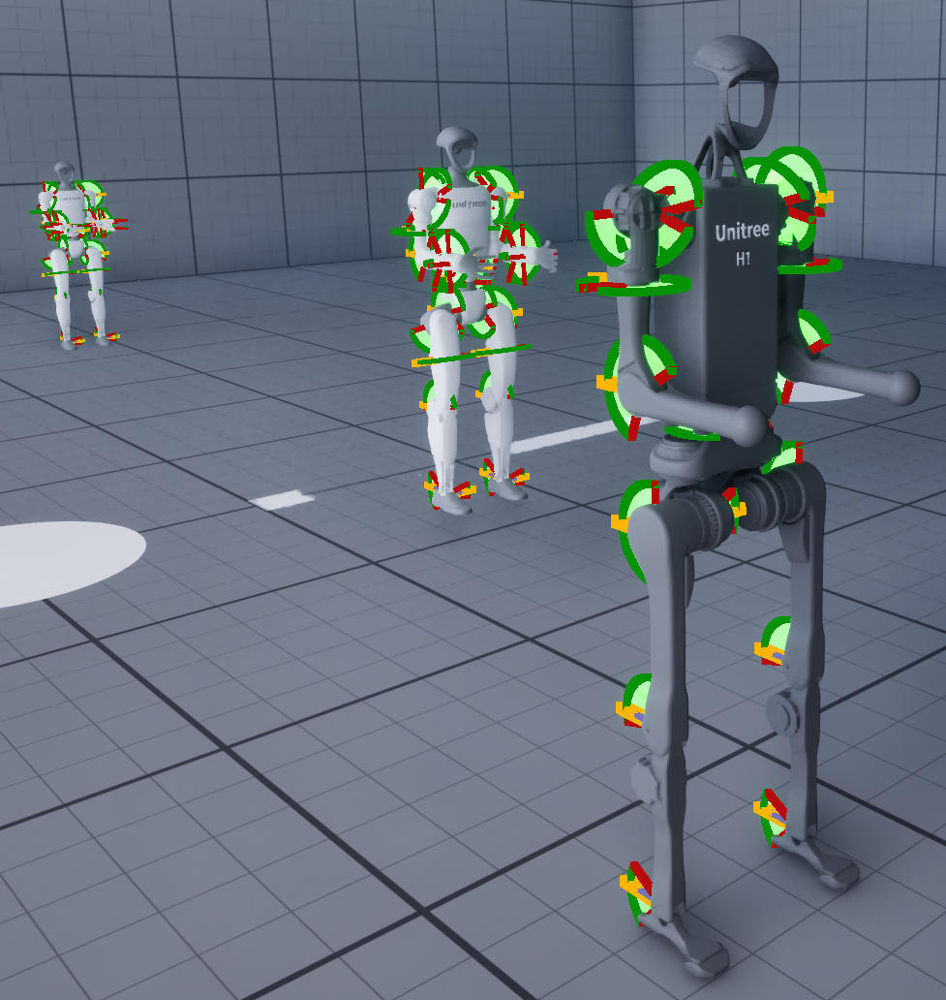
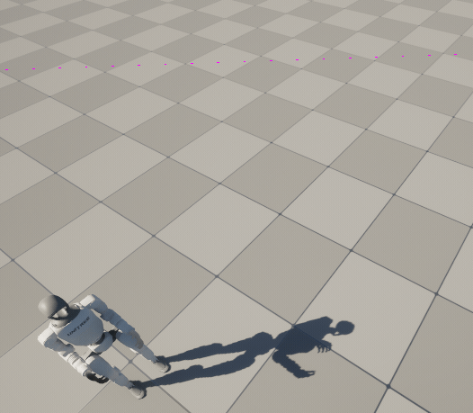

# 架构
<!-- Articulation 铰链；Joint 关节 -->
## 概述

UnrealRoboticsLab (URLab) 将 MuJoCo 物理引擎集成到虚幻引擎中，作为编辑器插件。[AAMjManager](https://github.com/OpenHUTB/UnrealRoboticsLab/blob/main/Source/URLab/Public/MuJoCo/Core/AMjManager.h) 是顶层协调器参与者（Actor），但它将核心职责委托给四个 [UActorComponent](https://openhutb.github.io/engine_doc/zh-CN/ProgrammingAndScripting/ProgrammingWithCPP/IntroductionToCPP/index.html) 子系统：[UMjPhysicsEngine](https://github.com/OpenHUTB/UnrealRoboticsLab/blob/main/Source/URLab/Public/MuJoCo/Core/MjPhysicsEngine.h)（物理引擎）、[UMjDebugVisualizer](https://github.com/OpenHUTB/UnrealRoboticsLab/blob/main/Source/URLab/Public/MuJoCo/Core/MjDebugVisualizer.h)（调试可视化）、[UMjNetworkManager](https://github.com/OpenHUTB/UnrealRoboticsLab/blob/main/Source/URLab/Public/MuJoCo/Net/MjNetworkManager.h)（网络管理器：ZMQ 发现）和 [UMjInputHandler](https://github.com/OpenHUTB/UnrealRoboticsLab/blob/main/Source/URLab/Public/MuJoCo/Input/MjInputHandler.h)（输入处理器）。组件系统与 MJCF 元素层级结构相对应——每个 XML 元素类型都映射到一个附加到 [AMjArticulation](https://github.com/OpenHUTB/UnrealRoboticsLab/blob/main/Source/URLab/Public/MuJoCo/Core/MjArticulation.h) 蓝图的 [UMjComponent](https://github.com/OpenHUTB/UnrealRoboticsLab/blob/main/Source/URLab/Public/MuJoCo/Components/MjComponent.h) 子类。物理引擎运行在专用的异步线程中；游戏线程读取结果进行渲染。ZMQ 网络提供外部控制和传感器广播功能。

---

## 子系统架构

[AAMjManager](https://github.com/OpenHUTB/UnrealRoboticsLab/blob/main/Source/URLab/Public/MuJoCo/Core/AMjManager.h) 将职责委托给四个  [UActorComponent](https://openhutb.github.io/engine_doc/zh-CN/ProgrammingAndScripting/ProgrammingWithCPP/IntroductionToCPP/index.html) 子系统，这些子系统是通过构造函数中的 [CreateDefaultSubobject](https://github.com/OpenHUTB/UnrealRoboticsLab/blob/352a9ea7bdce0eaa9e1bd365454f3b7ea421d44c/Source/URLab/Private/MuJoCo/Core/AMjManager.cpp#L49) 创建的：


```
AAMjManager (每个关卡一个单例协调器)
  |-- UMjPhysicsEngine      (物理引擎：异步物理循环，mjModel/mjData 生命周期)
  |-- UMjDebugVisualizer    (调试可视化：接触力、碰撞线框、关节轴)
  |-- UMjNetworkManager     (网络管理器：ZMQ 发现、相机流)
  |-- UMjInputHandler       (输入处理器：热键处理)
  |
  |-- AMjArticulation (robot / mechanism, possessable Pawn)
  |     |-- UMjBody -> UMjHingeJoint, UMjGeom, UMjSensor, ...
  |     |-- UMjActuator (position, velocity, motor, muscle, ...)
  |     |-- UMjKeyframe, UMjDefault, UMjEquality, UMjTendon
  |
  |-- UMjQuickConvertComponent (在任何静态网格(Static Mesh)参与者上)
  |-- AMjHeightfieldActor (UE 地形 -> MuJoCo 高度场)
  |-- WBP_MjSimulate (仪表板小部件)
```



### 物理引擎 UMjPhysicsEngine

**文件：** [Source/URLab/Public/MuJoCo/Core/MjPhysicsEngine.h](https://github.com/OpenHUTB/UnrealRoboticsLab/blob/main/Source/URLab/Public/MuJoCo/Core/MjPhysicsEngine.h)

拥有所有仿真状态：MuJoCo 规范结构 [`m_spec`](https://github.com/OpenHUTB/UnrealRoboticsLab/blob/352a9ea7bdce0eaa9e1bd365454f3b7ea421d44c/Source/URLab/Public/MuJoCo/Core/MjPhysicsEngine.h#L65) 、虚拟文件系统实例[`m_vfs`](https://github.com/OpenHUTB/UnrealRoboticsLab/blob/352a9ea7bdce0eaa9e1bd365454f3b7ea421d44c/Source/URLab/Public/MuJoCo/Core/MjPhysicsEngine.h#L68)、已编译的Mujoco模型[`m_model`](https://github.com/OpenHUTB/UnrealRoboticsLab/blob/352a9ea7bdce0eaa9e1bd365454f3b7ea421d44c/Source/URLab/Public/MuJoCo/Core/MjPhysicsEngine.h#L71)、激活的Mujoco模拟数据[`m_data`](https://github.com/OpenHUTB/UnrealRoboticsLab/blob/352a9ea7bdce0eaa9e1bd365454f3b7ea421d44c/Source/URLab/Public/MuJoCo/Core/MjPhysicsEngine.h#L74) 和 回调互斥量([CallbackMutex](https://github.com/OpenHUTB/UnrealRoboticsLab/blob/352a9ea7bdce0eaa9e1bd365454f3b7ea421d44c/Source/URLab/Public/MuJoCo/Core/MjPhysicsEngine.h#L84))。

处理完整的编译流程：

   * 预编译([PreCompile](https://github.com/OpenHUTB/UnrealRoboticsLab/blob/352a9ea7bdce0eaa9e1bd365454f3b7ea421d44c/Source/URLab/Public/MuJoCo/Core/MjPhysicsEngine.h#L173)) ：扫描场景中的 MuJoCo 组件和铰链，以填充 m_spec)
   * 编译([Compile](https://github.com/OpenHUTB/UnrealRoboticsLab/blob/352a9ea7bdce0eaa9e1bd365454f3b7ea421d44c/Source/URLab/Public/MuJoCo/Core/MjPhysicsEngine.h#L170))：将聚合的 mjSpec 编译成 mjModel 并初始化 mjData
   * 后编译([PostCompile](https://github.com/OpenHUTB/UnrealRoboticsLab/blob/352a9ea7bdce0eaa9e1bd365454f3b7ea421d44c/Source/URLab/Public/MuJoCo/Core/MjPhysicsEngine.h#L176))：编译后完成设置（执行器映射、PostSetup 调用）
   * 应用选项([ApplyOptions](https://github.com/OpenHUTB/UnrealRoboticsLab/blob/352a9ea7bdce0eaa9e1bd365454f3b7ea421d44c/Source/URLab/Public/MuJoCo/Core/MjPhysicsEngine.h#L179))：将 Options 中的设置应用到 m_model->opt。
   * 运行**异步物理循环**（[RunMujocoAsync](https://github.com/OpenHUTB/UnrealRoboticsLab/blob/352a9ea7bdce0eaa9e1bd365454f3b7ea421d44c/Source/URLab/Public/MuJoCo/Core/MjPhysicsEngine.h#L184)）：启动异步线程以执行 MuJoCo 模拟。
   * 提供回调注册（[RegisterPreStepCallback](https://github.com/OpenHUTB/UnrealRoboticsLab/blob/352a9ea7bdce0eaa9e1bd365454f3b7ea421d44c/Source/URLab/Public/MuJoCo/Core/MjPhysicsEngine.h#L242) 在每次物理计算步骤之前调用、[RegisterPostStepCallback](https://github.com/OpenHUTB/UnrealRoboticsLab/blob/352a9ea7bdce0eaa9e1bd365454f3b7ea421d44c/Source/URLab/Public/MuJoCo/Core/MjPhysicsEngine.h#L245) 在每次物理计算步骤后调用 ），以便其他子系统和 ZMQ 组件可以接入步进循环而无需直接耦合。此外，还提供 [StepSync](https://github.com/OpenHUTB/UnrealRoboticsLab/blob/352a9ea7bdce0eaa9e1bd365454f3b7ea421d44c/Source/URLab/Public/MuJoCo/Core/MjPhysicsEngine.h#L205) 在调用线程上同步执行模拟步骤、[ResetSimulation](https://github.com/OpenHUTB/UnrealRoboticsLab/blob/352a9ea7bdce0eaa9e1bd365454f3b7ea421d44c/Source/URLab/Public/MuJoCo/Core/MjPhysicsEngine.h#L202) 和快照([Snapshot](https://github.com/OpenHUTB/UnrealRoboticsLab/blob/352a9ea7bdce0eaa9e1bd365454f3b7ea421d44c/Source/URLab/Public/MuJoCo/Core/MjPhysicsEngine.h#L211))/恢复([Restore](https://github.com/OpenHUTB/UnrealRoboticsLab/blob/352a9ea7bdce0eaa9e1bd365454f3b7ea421d44c/Source/URLab/Public/MuJoCo/Core/MjPhysicsEngine.h#L214))功能。


### 调试可视化 UMjDebugVisualizer

**文件：** [Source/URLab/Public/MuJoCo/Core/MjDebugVisualizer.h](https://github.com/OpenHUTB/UnrealRoboticsLab/blob/main/Source/URLab/Public/MuJoCo/Core/MjDebugVisualizer.h)

拥有线程安全的调试数据 [DebugData](https://github.com/OpenHUTB/UnrealRoboticsLab/blob/352a9ea7bdce0eaa9e1bd365454f3b7ea421d44c/Source/URLab/Public/MuJoCo/Core/MjDebugVisualizer.h#L132)（来自 [MjDebugTypes.h](https://github.com/OpenHUTB/UnrealRoboticsLab/blob/main/Source/URLab/Public/MuJoCo/Core/MjDebugTypes.h) 的 [FMuJoCoDebugData](https://github.com/OpenHUTB/UnrealRoboticsLab/blob/352a9ea7bdce0eaa9e1bd365454f3b7ea421d44c/Source/URLab/Public/MuJoCo/Core/MjDebugTypes.h#L9) ）和 调试互斥量 [DebugMutex](https://github.com/OpenHUTB/UnrealRoboticsLab/blob/352a9ea7bdce0eaa9e1bd365454f3b7ea421d44c/Source/URLab/Public/MuJoCo/Core/MjDebugVisualizer.h#L133) 。[CaptureDebugData](https://github.com/OpenHUTB/UnrealRoboticsLab/blob/352a9ea7bdce0eaa9e1bd365454f3b7ea421d44c/Source/URLab/Public/MuJoCo/Core/MjDebugVisualizer.h#L138) 注册为 [UMjPhysicsEngine](https://github.com/OpenHUTB/UnrealRoboticsLab/blob/main/Source/URLab/Public/MuJoCo/Core/MjPhysicsEngine.h) 的后步骤回调函数——它将物理线程上互斥锁下的接触数据复制到该线程。节拍组件 [TickComponent](https://github.com/OpenHUTB/UnrealRoboticsLab/blob/352a9ea7bdce0eaa9e1bd365454f3b7ea421d44c/Source/URLab/Public/MuJoCo/Core/MjDebugVisualizer.h#L61) 在游戏线程上渲染接触力箭头/点。为每种调试可视化模式提供切换方法。


### 网络管理器 UMjNetworkManager

**文件：** [Source/URLab/Public/MuJoCo/Net/MjNetworkManager.h](https://github.com/OpenHUTB/UnrealRoboticsLab/blob/main/Source/URLab/Public/MuJoCo/Net/MjNetworkManager.h)

负责零代价消息队列组件 [ZmqComponents](https://github.com/OpenHUTB/UnrealRoboticsLab/blob/352a9ea7bdce0eaa9e1bd365454f3b7ea421d44c/Source/URLab/Public/MuJoCo/Net/MjNetworkManager.h#L47) 的发现和相机注册/流传输。在 BeginPlay 期间调用 [DiscoverZmqComponents()](https://github.com/OpenHUTB/UnrealRoboticsLab/blob/352a9ea7bdce0eaa9e1bd365454f3b7ea421d44c/Source/URLab/Public/MuJoCo/Net/MjNetworkManager.h#L66) 来收集管理器参与者上的所有 [UMjZmqComponent](https://github.com/OpenHUTB/UnrealRoboticsLab/blob/352a9ea7bdce0eaa9e1bd365454f3b7ea421d44c/Source/URLab/Public/MuJoCo/Net/MjNetworkManager.h#L47) 子组件。


### 输入处理器 UMjInputHandler

**文件：** [Source/URLab/Public/MuJoCo/Input/MjInputHandler.h](https://github.com/OpenHUTB/UnrealRoboticsLab/blob/main/Source/URLab/Public/MuJoCo/Input/MjInputHandler.h)

处理 [TickComponent](https://github.com/OpenHUTB/UnrealRoboticsLab/blob/352a9ea7bdce0eaa9e1bd365454f3b7ea421d44c/Source/URLab/Public/MuJoCo/Input/MjInputHandler.h#L47) 中的热键。向物理引擎 [UMjPhysicsEngine](https://github.com/OpenHUTB/UnrealRoboticsLab/blob/main/Source/URLab/Public/MuJoCo/Core/MjPhysicsEngine.h)（[暂停/重置](https://github.com/OpenHUTB/UnrealRoboticsLab/blob/352a9ea7bdce0eaa9e1bd365454f3b7ea421d44c/Source/URLab/Public/MuJoCo/Core/MjPhysicsEngine.h#L187)）、调试可视化器 [UMjDebugVisualizer](https://github.com/OpenHUTB/UnrealRoboticsLab/blob/main/Source/URLab/Public/MuJoCo/Core/MjDebugVisualizer.h)（[调试切换](https://github.com/OpenHUTB/UnrealRoboticsLab/blob/352a9ea7bdce0eaa9e1bd365454f3b7ea421d44c/Source/URLab/Public/MuJoCo/Core/MjDebugVisualizer.h#L67)）和场景参与者（网格可见性、碰撞线框、相机）分发。


### 通讯模式

子系统通过以下方式通信：

- **回调：** [UMjPhysicsEngine](https://github.com/OpenHUTB/UnrealRoboticsLab/blob/main/Source/URLab/Public/MuJoCo/Core/MjPhysicsEngine.h) 公开了 [RegisterPreStepCallback](https://github.com/OpenHUTB/UnrealRoboticsLab/blob/352a9ea7bdce0eaa9e1bd365454f3b7ea421d44c/Source/URLab/Public/MuJoCo/Core/MjPhysicsEngine.h#L242) 在每次物理计算步骤之前调用 /[RegisterPostStepCallback](https://github.com/OpenHUTB/UnrealRoboticsLab/blob/352a9ea7bdce0eaa9e1bd365454f3b7ea421d44c/Source/URLab/Public/MuJoCo/Core/MjPhysicsEngine.h#L245) 在每次物理计算步骤后调用。其他子系统在 BeginPlay 期间注册 lambda 表达式。

- 获取所有者 [GetOwner()](https://github.com/URLab-Sim/UnrealRoboticsLab/blob/352a9ea7bdce0eaa9e1bd365454f3b7ea421d44c/Source/URLab/Private/MuJoCo/Net/MjNetworkManager.cpp#L82) 方法的**遍历:** 子系统通过 [GetOwner()->FindComponentByClass<T>()](https://github.com/URLab-Sim/UnrealRoboticsLab/blob/352a9ea7bdce0eaa9e1bd365454f3b7ea421d44c/Source/URLab/Private/MuJoCo/Core/MjPhysicsEngine.cpp#L172) 访问兄弟组件（例如，[UMjInputHandler](https://github.com/OpenHUTB/UnrealRoboticsLab/blob/main/Source/URLab/Public/MuJoCo/Input/MjInputHandler.h) 找到 [UMjPhysicsEngine](https://github.com/OpenHUTB/UnrealRoboticsLab/blob/main/Source/URLab/Public/MuJoCo/Core/MjPhysicsEngine.h) 来调用 [Reset()](https://github.com/OpenHUTB/UnrealRoboticsLab/blob/352a9ea7bdce0eaa9e1bd365454f3b7ea421d44c/Source/URLab/Public/MuJoCo/Core/MjPhysicsEngine.h#L202) ）。

- **直接访问：** 外部代码可通过 [Manager->PhysicsEngine->Options](https://github.com/OpenHUTB/UnrealRoboticsLab/blob/352a9ea7bdce0eaa9e1bd365454f3b7ea421d44c/Source/URLab/Public/MuJoCo/Core/AMjManager.h#L50) 、[Manager->DebugVisualizer->bShowDebug](https://github.com/OpenHUTB/UnrealRoboticsLab/blob/352a9ea7bdce0eaa9e1bd365454f3b7ea421d44c/Source/URLab/Public/MuJoCo/Core/AMjManager.h#L71) 等直接访问子系统状态。[AAMjManager](https://github.com/OpenHUTB/UnrealRoboticsLab/blob/main/Source/URLab/Public/MuJoCo/Core/AMjManager.h) 没有重复属性——它是一个纯粹的协调器。诸如 [SetPaused()](https://github.com/OpenHUTB/UnrealRoboticsLab/blob/352a9ea7bdce0eaa9e1bd365454f3b7ea421d44c/Source/URLab/Public/MuJoCo/Core/AMjManager.h#L105)、[StepSync()](https://github.com/OpenHUTB/UnrealRoboticsLab/blob/352a9ea7bdce0eaa9e1bd365454f3b7ea421d44c/Source/URLab/Public/MuJoCo/Core/AMjManager.h#L240) 和 [ResetSimulation()](https://github.com/OpenHUTB/UnrealRoboticsLab/blob/352a9ea7bdce0eaa9e1bd365454f3b7ea421d44c/Source/URLab/Public/MuJoCo/Core/AMjManager.h#L230) 等蓝图可调用的便捷方法委托给 [PhysicsEngine](https://github.com/OpenHUTB/UnrealRoboticsLab/blob/352a9ea7bdce0eaa9e1bd365454f3b7ea421d44c/Source/URLab/Public/MuJoCo/Core/AMjManager.h#L66) 。

---

## 模块初始化

**文件：** [Source/URLab/Private/URLab.cpp](https://github.com/OpenHUTB/UnrealRoboticsLab/blob/main/Source/URLab/Private/URLab.cpp) -- [FURLabModule::StartupModule()](https://github.com/OpenHUTB/UnrealRoboticsLab/blob/352a9ea7bdce0eaa9e1bd365454f3b7ea421d44c/Source/URLab/Private/URLab.cpp#L35)

DLL 加载顺序（顺序加载，每个 DLL 必须成功加载）：

1. `mujoco.dll` (从 `third_party/install/MuJoCo/bin/`) — 自 MuJoCo 3.7.0 版本起，obj/stl 解码器已编译到此 DLL 中；早期版本中提供的独立 `obj_decoder.dll` / `stl_decoder.dll` 不应加载（插件注册冲突）。 
2. `libzmq-v143-mt-4_3_6.dll` (从 `third_party/install/libzmq/bin/`)
3. `lib_coacd.dll` (从 `third_party/install/CoACD/bin/`)


搜索路径策略：首先是 `third_party/install/{SubDir}/bin/`（编辑器/开发版本），然后是 [FPlatformProcess::GetModulesDirectory()](https://github.com/OpenHUTB/UnrealRoboticsLab/blob/352a9ea7bdce0eaa9e1bd365454f3b7ea421d44c/Source/URLab/Private/URLab.cpp#L50)（DLL 与可执行文件放在一起的打包版本）。

在编辑器构建中，该模块还通过 [IAssetTools::RegisterAdvancedAssetCategory()](https://github.com/OpenHUTB/UnrealRoboticsLab/blob/352a9ea7bdce0eaa9e1bd365454f3b7ea421d44c/Source/URLab/Private/URLab.cpp#L88) 注册了“MuJoCo”资产类别。


---

## 场景声明周期

### BeginPlay

**文件：** [Source/URLab/Private/MuJoCo/Core/AMjManager.cpp](https://github.com/OpenHUTB/UnrealRoboticsLab/blob/main/Source/URLab/Private/MuJoCo/Core/AMjManager.cpp) -- [AAMjManager::BeginPlay()](https://github.com/OpenHUTB/UnrealRoboticsLab/blob/352a9ea7bdce0eaa9e1bd365454f3b7ea421d44c/Source/URLab/Private/MuJoCo/Core/AMjManager.cpp#L87)

1. **单例模式强制执行。** 如果管理者实例 [AAMjManager::Instance 已分配给其他参与者](https://github.com/URLab-Sim/UnrealRoboticsLab/blob/352a9ea7bdce0eaa9e1bd365454f3b7ea421d44c/Source/URLab/Private/MuJoCo/Core/AMjManager.cpp#L90)，则此实例会记录错误并返回。每个关卡仅支持一个管理者 [AAMjManager](https://github.com/OpenHUTB/UnrealRoboticsLab/blob/main/Source/URLab/Private/MuJoCo/Core/AMjManager.cpp)。
2. **子系统创建。** 四个子系统（[UMjPhysicsEngine](https://github.com/URLab-Sim/UnrealRoboticsLab/blob/352a9ea7bdce0eaa9e1bd365454f3b7ea421d44c/Source/URLab/Private/MuJoCo/Core/AMjManager.cpp#L49)、[UMjDebugVisualizer](https://github.com/URLab-Sim/UnrealRoboticsLab/blob/352a9ea7bdce0eaa9e1bd365454f3b7ea421d44c/Source/URLab/Private/MuJoCo/Core/AMjManager.cpp#L50)、[UMjNetworkManager](https://github.com/URLab-Sim/UnrealRoboticsLab/blob/352a9ea7bdce0eaa9e1bd365454f3b7ea421d44c/Source/URLab/Private/MuJoCo/Core/AMjManager.cpp#L51)、[UMjInputHandler](https://github.com/URLab-Sim/UnrealRoboticsLab/blob/352a9ea7bdce0eaa9e1bd365454f3b7ea421d44c/Source/URLab/Private/MuJoCo/Core/AMjManager.cpp#L52)）通过 [构造函数中的 CreateDefaultSubobject](https://github.com/URLab-Sim/UnrealRoboticsLab/blob/352a9ea7bdce0eaa9e1bd365454f3b7ea421d44c/Source/URLab/Private/MuJoCo/Core/AMjManager.cpp#L49) 创建。
3. **自动创建 ZMQ 组件。** 如果管理器参与者上不存在 [UMjZmqComponent](https://github.com/OpenHUTB/UnrealRoboticsLab/blob/352a9ea7bdce0eaa9e1bd365454f3b7ea421d44c/Source/URLab/Private/MuJoCo/Core/AMjManager.cpp#L101) 子类，则会创建一个 ZMQ 的传感器广播者[UZmqSensorBroadcaster](https://github.com/URLab-Sim/UnrealRoboticsLab/blob/352a9ea7bdce0eaa9e1bd365454f3b7ea421d44c/Source/URLab/Private/MuJoCo/Core/AMjManager.cpp#L105) (tcp://*:5555) 和一个 ZMQ 控制器订阅者 [UZmqControlSubscriber](https://github.com/URLab-Sim/UnrealRoboticsLab/blob/352a9ea7bdce0eaa9e1bd365454f3b7ea421d44c/Source/URLab/Private/MuJoCo/Core/AMjManager.cpp#L112) (tcp://127.0.0.1:5556)。 
4. **ZMQ 发现。** [UMjNetworkManager::DiscoverZmqComponents()](https://github.com/URLab-Sim/UnrealRoboticsLab/blob/352a9ea7bdce0eaa9e1bd365454f3b7ea421d44c/Source/URLab/Private/MuJoCo/Core/AMjManager.cpp#L74) 收集管理器参与者上的所有 ZMQ 组件。
5. **自动创建回放管理器。** 如果关卡中不存在  [AMjReplayManager](https://github.com/URLab-Sim/UnrealRoboticsLab/blob/352a9ea7bdce0eaa9e1bd365454f3b7ea421d44c/Source/URLab/Private/MuJoCo/Core/AMjManager.cpp#L128)，则会生成一个。
6. **编译** [**Compile()**](https://github.com/URLab-Sim/UnrealRoboticsLab/blob/352a9ea7bdce0eaa9e1bd365454f3b7ea421d44c/Source/URLab/Private/MuJoCo/Core/AMjManager.cpp#L137) -- 委托给 [UMjPhysicsEngine](https://github.com/OpenHUTB/UnrealRoboticsLab/blob/main/Source/URLab/Private/MuJoCo/Core/MjPhysicsEngine.cpp) 进行规范构建和 [mj_compile()](https://github.com/OpenHUTB/UnrealRoboticsLab/blob/352a9ea7bdce0eaa9e1bd365454f3b7ea421d44c/Source/URLab/Private/MuJoCo/Core/MjPhysicsEngine.cpp#L221)（见下文）。
7. **回调注册。** [UMjDebugVisualizer::CaptureDebugData](https://github.com/URLab-Sim/UnrealRoboticsLab/blob/352a9ea7bdce0eaa9e1bd365454f3b7ea421d44c/Source/URLab/Private/MuJoCo/Core/AMjManager.cpp#L171) 注册为 [UMjPhysicsEngine](https://github.com/URLab-Sim/UnrealRoboticsLab/blob/352a9ea7bdce0eaa9e1bd365454f3b7ea421d44c/Source/URLab/Private/MuJoCo/Core/AMjManager.cpp#L163) 上的步骤后回调。
8. **更新相机流状态** [**UpdateCameraStreamingState()**](https://github.com/OpenHUTB/UnrealRoboticsLab/blob/352a9ea7bdce0eaa9e1bd365454f3b7ea421d44c/Source/URLab/Private/MuJoCo/Core/AMjManager.cpp#L138)。应用全局相机广播切换。
9. **异步运行 Mujoco 物理模拟** [**RunMujocoAsync()**](https://github.com/OpenHUTB/UnrealRoboticsLab/blob/352a9ea7bdce0eaa9e1bd365454f3b7ea421d44c/Source/URLab/Private/MuJoCo/Core/AMjManager.cpp#L175) -- 委托给 mujoco 物理引擎 [UMjPhysicsEngine](https://github.com/OpenHUTB/UnrealRoboticsLab/blob/main/Source/URLab/Private/MuJoCo/Core/MjPhysicsEngine.cpp) 来启动物理线程。
10. [**自动创建 MjSimulate 小部件**](https://github.com/OpenHUTB/UnrealRoboticsLab/blob/352a9ea7bdce0eaa9e1bd365454f3b7ea421d44c/Source/URLab/Private/MuJoCo/Core/AMjManager.cpp#L188)。加载 [/UnrealRoboticsLab/WBP_MjSimulate 蓝图](https://github.com/OpenHUTB/UnrealRoboticsLab/blob/352a9ea7bdce0eaa9e1bd365454f3b7ea421d44c/Source/URLab/Private/MuJoCo/Core/AMjManager.cpp#L181)并将其添加到视口（由 [bAutoCreateSimulateWidget](https://github.com/OpenHUTB/UnrealRoboticsLab/blob/352a9ea7bdce0eaa9e1bd365454f3b7ea421d44c/Source/URLab/Private/MuJoCo/Core/AMjManager.cpp#L179) 控制）。

### 规范构建（预编译）

**文件：** [UMjPhysicsEngine::PreCompile()](https://github.com/URLab-Sim/UnrealRoboticsLab/blob/352a9ea7bdce0eaa9e1bd365454f3b7ea421d44c/Source/URLab/Private/MuJoCo/Core/MjPhysicsEngine.cpp#L156)

1.通过 [mj_makeSpec()](https://github.com/URLab-Sim/UnrealRoboticsLab/blob/352a9ea7bdce0eaa9e1bd365454f3b7ea421d44c/Source/URLab/Private/MuJoCo/Core/MjPhysicsEngine.cpp#L158) 创建一个新的 mujoco 规范 [mjSpec](https://github.com/URLab-Sim/UnrealRoboticsLab/blob/352a9ea7bdce0eaa9e1bd365454f3b7ea421d44c/Source/URLab/Private/MuJoCo/Core/MjPhysicsEngine.cpp#L158)（禁用弧度模式：[compiler.degree = false](https://github.com/OpenHUTB/UnrealRoboticsLab/blob/352a9ea7bdce0eaa9e1bd365454f3b7ea421d44c/Source/URLab/Private/MuJoCo/Core/MjPhysicsEngine.cpp#L159)）。 

2.通过 [mj_defaultVFS()](https://github.com/OpenHUTB/UnrealRoboticsLab/blob/352a9ea7bdce0eaa9e1bd365454f3b7ea421d44c/Source/URLab/Private/MuJoCo/Core/MjPhysicsEngine.cpp#L160) 初始化虚拟文件系统(Virtual File System, VFS)。

3.通过 [UGameplayStatics::GetAllActorsOfClass()](https://github.com/OpenHUTB/UnrealRoboticsLab/blob/352a9ea7bdce0eaa9e1bd365454f3b7ea421d44c/Source/URLab/Private/MuJoCo/Core/MjPhysicsEngine.cpp#L166) 发现关卡中的所有参与者。

4.在发现循环中按顺序处理：

   - **快速转换：** 任何带有快速转换组件（[UMjQuickConvertComponent](https://github.com/OpenHUTB/UnrealRoboticsLab/blob/352a9ea7bdce0eaa9e1bd365454f3b7ea421d44c/Source/URLab/Private/MuJoCo/Core/MjPhysicsEngine.cpp#L172)）的参与者都会调用 [Setup(spec, vfs)](https://github.com/OpenHUTB/UnrealRoboticsLab/blob/352a9ea7bdce0eaa9e1bd365454f3b7ea421d44c/Source/URLab/Private/MuJoCo/Core/MjPhysicsEngine.cpp#L174)。
   - **铰链：** 任何铰链（[AMjArticulation](https://github.com/OpenHUTB/UnrealRoboticsLab/blob/352a9ea7bdce0eaa9e1bd365454f3b7ea421d44c/Source/URLab/Private/MuJoCo/Core/MjPhysicsEngine.cpp#L176)）都会调用 [Setup(spec, vfs)](https://github.com/OpenHUTB/UnrealRoboticsLab/blob/352a9ea7bdce0eaa9e1bd365454f3b7ea421d44c/Source/URLab/Private/MuJoCo/Core/MjPhysicsEngine.cpp#L178)。
   - **高度场：** 任何高度场参与者（[AMjHeightfieldActor](https://github.com/OpenHUTB/UnrealRoboticsLab/blob/352a9ea7bdce0eaa9e1bd365454f3b7ea421d44c/Source/URLab/Private/MuJoCo/Core/MjPhysicsEngine.cpp#L181)）都会调用 [Setup(spec, vfs)](https://github.com/OpenHUTB/UnrealRoboticsLab/blob/352a9ea7bdce0eaa9e1bd365454f3b7ea421d44c/Source/URLab/Private/MuJoCo/Core/MjPhysicsEngine.cpp#L183)。
   
5.ZMQ 组件的发现由 [UMjNetworkManager::DiscoverZmqComponents()](https://github.com/OpenHUTB/UnrealRoboticsLab/blob/352a9ea7bdce0eaa9e1bd365454f3b7ea421d44c/Source/URLab/Private/MuJoCo/Net/MjNetworkManager.cpp#L80) 在 BeginPlay 期间单独处理。


!!! 注意
   发现循环会遍历所有参与者一次。同一参与者上的快速转换组件和关节都会被处理（尽管在循环逻辑中它们并非互斥，但实际上它们存在于不同的参与者上）。


### 铰链设置

**文件:** [Source/URLab/Private/MuJoCo/Core/MjArticulation.cpp](https://github.com/OpenHUTB/UnrealRoboticsLab/blob/main/Source/URLab/Private/MuJoCo/Core/MjArticulation.cpp) -- [AMjArticulation::Setup()](https://github.com/OpenHUTB/UnrealRoboticsLab/blob/352a9ea7bdce0eaa9e1bd365454f3b7ea421d44c/Source/URLab/Private/MuJoCo/Core/MjArticulation.cpp#L241)

这是规范构建中最复杂的部分。每个关节都会创建一个独立的子规范，该子规范随后会合并到根规范中。

1.**创建子规范。** 使用 [mj_makeSpec()](https://github.com/OpenHUTB/UnrealRoboticsLab/blob/352a9ea7bdce0eaa9e1bd365454f3b7ea421d44c/Source/URLab/Private/MuJoCo/Core/MjArticulation.cpp#L246) 创建子规范进行隔离。禁用弧度模式。通过 [ApplyToSpec()](https://github.com/OpenHUTB/UnrealRoboticsLab/blob/352a9ea7bdce0eaa9e1bd365454f3b7ea421d44c/Source/URLab/Private/MuJoCo/Core/MjArticulation.cpp#L251) 应用关节级模拟选项(SimOptions)。

2.**创建封装器。** [FMujocoSpecWrapper](https://github.com/OpenHUTB/UnrealRoboticsLab/blob/352a9ea7bdce0eaa9e1bd365454f3b7ea421d44c/Source/URLab/Private/MuJoCo/Core/MjArticulation.cpp#L255) 封装子规范和虚拟文件系统(VFS)，以便于创建元素。

3.**前缀。** 设置为 `{ActorName}_` -- 此表达式中的所有元素都将在 `mjs_attach()` 之后添加前缀。

1b.自动解析 bIsDefault 并从层级结构中同步 ParentClassName。即使 OnBlueprintCompiled 尚未运行，这也能确保正确性。

4.**处理顺序至关重要：**

   - **默认** （必须放在首位）。首先调用 [GetComponents<UMjDefault>()](https://github.com/OpenHUTB/UnrealRoboticsLab/blob/352a9ea7bdce0eaa9e1bd365454f3b7ea421d44c/Source/URLab/Private/MuJoCo/Core/MjArticulation.cpp#L262) 获取默认组件，然后对每个组件调用 [m_Wrapper->AddDefault()](https://github.com/OpenHUTB/UnrealRoboticsLab/blob/352a9ea7bdce0eaa9e1bd365454f3b7ea421d44c/Source/URLab/Private/MuJoCo/Core/MjArticulation.cpp#L301) 。其他元素引用这些默认类。

   - **遍历 WorldBody。** 找到 Mujoco 世界节点 [UMjWorldBody](https://github.com/OpenHUTB/UnrealRoboticsLab/blob/352a9ea7bdce0eaa9e1bd365454f3b7ea421d44c/Source/URLab/Private/MuJoCo/Core/MjArticulation.cpp#L331) 组件并正常构建主体层级结构（到子规范中）：迭代其 [GetAttachChildren()](https://github.com/OpenHUTB/UnrealRoboticsLab/blob/352a9ea7bdce0eaa9e1bd365454f3b7ea421d44c/Source/URLab/Private/MuJoCo/Core/MjArticulation.cpp#L341) 方法。对于每个子组件：

      [UMjBody](https://github.com/OpenHUTB/UnrealRoboticsLab/blob/352a9ea7bdce0eaa9e1bd365454f3b7ea421d44c/Source/URLab/Private/MuJoCo/Core/MjArticulation.cpp#L344) (非默认) -> [Setup(nullptr, nullptr, wrapper)](https://github.com/OpenHUTB/UnrealRoboticsLab/blob/352a9ea7bdce0eaa9e1bd365454f3b7ea421d44c/Source/URLab/Private/MuJoCo/Core/MjArticulation.cpp#L349) (递归)；

      [UMjFrame](https://github.com/OpenHUTB/UnrealRoboticsLab/blob/352a9ea7bdce0eaa9e1bd365454f3b7ea421d44c/Source/URLab/Private/MuJoCo/Core/MjArticulation.cpp#L352) (非默认) -> [Setup(nullptr, nullptr, wrapper)](https://github.com/OpenHUTB/UnrealRoboticsLab/blob/352a9ea7bdce0eaa9e1bd365454f3b7ea421d44c/Source/URLab/Private/MuJoCo/Core/MjArticulation.cpp#L356)。

   - **肌腱。** 添加肌腱：首先调用 [GetComponents<UMjTendon\>()](https://github.com/OpenHUTB/UnrealRoboticsLab/blob/352a9ea7bdce0eaa9e1bd365454f3b7ea421d44c/Source/URLab/Private/MuJoCo/Core/MjArticulation.cpp#L414) 获取肌腱组件，然后调用 [RegisterToSpec()](https://github.com/OpenHUTB/UnrealRoboticsLab/blob/352a9ea7bdce0eaa9e1bd365454f3b7ea421d44c/Source/URLab/Private/MuJoCo/Core/MjArticulation.cpp#L418)。必须在刚体组件之后调用，以便关节名称存在。

   - **传感器。** 首先调用 [GetComponents<UMjSensor\>()](https://github.com/OpenHUTB/UnrealRoboticsLab/blob/352a9ea7bdce0eaa9e1bd365454f3b7ea421d44c/Source/URLab/Private/MuJoCo/Core/MjArticulation.cpp#L423) 获取传感器组件，然后调用 [RegisterToSpec()](https://github.com/OpenHUTB/UnrealRoboticsLab/blob/352a9ea7bdce0eaa9e1bd365454f3b7ea421d44c/Source/URLab/Private/MuJoCo/Core/MjArticulation.cpp#L427) 注册到规范中。

   - **执行器。** 首先调用 [GetComponents<UMjActuator\>()](https://github.com/OpenHUTB/UnrealRoboticsLab/blob/352a9ea7bdce0eaa9e1bd365454f3b7ea421d44c/Source/URLab/Private/MuJoCo/Core/MjArticulation.cpp#L431) 获取执行器组件，然后调用 [RegisterToSpec()](https://github.com/OpenHUTB/UnrealRoboticsLab/blob/352a9ea7bdce0eaa9e1bd365454f3b7ea421d44c/Source/URLab/Private/MuJoCo/Core/MjArticulation.cpp#L435) 注册到规范中。

   - **接触对。** 首先调用 [GetComponents<UMjContactPair\>()](https://github.com/OpenHUTB/UnrealRoboticsLab/blob/352a9ea7bdce0eaa9e1bd365454f3b7ea421d44c/Source/URLab/Private/MuJoCo/Core/MjArticulation.cpp#L439) 获取接触对组件，然后调用 [RegisterToSpec()](https://github.com/OpenHUTB/UnrealRoboticsLab/blob/352a9ea7bdce0eaa9e1bd365454f3b7ea421d44c/Source/URLab/Private/MuJoCo/Core/MjArticulation.cpp#L442) 注册到规范中。

   - **接触排除项。** 先调用 [GetComponents<UMjContactExclude\>()](https://github.com/OpenHUTB/UnrealRoboticsLab/blob/352a9ea7bdce0eaa9e1bd365454f3b7ea421d44c/Source/URLab/Private/MuJoCo/Core/MjArticulation.cpp#L446) 获取接触排除项，然后调用 [RegisterToSpec()](https://github.com/OpenHUTB/UnrealRoboticsLab/blob/352a9ea7bdce0eaa9e1bd365454f3b7ea421d44c/Source/URLab/Private/MuJoCo/Core/MjArticulation.cpp#L449) 注册到规范中。

   - **等值约束(Equalities)。** 先调用 [GetComponents<UMjEquality\>()](https://github.com/OpenHUTB/UnrealRoboticsLab/blob/352a9ea7bdce0eaa9e1bd365454f3b7ea421d44c/Source/URLab/Private/MuJoCo/Core/MjArticulation.cpp#L453) 获取等值约束，然后调用 [RegisterToSpec()](https://github.com/OpenHUTB/UnrealRoboticsLab/blob/352a9ea7bdce0eaa9e1bd365454f3b7ea421d44c/Source/URLab/Private/MuJoCo/Core/MjArticulation.cpp#L457) 注册到规范中。注：等值约束用来强制两个独立的物理量始终保持同步或满足特定的几何关系。

   - **关键帧。** 先调用 [GetComponents<UMjKeyframe\>()](https://github.com/OpenHUTB/UnrealRoboticsLab/blob/352a9ea7bdce0eaa9e1bd365454f3b7ea421d44c/Source/URLab/Private/MuJoCo/Core/MjArticulation.cpp#L461) 获取关键帧，然后调用 [RegisterToSpec()](https://github.com/OpenHUTB/UnrealRoboticsLab/blob/352a9ea7bdce0eaa9e1bd365454f3b7ea421d44c/Source/URLab/Private/MuJoCo/Core/MjArticulation.cpp#L465).

5.**附着。** [mjs_attach(attachmentFrame->element, childSpec->element, prefix, "")](https://github.com/OpenHUTB/UnrealRoboticsLab/blob/352a9ea7bdce0eaa9e1bd365454f3b7ea421d44c/Source/URLab/Private/MuJoCo/Core/MjArticulation.cpp#L474) 通过 [mjsFrame](https://github.com/OpenHUTB/UnrealRoboticsLab/blob/352a9ea7bdce0eaa9e1bd365454f3b7ea421d44c/Source/URLab/Private/MuJoCo/Core/MjArticulation.cpp#L469) 将子模型合并到根世界刚体(world body)中。帧的 pos/quat 值由关节参与者的世界变换（转换为 MuJoCo 坐标）设置。附加完成后，[m_ChildSpec](https://github.com/OpenHUTB/UnrealRoboticsLab/blob/352a9ea7bdce0eaa9e1bd365454f3b7ea421d44c/Source/URLab/Private/MuJoCo/Core/MjArticulation.cpp#L512) 被设置为 nullptr（所有权转移给根模型）。

---

### 刚体遍历（递归）

**文件：** [Source/URLab/Private/MuJoCo/Components/Bodies/MjBody.cpp](https://github.com/OpenHUTB/UnrealRoboticsLab/blob/main/Source/URLab/Private/MuJoCo/Components/Bodies/MjBody.cpp) -- [UMjBody::Setup()](https://github.com/OpenHUTB/UnrealRoboticsLab/blob/352a9ea7bdce0eaa9e1bd365454f3b7ea421d44c/Source/URLab/Private/MuJoCo/Components/Bodies/MjBody.cpp#L95)

[UMjBody::Setup()](https://github.com/OpenHUTB/UnrealRoboticsLab/blob/352a9ea7bdce0eaa9e1bd365454f3b7ea421d44c/Source/URLab/Private/MuJoCo/Components/Bodies/MjBody.cpp#L95) 通过封装器创建一个 [mjsBody](https://github.com/OpenHUTB/UnrealRoboticsLab/blob/352a9ea7bdce0eaa9e1bd365454f3b7ea421d44c/Source/URLab/Private/MuJoCo/Components/Bodies/MjBody.cpp#L111)，然后迭代 [GetAttachChildren()](https://github.com/OpenHUTB/UnrealRoboticsLab/blob/352a9ea7bdce0eaa9e1bd365454f3b7ea421d44c/Source/URLab/Private/MuJoCo/Components/Bodies/MjBody.cpp#L146)：

- 子对象 [UMjBody](https://github.com/OpenHUTB/UnrealRoboticsLab/blob/352a9ea7bdce0eaa9e1bd365454f3b7ea421d44c/Source/URLab/Private/MuJoCo/Components/Bodies/MjBody.cpp#L150) -> 递归 [Setup()](https://github.com/OpenHUTB/UnrealRoboticsLab/blob/352a9ea7bdce0eaa9e1bd365454f3b7ea421d44c/Source/URLab/Private/MuJoCo/Components/Bodies/MjBody.cpp#L155)
- 子对象 [UMjFrame](https://github.com/OpenHUTB/UnrealRoboticsLab/blob/352a9ea7bdce0eaa9e1bd365454f3b7ea421d44c/Source/URLab/Private/MuJoCo/Components/Bodies/MjBody.cpp#L159) -> [Frame::Setup()](https://github.com/OpenHUTB/UnrealRoboticsLab/blob/352a9ea7bdce0eaa9e1bd365454f3b7ea421d44c/Source/URLab/Private/MuJoCo/Components/Bodies/MjBody.cpp#L163)
- 子对象 [UMjGeom](https://github.com/OpenHUTB/UnrealRoboticsLab/blob/352a9ea7bdce0eaa9e1bd365454f3b7ea421d44c/Source/URLab/Private/MuJoCo/Components/Bodies/MjBody.cpp#L204), [UMjJoint](https://github.com/OpenHUTB/UnrealRoboticsLab/blob/352a9ea7bdce0eaa9e1bd365454f3b7ea421d44c/Source/URLab/Private/MuJoCo/Components/Bodies/MjBody.cpp#L208), [UMjSensor](https://github.com/OpenHUTB/UnrealRoboticsLab/blob/352a9ea7bdce0eaa9e1bd365454f3b7ea421d44c/Source/URLab/Private/MuJoCo/Components/Bodies/MjBody.cpp#L212), [UMjActuator](https://github.com/OpenHUTB/UnrealRoboticsLab/blob/352a9ea7bdce0eaa9e1bd365454f3b7ea421d44c/Source/URLab/Private/MuJoCo/Components/Bodies/MjBody.cpp#L216) 等 -> [RegisterToSpec()](https://github.com/OpenHUTB/UnrealRoboticsLab/blob/352a9ea7bdce0eaa9e1bd365454f3b7ea421d44c/Source/URLab/Private/MuJoCo/Components/Bodies/MjBody.cpp#L194)

网格准备（通过 [PrepareMeshForMuJoCo](https://github.com/OpenHUTB/UnrealRoboticsLab/blob/352a9ea7bdce0eaa9e1bd365454f3b7ea421d44c/Source/URLab/Private/MuJoCo/Components/Bodies/MjBody.cpp#L183) 进行 CoACD 凸分解）在几何体配准期间进行。


---

### 编译

**文件** [Source/URLab/Private/MuJoCo/Core/MjPhysicsEngine.cpp](https://github.com/OpenHUTB/UnrealRoboticsLab/blob/main/Source/URLab/Private/MuJoCo/Core/MjPhysicsEngine.cpp) -- [UMjPhysicsEngine::Compile()](https://github.com/OpenHUTB/UnrealRoboticsLab/blob/352a9ea7bdce0eaa9e1bd365454f3b7ea421d44c/Source/URLab/Private/MuJoCo/Core/MjPhysicsEngine.cpp#L215)

1.调用 [PreCompile()](https://github.com/OpenHUTB/UnrealRoboticsLab/blob/352a9ea7bdce0eaa9e1bd365454f3b7ea421d44c/Source/URLab/Private/MuJoCo/Core/MjPhysicsEngine.cpp#L217)。

2.[mj_compile(m_spec, &m_vfs)](https://github.com/OpenHUTB/UnrealRoboticsLab/blob/352a9ea7bdce0eaa9e1bd365454f3b7ea421d44c/Source/URLab/Private/MuJoCo/Core/MjPhysicsEngine.cpp#L221) 产生 [mjModel](https://github.com/OpenHUTB/UnrealRoboticsLab/blob/352a9ea7bdce0eaa9e1bd365454f3b7ea421d44c/Source/URLab/Private/MuJoCo/Core/MjPhysicsEngine.cpp#L221)。

3.**失败时：** 通过 [mjs_getError(m_spec)](https://github.com/OpenHUTB/UnrealRoboticsLab/blob/352a9ea7bdce0eaa9e1bd365454f3b7ea421d44c/Source/URLab/Private/MuJoCo/Core/MjPhysicsEngine.cpp#L225) 获取错误信息，记录错误日志，并显示编辑器对话框 ([FMessageDialog](https://github.com/OpenHUTB/UnrealRoboticsLab/blob/352a9ea7bdce0eaa9e1bd365454f3b7ea421d44c/Source/URLab/Private/MuJoCo/Core/MjPhysicsEngine.cpp#L229))。返回，不创建数据。

4.**成功时：**

   - 如果 [bSaveDebugXml](https://github.com/OpenHUTB/UnrealRoboticsLab/blob/352a9ea7bdce0eaa9e1bd365454f3b7ea421d44c/Source/URLab/Private/MuJoCo/Core/MjPhysicsEngine.cpp#L235) 为 true：将 [scene_compiled.xml](https://github.com/OpenHUTB/UnrealRoboticsLab/blob/352a9ea7bdce0eaa9e1bd365454f3b7ea421d44c/Source/URLab/Private/MuJoCo/Core/MjPhysicsEngine.cpp#L255) 和 [scene_compiled.mjb](https://github.com/OpenHUTB/UnrealRoboticsLab/blob/352a9ea7bdce0eaa9e1bd365454f3b7ea421d44c/Source/URLab/Private/MuJoCo/Core/MjPhysicsEngine.cpp#L241) 保存到 [Saved/URLab/](https://github.com/OpenHUTB/UnrealRoboticsLab/blob/352a9ea7bdce0eaa9e1bd365454f3b7ea421d44c/Source/URLab/Private/MuJoCo/Core/MjPhysicsEngine.cpp#L273) 目录，文件路径为相对路径。
   - 通过 [mj_makeData(m_model)](https://github.com/OpenHUTB/UnrealRoboticsLab/blob/352a9ea7bdce0eaa9e1bd365454f3b7ea421d44c/Source/URLab/Private/MuJoCo/Core/MjPhysicsEngine.cpp#L301)  创建 [mjData](https://github.com/OpenHUTB/UnrealRoboticsLab/blob/352a9ea7bdce0eaa9e1bd365454f3b7ea421d44c/Source/URLab/Private/MuJoCo/Core/MjPhysicsEngine.cpp#L301).
   - 调用 [ApplyOptions()](https://github.com/OpenHUTB/UnrealRoboticsLab/blob/352a9ea7bdce0eaa9e1bd365454f3b7ea421d44c/Source/URLab/Private/MuJoCo/Core/MjPhysicsEngine.cpp#L311)（将管理器级别的选项覆盖应用于 `m_model->opt`）。
   - 调用 [PostCompile()](https://github.com/OpenHUTB/UnrealRoboticsLab/blob/352a9ea7bdce0eaa9e1bd365454f3b7ea421d44c/Source/URLab/Private/MuJoCo/Core/MjPhysicsEngine.cpp#L312)。

   执行一次步进，然后重置，以确保所有衍生量（接触、约束、传感器数据）在用户看到暂停的场景之前都已完全计算和同步。


---

### 后编译 (绑定)

**文件:** [UMjPhysicsEngine::PostCompile()](https://github.com/OpenHUTB/UnrealRoboticsLab/blob/352a9ea7bdce0eaa9e1bd365454f3b7ea421d44c/Source/URLab/Private/MuJoCo/Core/MjPhysicsEngine.cpp#L189)

1. 对每个 [UMjQuickConvertComponent](https://github.com/OpenHUTB/UnrealRoboticsLab/blob/352a9ea7bdce0eaa9e1bd365454f3b7ea421d44c/Source/URLab/Private/MuJoCo/Core/MjPhysicsEngine.cpp#L197) 调用 [PostSetup(model, data)](https://github.com/OpenHUTB/UnrealRoboticsLab/blob/352a9ea7bdce0eaa9e1bd365454f3b7ea421d44c/Source/URLab/Private/MuJoCo/Core/MjPhysicsEngine.cpp#L200)。
2. 构建查找时间复杂度为 O(1) 的 [m_ArticulationMap](https://github.com/OpenHUTB/UnrealRoboticsLab/blob/352a9ea7bdce0eaa9e1bd365454f3b7ea421d44c/Source/URLab/Private/MuJoCo/Core/MjPhysicsEngine.cpp#L203) (name -> [AMjArticulation*](https://github.com/OpenHUTB/UnrealRoboticsLab/blob/352a9ea7bdce0eaa9e1bd365454f3b7ea421d44c/Source/URLab/Private/MuJoCo/Core/MjPhysicsEngine.cpp#L206)) 。
3. 对每个 [AMjArticulation](https://github.com/OpenHUTB/UnrealRoboticsLab/blob/352a9ea7bdce0eaa9e1bd365454f3b7ea421d44c/Source/URLab/Private/MuJoCo/Core/MjPhysicsEngine.cpp#L209) 调用 [PostSetup(model, data)](https://github.com/OpenHUTB/UnrealRoboticsLab/blob/352a9ea7bdce0eaa9e1bd365454f3b7ea421d44c/Source/URLab/Private/MuJoCo/Core/MjPhysicsEngine.cpp#L210)。 
4. 对每个 [AMjHeightfieldActor](https://github.com/OpenHUTB/UnrealRoboticsLab/blob/352a9ea7bdce0eaa9e1bd365454f3b7ea421d44c/Source/URLab/Private/MuJoCo/Core/MjPhysicsEngine.cpp#L211) 调用 [PostSetup(model, data)](https://github.com/OpenHUTB/UnrealRoboticsLab/blob/352a9ea7bdce0eaa9e1bd365454f3b7ea421d44c/Source/URLab/Private/MuJoCo/Core/MjPhysicsEngine.cpp#L212)。

**在 [AMjArticulation::PostSetup()](https://github.com/OpenHUTB/UnrealRoboticsLab/blob/352a9ea7bdce0eaa9e1bd365454f3b7ea421d44c/Source/URLab/Private/MuJoCo/Core/MjArticulation.cpp#L542) 函数内部：**

每个组件都会调用 [Bind(model, data, prefix)](https://github.com/OpenHUTB/UnrealRoboticsLab/blob/352a9ea7bdce0eaa9e1bd365454f3b7ea421d44c/Source/URLab/Private/MuJoCo/Core/MjArticulation.cpp#L553)。`UMjComponent` 组件的 [Bind()](https://github.com/OpenHUTB/UnrealRoboticsLab/blob/352a9ea7bdce0eaa9e1bd365454f3b7ea421d44c/Source/URLab/Public/MuJoCo/Components/MjComponent.h#L71) 方法会调用 [BindToView<T>()](https://github.com/OpenHUTB/UnrealRoboticsLab/blob/352a9ea7bdce0eaa9e1bd365454f3b7ea421d44c/Source/URLab/Public/MuJoCo/Components/MjComponent.h#L100) 函数，该函数会执行以下操作：

1. **路径 1 (基于 ID):** 如果设置了 [m_SpecElement](https://github.com/OpenHUTB/UnrealRoboticsLab/blob/352a9ea7bdce0eaa9e1bd365454f3b7ea421d44c/Source/URLab/Public/MuJoCo/Components/MjComponent.h#L112)，则尝试通过 spec 元素进行基于 [mjs_getId(m_SpecElement)](https://github.com/OpenHUTB/UnrealRoboticsLab/blob/352a9ea7bdce0eaa9e1bd365454f3b7ea421d44c/Source/URLab/Public/MuJoCo/Components/MjComponent.h#L114) 的 ID 的绑定。验证 ID 是否在模型范围内（注意：mjs_attach 将子 spec 合并到根 spec 后，[mjs_getId](https://github.com/OpenHUTB/UnrealRoboticsLab/blob/352a9ea7bdce0eaa9e1bd365454f3b7ea421d44c/Source/URLab/Public/MuJoCo/Components/MjComponent.h#L109) 可能会返回过时或无效的 ID。我们在使用 ID 之前会根据模型边界对其进行验证）。 
2. **路径 2 (名称回退):** 构造 [{Prefix}{MjName}](https://github.com/OpenHUTB/UnrealRoboticsLab/blob/352a9ea7bdce0eaa9e1bd365454f3b7ea421d44c/Source/URLab/Public/MuJoCo/Components/MjComponent.h#L137)（如果 MjName 为空，则构造 [{Prefix}{GetName()}](https://github.com/OpenHUTB/UnrealRoboticsLab/blob/352a9ea7bdce0eaa9e1bd365454f3b7ea421d44c/Source/URLab/Public/MuJoCo/Components/MjComponent.h#L136)），并调用 [mj_name2id()](https://github.com/OpenHUTB/UnrealRoboticsLab/blob/352a9ea7bdce0eaa9e1bd365454f3b7ea421d44c/Source/URLab/Public/MuJoCo/Components/MjComponent.h#L138) 函数。

此操作会创建视图结构体（`BodyView`、`GeomView`、`JointView`、`ActuatorView`、`SensorView`、`TendonView`、`SiteView`），这些结构体将原始指针缓存到 `mjModel`/`mjData` 数组中。

PostSetup 还会填充组件名称映射（`ActuatorComponentMap`、`JointComponentMap` 等）和 MuJoCo-ID 映射（`BodyIdMap`、`GeomIdMap` 等），以实现 O(1) 运行时访问。


---

## 物理循环 (异步线程)

**文件:** [Source/URLab/Private/MuJoCo/Core/MjPhysicsEngine.cpp](https://github.com/OpenHUTB/UnrealRoboticsLab/blob/main/Source/URLab/Private/MuJoCo/Core/MjPhysicsEngine.cpp) -- [UMjPhysicsEngine::RunMujocoAsync()](https://github.com/OpenHUTB/UnrealRoboticsLab/blob/352a9ea7bdce0eaa9e1bd365454f3b7ea421d44c/Source/URLab/Private/MuJoCo/Core/MjPhysicsEngine.cpp#L332)

通过 [Async(EAsyncExecution::Thread, ...)](https://github.com/OpenHUTB/UnrealRoboticsLab/blob/352a9ea7bdce0eaa9e1bd365454f3b7ea421d44c/Source/URLab/Private/MuJoCo/Core/MjPhysicsEngine.cpp#L343) 在专用线程上运行。存储在 一个在**将来**某个时刻会得到任务结果的**占位符** [AsyncPhysicsFuture](https://github.com/OpenHUTB/UnrealRoboticsLab/blob/352a9ea7bdce0eaa9e1bd365454f3b7ea421d44c/Source/URLab/Private/MuJoCo/Core/MjPhysicsEngine.cpp#L343) 中。

每次迭代（在 [UMjPhysicsEngine](https://github.com/OpenHUTB/UnrealRoboticsLab/blob/main/Source/URLab/Private/MuJoCo/Core/MjPhysicsEngine.cpp) 持有的 回调互斥量 [CallbackMutex](https://github.com/OpenHUTB/UnrealRoboticsLab/blob/352a9ea7bdce0eaa9e1bd365454f3b7ea421d44c/Source/URLab/Private/MuJoCo/Core/MjPhysicsEngine.cpp#L354) 锁下）：

1.**检查是否重置模拟 [bPendingReset](https://github.com/OpenHUTB/UnrealRoboticsLab/blob/352a9ea7bdce0eaa9e1bd365454f3b7ea421d44c/Source/URLab/Private/MuJoCo/Core/MjPhysicsEngine.cpp#L359)** -> [mj_resetData()](https://github.com/OpenHUTB/UnrealRoboticsLab/blob/352a9ea7bdce0eaa9e1bd365454f3b7ea421d44c/Source/URLab/Private/MuJoCo/Core/MjPhysicsEngine.cpp#L361) + [mj_forward()](https://github.com/OpenHUTB/UnrealRoboticsLab/blob/352a9ea7bdce0eaa9e1bd365454f3b7ea421d44c/Source/URLab/Private/MuJoCo/Core/MjPhysicsEngine.cpp#L362)，将所有执行器控制值清零，以防止重置后残留过期的命令。在游戏线程上广播 [OnSimulationReset](https://github.com/OpenHUTB/UnrealRoboticsLab/blob/352a9ea7bdce0eaa9e1bd365454f3b7ea421d44c/Source/URLab/Private/MuJoCo/Core/MjPhysicsEngine.cpp#L379)。

2.**检查是否恢复到某个快照 [bPendingRestore](https://github.com/OpenHUTB/UnrealRoboticsLab/blob/352a9ea7bdce0eaa9e1bd365454f3b7ea421d44c/Source/URLab/Private/MuJoCo/Core/MjPhysicsEngine.cpp#L384)** -> [mj_setState()](https://github.com/OpenHUTB/UnrealRoboticsLab/blob/352a9ea7bdce0eaa9e1bd365454f3b7ea421d44c/Source/URLab/Private/MuJoCo/Core/MjPhysicsEngine.cpp#L389) 使用 [PendingStateVector](https://github.com/OpenHUTB/UnrealRoboticsLab/blob/352a9ea7bdce0eaa9e1bd365454f3b7ea421d44c/Source/URLab/Private/MuJoCo/Core/MjPhysicsEngine.cpp#L389) + [mj_forward()](https://github.com/OpenHUTB/UnrealRoboticsLab/blob/352a9ea7bdce0eaa9e1bd365454f3b7ea421d44c/Source/URLab/Private/MuJoCo/Core/MjPhysicsEngine.cpp#L390)。

3.**注册预步回调** (取代直接调用 ZMQ PreStep)。 ZMQ 组件通过 [RegisterPreStepCallback()](https://github.com/OpenHUTB/UnrealRoboticsLab/blob/352a9ea7bdce0eaa9e1bd365454f3b7ea421d44c/Source/URLab/Private/MuJoCo/Core/MjPhysicsEngine.cpp#L595) 注册。

4.对每个关节应用 **[ApplyControls](https://github.com/OpenHUTB/UnrealRoboticsLab/blob/352a9ea7bdce0eaa9e1bd365454f3b7ea421d44c/Source/URLab/Private/MuJoCo/Core/MjPhysicsEngine.cpp#L401)**（根据执行器值写入 `d->ctrl`）。 

5.**物理步骤：**

   - 如果 [bIsPaused](https://github.com/OpenHUTB/UnrealRoboticsLab/blob/352a9ea7bdce0eaa9e1bd365454f3b7ea421d44c/Source/URLab/Private/MuJoCo/Core/MjPhysicsEngine.cpp#L404)：跳过。

   - 如果已经绑定 [CustomStepHandler](https://github.com/OpenHUTB/UnrealRoboticsLab/blob/352a9ea7bdce0eaa9e1bd365454f3b7ea421d44c/Source/URLab/Private/MuJoCo/Core/MjPhysicsEngine.cpp#L407)：调用它而不是 [mj_step()](https://github.com/OpenHUTB/UnrealRoboticsLab/blob/352a9ea7bdce0eaa9e1bd365454f3b7ea421d44c/Source/URLab/Private/MuJoCo/Core/MjPhysicsEngine.cpp#L409)（用于回放）。

   - 否则：[mj_step(m_model, m_data)](https://github.com/OpenHUTB/UnrealRoboticsLab/blob/352a9ea7bdce0eaa9e1bd365454f3b7ea421d44c/Source/URLab/Private/MuJoCo/Core/MjPhysicsEngine.cpp#L409)。

6.**已注册的步骤后回调函数** （取代直接调用 ZMQ PostStep 和调试捕获函数）。ZMQ 组件和 [UMjDebugVisualizer::CaptureDebugData](https://github.com/OpenHUTB/UnrealRoboticsLab/blob/352a9ea7bdce0eaa9e1bd365454f3b7ea421d44c/Source/URLab/Private/MuJoCo/Core/MjDebugVisualizer.cpp#L105) 通过 [RegisterPostStepCallback()](https://github.com/OpenHUTB/UnrealRoboticsLab/blob/352a9ea7bdce0eaa9e1bd365454f3b7ea421d44c/Source/URLab/Private/MuJoCo/Core/MjPhysicsEngine.cpp#L600) 进行注册。

7.**[OnPostStep](https://github.com/OpenHUTB/UnrealRoboticsLab/blob/352a9ea7bdce0eaa9e1bd365454f3b7ea421d44c/Source/URLab/Private/MuJoCo/Core/MjPhysicsEngine.cpp#L419) 委托** （回放录制在此处捕获状态）。


**时序：** 释放互斥锁后，循环会进行小时间步长精确计时的自旋等待（[FPlatformProcess::YieldThread()](https://github.com/OpenHUTB/UnrealRoboticsLab/blob/352a9ea7bdce0eaa9e1bd365454f3b7ea421d44c/Source/URLab/Private/MuJoCo/Core/MjPhysicsEngine.cpp#L428)），直到 [TargetInterval / SpeedFactor](https://github.com/OpenHUTB/UnrealRoboticsLab/blob/352a9ea7bdce0eaa9e1bd365454f3b7ea421d44c/Source/URLab/Private/MuJoCo/Core/MjPhysicsEngine.cpp#L425) 的时间过去。[SimSpeedPercent](https://github.com/OpenHUTB/UnrealRoboticsLab/blob/352a9ea7bdce0eaa9e1bd365454f3b7ea421d44c/Source/URLab/Private/MuJoCo/Core/MjPhysicsEngine.cpp#L424) 控制速度因子。 

---

## 游戏线程 (节拍信号)

**文件:** [AAMjManager::Tick()](https://github.com/OpenHUTB/UnrealRoboticsLab/blob/352a9ea7bdce0eaa9e1bd365454f3b7ea421d44c/Source/URLab/Private/MuJoCo/Core/AMjManager.cpp#L287)

1. **向后兼容的指针同步。** 从 [UMjPhysicsEngine](https://github.com/OpenHUTB/UnrealRoboticsLab/blob/main/Source/URLab/Private/MuJoCo/Core/MjPhysicsEngine.cpp) 复制 [m_model/m_data](https://github.com/OpenHUTB/UnrealRoboticsLab/blob/352a9ea7bdce0eaa9e1bd365454f3b7ea421d44c/Source/URLab/Private/MuJoCo/Core/AMjManager.cpp#L217-L224)，以便读取 [AAMjManager::m_model](https://github.com/OpenHUTB/UnrealRoboticsLab/blob/main/Source/URLab/Private/MuJoCo/Core/AMjManager.cpp) 的旧版调用者仍然可以正常工作。
2. 热键处理和调试绘图分别委托给 [UMjInputHandler](https://github.com/OpenHUTB/UnrealRoboticsLab/blob/352a9ea7bdce0eaa9e1bd365454f3b7ea421d44c/Source/URLab/Private/MuJoCo/Core/AMjManager.cpp#L52) 和 [UMjDebugVisualizer](https://github.com/OpenHUTB/UnrealRoboticsLab/blob/352a9ea7bdce0eaa9e1bd365454f3b7ea421d44c/Source/URLab/Private/MuJoCo/Core/AMjManager.cpp#L50)（两者都通过各自的 [TickComponent](https://github.com/OpenHUTB/UnrealRoboticsLab/blob/352a9ea7bdce0eaa9e1bd365454f3b7ea421d44c/Source/URLab/Private/MuJoCo/Core/AMjManager.cpp#L290) 发送节拍）。 


### [UMjInputHandler::TickComponent](https://github.com/OpenHUTB/UnrealRoboticsLab/blob/352a9ea7bdce0eaa9e1bd365454f3b7ea421d44c/Source/URLab/Private/MuJoCo/Input/MjInputHandler.cpp#L113)

每帧处理热键并分派至相应的子系统：

- [1](https://github.com/OpenHUTB/UnrealRoboticsLab/blob/352a9ea7bdce0eaa9e1bd365454f3b7ea421d44c/Source/URLab/Private/MuJoCo/Input/MjInputHandler.cpp#L136) -> 切换调试接触的可见性 [DebugVisualizer->ToggleDebugContacts()](https://github.com/OpenHUTB/UnrealRoboticsLab/blob/352a9ea7bdce0eaa9e1bd365454f3b7ea421d44c/Source/URLab/Private/MuJoCo/Input/MjInputHandler.cpp#L138)：对于人形机器人显示的是脚掌位置的接触力箭头
   
- [2](https://github.com/OpenHUTB/UnrealRoboticsLab/blob/352a9ea7bdce0eaa9e1bd365454f3b7ea421d44c/Source/URLab/Private/MuJoCo/Input/MjInputHandler.cpp#L140) -> 切换视觉网格可见性：显示或隐藏场景参与者
   
- [3](https://github.com/OpenHUTB/UnrealRoboticsLab/blob/352a9ea7bdce0eaa9e1bd365454f3b7ea421d44c/Source/URLab/Private/MuJoCo/Input/MjInputHandler.cpp#L144) -> 切换铰链碰撞线框（场景参与者）
   
- [4](https://github.com/OpenHUTB/UnrealRoboticsLab/blob/352a9ea7bdce0eaa9e1bd365454f3b7ea421d44c/Source/URLab/Private/MuJoCo/Input/MjInputHandler.cpp#L148) -> 切换关节调试轴（场景参与者）
   
- [5](https://github.com/OpenHUTB/UnrealRoboticsLab/blob/352a9ea7bdce0eaa9e1bd365454f3b7ea421d44c/Source/URLab/Private/MuJoCo/Input/MjInputHandler.cpp#L154) -> 切换快速转换碰撞线框（场景参与者）
   
- [6](https://github.com/OpenHUTB/UnrealRoboticsLab/blob/352a9ea7bdce0eaa9e1bd365454f3b7ea421d44c/Source/URLab/Private/MuJoCo/Input/MjInputHandler.cpp#L156) -> 调试着色器模式
   
- [7](https://github.com/OpenHUTB/UnrealRoboticsLab/blob/352a9ea7bdce0eaa9e1bd365454f3b7ea421d44c/Source/URLab/Private/MuJoCo/Input/MjInputHandler.cpp#L160) -> 显示肌腱
- [P](https://github.com/OpenHUTB/UnrealRoboticsLab/blob/352a9ea7bdce0eaa9e1bd365454f3b7ea421d44c/Source/URLab/Private/MuJoCo/Input/MjInputHandler.cpp#L166) -> 暂停/继续：[PhysicsEngine->TogglePause()](https://github.com/OpenHUTB/UnrealRoboticsLab/blob/352a9ea7bdce0eaa9e1bd365454f3b7ea421d44c/Source/URLab/Private/MuJoCo/Input/MjInputHandler.cpp#L170)
- [R](https://github.com/OpenHUTB/UnrealRoboticsLab/blob/352a9ea7bdce0eaa9e1bd365454f3b7ea421d44c/Source/URLab/Private/MuJoCo/Input/MjInputHandler.cpp#L176) -> [PhysicsEngine->Reset()](https://github.com/OpenHUTB/UnrealRoboticsLab/blob/352a9ea7bdce0eaa9e1bd365454f3b7ea421d44c/Source/URLab/Private/MuJoCo/Input/MjInputHandler.cpp#L178)
- [O](https://github.com/OpenHUTB/UnrealRoboticsLab/blob/352a9ea7bdce0eaa9e1bd365454f3b7ea421d44c/Source/URLab/Private/MuJoCo/Input/MjInputHandler.cpp#L183) -> 切换轨道和关键帧相机（场景参与者）
- [F](https://github.com/OpenHUTB/UnrealRoboticsLab/blob/352a9ea7bdce0eaa9e1bd365454f3b7ea421d44c/Source/URLab/Private/MuJoCo/Input/MjInputHandler.cpp#L213) -> 发射脉冲发射器（场景参与者）

### [UMjDebugVisualizer::TickComponent](https://github.com/OpenHUTB/UnrealRoboticsLab/blob/352a9ea7bdce0eaa9e1bd365454f3b7ea421d44c/Source/URLab/Private/MuJoCo/Core/MjDebugVisualizer.cpp#L57)

如果启用调试模式，则读取 [DebugData](https://github.com/OpenHUTB/UnrealRoboticsLab/blob/352a9ea7bdce0eaa9e1bd365454f3b7ea421d44c/Source/URLab/Private/MuJoCo/Core/MjDebugVisualizer.cpp#L77)（可视化器上受 [DebugMutex](https://github.com/OpenHUTB/UnrealRoboticsLab/blob/352a9ea7bdce0eaa9e1bd365454f3b7ea421d44c/Source/URLab/Private/MuJoCo/Core/MjDebugVisualizer.cpp#L76) 保护），并通过 [DrawDebugDirectionalArrow](https://github.com/OpenHUTB/UnrealRoboticsLab/blob/352a9ea7bdce0eaa9e1bd365454f3b7ea421d44c/Source/URLab/Private/MuJoCo/Core/MjDebugVisualizer.cpp#L97) / [DrawDebugPoint](https://github.com/OpenHUTB/UnrealRoboticsLab/blob/352a9ea7bdce0eaa9e1bd365454f3b7ea421d44c/Source/URLab/Private/MuJoCo/Core/MjDebugVisualizer.cpp#L91) 绘制接触力箭头和点。

**变换同步** 在 [UMjBody::TickComponent()](https://github.com/OpenHUTB/UnrealRoboticsLab/blob/352a9ea7bdce0eaa9e1bd365454f3b7ea421d44c/Source/URLab/Private/MuJoCo/Components/Bodies/MjBody.cpp#L51) 中进行：

- 如果 [bDrivenByUnreal](https://github.com/OpenHUTB/UnrealRoboticsLab/blob/352a9ea7bdce0eaa9e1bd365454f3b7ea421d44c/Source/URLab/Private/MuJoCo/Components/Bodies/MjBody.cpp#L57)：将 UE 世界变换写入 MuJoCo 动作捕捉模型（[d->mocap_pos](https://github.com/OpenHUTB/UnrealRoboticsLab/blob/352a9ea7bdce0eaa9e1bd365454f3b7ea421d44c/Source/URLab/Private/MuJoCo/Components/Bodies/MjBody.cpp#L59)，[d->mocap_quat](https://github.com/OpenHUTB/UnrealRoboticsLab/blob/352a9ea7bdce0eaa9e1bd365454f3b7ea421d44c/Source/URLab/Private/MuJoCo/Components/Bodies/MjBody.cpp#L60)）。 
- 否则：从 [BodyView](https://github.com/OpenHUTB/UnrealRoboticsLab/blob/352a9ea7bdce0eaa9e1bd365454f3b7ea421d44c/Source/URLab/Private/MuJoCo/Components/Bodies/MjBody.cpp#L64) 读取 MuJoCo [xpos](https://github.com/OpenHUTB/UnrealRoboticsLab/blob/352a9ea7bdce0eaa9e1bd365454f3b7ea421d44c/Source/URLab/Private/MuJoCo/Components/Bodies/MjBody.cpp#L76)/[xquat](https://github.com/OpenHUTB/UnrealRoboticsLab/blob/352a9ea7bdce0eaa9e1bd365454f3b7ea421d44c/Source/URLab/Private/MuJoCo/Components/Bodies/MjBody.cpp#L77)，并通过 [SetWorldLocationAndRotation()](https://github.com/OpenHUTB/UnrealRoboticsLab/blob/352a9ea7bdce0eaa9e1bd365454f3b7ea421d44c/Source/URLab/Private/MuJoCo/Components/Bodies/MjBody.cpp#L89) 设置 UE 世界变换。 

---

## 线程安全

| 互斥量/机制 | 所有者 | 保护 | 使用者 |
|---|---|---|---|
| 回调互斥量 [CallbackMutex](https://github.com/OpenHUTB/UnrealRoboticsLab/blob/352a9ea7bdce0eaa9e1bd365454f3b7ea421d44c/Source/URLab/Private/MuJoCo/Core/MjPhysicsEngine.cpp#L354) (临界区 [FCriticalSection](https://github.com/OpenHUTB/UnrealRoboticsLab/blob/352a9ea7bdce0eaa9e1bd365454f3b7ea421d44c/Source/URLab/Private/MuJoCo/Core/MjPhysicsEngine.cpp#L49)) | [UMjPhysicsEngine](https://github.com/OpenHUTB/UnrealRoboticsLab/blob/main/Source/URLab/Private/MuJoCo/Core/MjPhysicsEngine.cpp) | 物理步进期间的 [m_model](https://github.com/OpenHUTB/UnrealRoboticsLab/blob/352a9ea7bdce0eaa9e1bd365454f3b7ea421d44c/Source/URLab/Private/MuJoCo/Core/MjPhysicsEngine.cpp#L356), [m_data](https://github.com/OpenHUTB/UnrealRoboticsLab/blob/352a9ea7bdce0eaa9e1bd365454f3b7ea421d44c/Source/URLab/Private/MuJoCo/Core/MjPhysicsEngine.cpp#L356) | 物理线程（主锁）, [StepSync()](https://github.com/OpenHUTB/UnrealRoboticsLab/blob/352a9ea7bdce0eaa9e1bd365454f3b7ea421d44c/Source/URLab/Private/MuJoCo/Core/MjPhysicsEngine.cpp#L464) |
| 调试互斥量 [DebugMutex](https://github.com/OpenHUTB/UnrealRoboticsLab/blob/352a9ea7bdce0eaa9e1bd365454f3b7ea421d44c/Source/URLab/Private/MuJoCo/Core/MjDebugVisualizer.cpp#L76) (临界区 FCriticalSection ) | [UMjDebugVisualizer](https://github.com/OpenHUTB/UnrealRoboticsLab/blob/main/Source/URLab/Private/MuJoCo/Core/MjDebugVisualizer.cpp) | 调试数据[DebugData](https://github.com/OpenHUTB/UnrealRoboticsLab/blob/352a9ea7bdce0eaa9e1bd365454f3b7ea421d44c/Source/URLab/Private/MuJoCo/Core/MjDebugVisualizer.cpp#L77)（接触可视化缓冲区） | 物理线程写入（通过步骤后回调），游戏线程读取 |
| 相机互斥量 [CameraMutex](https://github.com/OpenHUTB/UnrealRoboticsLab/blob/352a9ea7bdce0eaa9e1bd365454f3b7ea421d44c/Source/URLab/Private/MuJoCo/Net/MjNetworkManager.cpp#L38) (临界区 FCriticalSection) | [UMjNetworkManager](https://github.com/OpenHUTB/UnrealRoboticsLab/blob/main/Source/URLab/Private/MuJoCo/Net/MjNetworkManager.cpp) | [ActiveCameras](https://github.com/OpenHUTB/UnrealRoboticsLab/blob/352a9ea7bdce0eaa9e1bd365454f3b7ea421d44c/Source/URLab/Private/MuJoCo/Net/MjNetworkManager.cpp#L40) 数组 | 在任何线程中注册/取消注册 |
| [bPendingReset](https://github.com/OpenHUTB/UnrealRoboticsLab/blob/352a9ea7bdce0eaa9e1bd365454f3b7ea421d44c/Source/URLab/Private/MuJoCo/Core/MjPhysicsEngine.cpp#L359) ([std::atomic<bool>](https://github.com/OpenHUTB/UnrealRoboticsLab/blob/352a9ea7bdce0eaa9e1bd365454f3b7ea421d44c/Source/URLab/Private/MuJoCo/Core/MjPhysicsEngine.cpp#L36)) | [UMjPhysicsEngine](https://github.com/OpenHUTB/UnrealRoboticsLab/blob/main/Source/URLab/Private/MuJoCo/Core/MjPhysicsEngine.cpp) | 复位信号 | 游戏线程设置，物理线程读取/清除 |
| [bPendingRestore](https://github.com/OpenHUTB/UnrealRoboticsLab/blob/352a9ea7bdce0eaa9e1bd365454f3b7ea421d44c/Source/URLab/Private/MuJoCo/Core/MjPhysicsEngine.cpp#L384) ([std::atomic<bool>](https://github.com/OpenHUTB/UnrealRoboticsLab/blob/352a9ea7bdce0eaa9e1bd365454f3b7ea421d44c/Source/URLab/Private/MuJoCo/Core/MjPhysicsEngine.cpp#L36)) | [UMjPhysicsEngine](https://github.com/OpenHUTB/UnrealRoboticsLab/blob/main/Source/URLab/Private/MuJoCo/Core/MjPhysicsEngine.cpp) | 恢复信号 | 游戏线程设置，物理线程读取/清除 |
| [bIsPaused](https://github.com/OpenHUTB/UnrealRoboticsLab/blob/352a9ea7bdce0eaa9e1bd365454f3b7ea421d44c/Source/URLab/Private/MuJoCo/Core/MjPhysicsEngine.cpp#L404)（非原子操作，但仅从游戏线程写入） | [UMjPhysicsEngine](https://github.com/OpenHUTB/UnrealRoboticsLab/blob/main/Source/URLab/Private/MuJoCo/Core/MjPhysicsEngine.cpp) | 暂停状态 | 由物理线程读取 |
| [bShouldStopTask](https://github.com/OpenHUTB/UnrealRoboticsLab/blob/352a9ea7bdce0eaa9e1bd365454f3b7ea421d44c/Source/URLab/Private/MuJoCo/Core/MjPhysicsEngine.cpp#L340) ([std::atomic<bool>](https://github.com/OpenHUTB/UnrealRoboticsLab/blob/352a9ea7bdce0eaa9e1bd365454f3b7ea421d44c/Source/URLab/Private/MuJoCo/Core/MjPhysicsEngine.cpp#L36)) | [UMjPhysicsEngine](https://github.com/OpenHUTB/UnrealRoboticsLab/blob/main/Source/URLab/Private/MuJoCo/Core/MjPhysicsEngine.cpp) | 关闭信号 | 游戏线程在 [EndPlay](https://github.com/OpenHUTB/UnrealRoboticsLab/blob/352a9ea7bdce0eaa9e1bd365454f3b7ea421d44c/Source/URLab/Private/MuJoCo/Core/AMjManager.cpp#L213) 中设置，物理线程进行检查 |
| [UMjActuator::InternalValue](https://github.com/OpenHUTB/UnrealRoboticsLab/blob/352a9ea7bdce0eaa9e1bd365454f3b7ea421d44c/Source/URLab/Private/MuJoCo/Components/Actuators/MjActuator.cpp#L41) / [NetworkValue](https://github.com/OpenHUTB/UnrealRoboticsLab/blob/352a9ea7bdce0eaa9e1bd365454f3b7ea421d44c/Source/URLab/Private/MuJoCo/Components/Actuators/MjActuator.cpp#L42) | [UMjActuator](https://github.com/OpenHUTB/UnrealRoboticsLab/blob/main/Source/URLab/Private/MuJoCo/Components/Actuators/MjActuator.cpp) | 每个执行器控制值 | 跨线程的原子读写操作 |

---

## 组件系统

### 基类：UMjComponent

**文件：** [Source/URLab/Public/MuJoCo/Components/MjComponent.h](https://github.com/OpenHUTB/UnrealRoboticsLab/blob/main/Source/URLab/Public/MuJoCo/Components/MjComponent.h)

继承自 [USceneComponent](https://github.com/OpenHUTB/UnrealRoboticsLab/blob/352a9ea7bdce0eaa9e1bd365454f3b7ea421d44c/Source/URLab/Public/MuJoCo/Components/MjComponent.h#L47) 和 [IMjSpecElement](https://github.com/OpenHUTB/UnrealRoboticsLab/blob/352a9ea7bdce0eaa9e1bd365454f3b7ea421d44c/Source/URLab/Public/MuJoCo/Components/MjComponent.h#L47) 。所有 MuJoCo 元素组件均派生自此基类。

关键成员:

- [m_SpecElement](https://github.com/OpenHUTB/UnrealRoboticsLab/blob/352a9ea7bdce0eaa9e1bd365454f3b7ea421d44c/Source/URLab/Public/MuJoCo/Components/MjComponent.h#L207) ([mjsElement*](https://github.com/OpenHUTB/UnrealRoboticsLab/blob/352a9ea7bdce0eaa9e1bd365454f3b7ea421d44c/Source/URLab/Public/MuJoCo/Components/MjComponent.h#L207)) -- 在 [RegisterToSpec()](https://github.com/OpenHUTB/UnrealRoboticsLab/blob/352a9ea7bdce0eaa9e1bd365454f3b7ea421d44c/Source/URLab/Public/MuJoCo/Components/MjComponent.h#L65) 期间创建的 MuJoCo spec 元素的指针，用于 [Bind()](https://github.com/OpenHUTB/UnrealRoboticsLab/blob/352a9ea7bdce0eaa9e1bd365454f3b7ea421d44c/Source/URLab/Public/MuJoCo/Components/MjComponent.h#L71) 中的 ID 解析。
- [m_ID](https://github.com/OpenHUTB/UnrealRoboticsLab/blob/352a9ea7bdce0eaa9e1bd365454f3b7ea421d44c/Source/URLab/Public/MuJoCo/Components/MjComponent.h#L210) ([int](https://github.com/OpenHUTB/UnrealRoboticsLab/blob/352a9ea7bdce0eaa9e1bd365454f3b7ea421d44c/Source/URLab/Public/MuJoCo/Components/MjComponent.h#L210)) -- MuJoCo 对象 ID，在 [Bind()](https://github.com/OpenHUTB/UnrealRoboticsLab/blob/352a9ea7bdce0eaa9e1bd365454f3b7ea421d44c/Source/URLab/Public/MuJoCo/Components/MjComponent.h#L71) 期间解析。
- [m_Model](https://github.com/OpenHUTB/UnrealRoboticsLab/blob/352a9ea7bdce0eaa9e1bd365454f3b7ea421d44c/Source/URLab/Public/MuJoCo/Components/MjComponent.h#L212), [m_Data](https://github.com/OpenHUTB/UnrealRoboticsLab/blob/352a9ea7bdce0eaa9e1bd365454f3b7ea421d44c/Source/URLab/Public/MuJoCo/Components/MjComponent.h#L213) -- 缓存指针，在 [Bind()](https://github.com/OpenHUTB/UnrealRoboticsLab/blob/352a9ea7bdce0eaa9e1bd365454f3b7ea421d44c/Source/URLab/Public/MuJoCo/Components/MjComponent.h#L71) 期间设置。
- [MjName](https://github.com/OpenHUTB/UnrealRoboticsLab/blob/352a9ea7bdce0eaa9e1bd365454f3b7ea421d44c/Source/URLab/Public/MuJoCo/Components/MjComponent.h#L171) ([FString](https://github.com/OpenHUTB/UnrealRoboticsLab/blob/352a9ea7bdce0eaa9e1bd365454f3b7ea421d44c/Source/URLab/Public/MuJoCo/Components/MjComponent.h#L171)) -- 原始 MJCF 名称，用于交叉引用。
- [bIsDefault](https://github.com/OpenHUTB/UnrealRoboticsLab/blob/352a9ea7bdce0eaa9e1bd365454f3b7ea421d44c/Source/URLab/Public/MuJoCo/Components/MjComponent.h#L163) ([bool](https://github.com/OpenHUTB/UnrealRoboticsLab/blob/352a9ea7bdce0eaa9e1bd365454f3b7ea421d44c/Source/URLab/Public/MuJoCo/Components/MjComponent.h#L163)) -- 如果为 true，则此组件为默认模板，运行时查找时会跳过。

关键方法:

- [RegisterToSpec(FMujocoSpecWrapper&, mjsBody*)](https://github.com/OpenHUTB/UnrealRoboticsLab/blob/352a9ea7bdce0eaa9e1bd365454f3b7ea421d44c/Source/URLab/Public/MuJoCo/Components/MjComponent.h#L65) -- 创建规范（spec）元素。子类会重写此方法。
- [Bind(mjModel*, mjData*, Prefix)](https://github.com/OpenHUTB/UnrealRoboticsLab/blob/352a9ea7bdce0eaa9e1bd365454f3b7ea421d44c/Source/URLab/Public/MuJoCo/Components/MjComponent.h#L71) -- 将此组件绑定到运行时 MuJoCo 仿真。解析 ID 并缓存模型/数据指针。
- [BindToView<T>(Prefix)](https://github.com/OpenHUTB/UnrealRoboticsLab/blob/352a9ea7bdce0eaa9e1bd365454f3b7ea421d44c/Source/URLab/Public/MuJoCo/Components/MjComponent.h#L100) -- 创建 View 结构体的模板方法。首先尝试使用 [mjs_getId()](https://github.com/OpenHUTB/UnrealRoboticsLab/blob/352a9ea7bdce0eaa9e1bd365454f3b7ea421d44c/Source/URLab/Public/MuJoCo/Components/MjComponent.h#L114)（带有边界验证），如果失败则回退到 [mj_name2id()](https://github.com/OpenHUTB/UnrealRoboticsLab/blob/352a9ea7bdce0eaa9e1bd365454f3b7ea421d44c/Source/URLab/Public/MuJoCo/Components/MjComponent.h#L138)。
- [ResolveDefault(mjSpec*, ClassName)](https://github.com/OpenHUTB/UnrealRoboticsLab/blob/352a9ea7bdce0eaa9e1bd365454f3b7ea421d44c/Source/URLab/Public/MuJoCo/Components/MjComponent.h#L182) -- 通过类名查找 Mujoco 默认类 [mjsDefault](https://github.com/OpenHUTB/UnrealRoboticsLab/blob/352a9ea7bdce0eaa9e1bd365454f3b7ea421d44c/Source/URLab/Public/MuJoCo/Components/MjComponent.h#L182) 的静态辅助方法。如果失败则回退到全局默认值。
- [FindEditorDefault()](https://github.com/OpenHUTB/UnrealRoboticsLab/blob/352a9ea7bdce0eaa9e1bd365454f3b7ea421d44c/Source/URLab/Public/MuJoCo/Components/MjComponent.h#L192) -- 编辑器时解析默认值，无需 mjSpec。
- [SetSpecElementName()](https://github.com/OpenHUTB/UnrealRoboticsLab/blob/352a9ea7bdce0eaa9e1bd365454f3b7ea421d44c/Source/URLab/Public/MuJoCo/Components/MjComponent.h#L204) -- 通过封装器去重为 spec 元素分配唯一名称。 


### 查看结构体

**文件：** [Source/URLab/Public/MuJoCo/Utils/MjBind.h](https://github.com/OpenHUTB/UnrealRoboticsLab/blob/main/Source/URLab/Public/MuJoCo/Utils/MjBind.h)

轻量级结构体，将原始指针缓存到 [mjModel](https://github.com/OpenHUTB/UnrealRoboticsLab/blob/352a9ea7bdce0eaa9e1bd365454f3b7ea421d44c/Source/URLab/Public/MuJoCo/Utils/MjBind.h#L54)/[mjData](https://github.com/OpenHUTB/UnrealRoboticsLab/blob/352a9ea7bdce0eaa9e1bd365454f3b7ea421d44c/Source/URLab/Public/MuJoCo/Utils/MjBind.h#L55) 数组中，实现零开销运行时访问。每个结构体都有一个 [static constexpr mjtObj obj_type](https://github.com/OpenHUTB/UnrealRoboticsLab/blob/352a9ea7bdce0eaa9e1bd365454f3b7ea421d44c/Source/URLab/Public/MuJoCo/Utils/MjBind.h#L52) 用于模板分发。

| 结构体 | 对象类型 | 关键指针 |
|---|---|---|
| 刚体视图 [BodyView](https://github.com/OpenHUTB/UnrealRoboticsLab/blob/352a9ea7bdce0eaa9e1bd365454f3b7ea421d44c/Source/URLab/Public/MuJoCo/Utils/MjBind.h#L496) | [mjOBJ_BODY](https://github.com/OpenHUTB/UnrealRoboticsLab/blob/352a9ea7bdce0eaa9e1bd365454f3b7ea421d44c/Source/URLab/Public/MuJoCo/Utils/MjBind.h#L497) | [xpos](https://github.com/OpenHUTB/UnrealRoboticsLab/blob/352a9ea7bdce0eaa9e1bd365454f3b7ea421d44c/Source/URLab/Public/MuJoCo/Utils/MjBind.h#L519), [xquat](https://github.com/OpenHUTB/UnrealRoboticsLab/blob/352a9ea7bdce0eaa9e1bd365454f3b7ea421d44c/Source/URLab/Public/MuJoCo/Utils/MjBind.h#L520), 施加在该 body 上的外部广义空间力 [xfrc_applied](https://github.com/OpenHUTB/UnrealRoboticsLab/blob/352a9ea7bdce0eaa9e1bd365454f3b7ea421d44c/Source/URLab/Public/MuJoCo/Utils/MjBind.h#L525), 质量 [mass](https://github.com/OpenHUTB/UnrealRoboticsLab/blob/352a9ea7bdce0eaa9e1bd365454f3b7ea421d44c/Source/URLab/Public/MuJoCo/Utils/MjBind.h#L540), 动作捕捉刚体的编号 [mocap_id](https://github.com/OpenHUTB/UnrealRoboticsLab/blob/352a9ea7bdce0eaa9e1bd365454f3b7ea421d44c/Source/URLab/Public/MuJoCo/Utils/MjBind.h#L548) |
| 几何视图 [GeomView](https://github.com/OpenHUTB/UnrealRoboticsLab/blob/352a9ea7bdce0eaa9e1bd365454f3b7ea421d44c/Source/URLab/Public/MuJoCo/Utils/MjBind.h#L51) | [mjOBJ_GEOM](https://github.com/OpenHUTB/UnrealRoboticsLab/blob/352a9ea7bdce0eaa9e1bd365454f3b7ea421d44c/Source/URLab/Public/MuJoCo/Utils/MjBind.h#L52) | [xpos](https://github.com/OpenHUTB/UnrealRoboticsLab/blob/352a9ea7bdce0eaa9e1bd365454f3b7ea421d44c/Source/URLab/Public/MuJoCo/Utils/MjBind.h#L81), [xmat](https://github.com/OpenHUTB/UnrealRoboticsLab/blob/352a9ea7bdce0eaa9e1bd365454f3b7ea421d44c/Source/URLab/Public/MuJoCo/Utils/MjBind.h#L82), [size](https://github.com/OpenHUTB/UnrealRoboticsLab/blob/352a9ea7bdce0eaa9e1bd365454f3b7ea421d44c/Source/URLab/Public/MuJoCo/Utils/MjBind.h#L92), [type](https://github.com/OpenHUTB/UnrealRoboticsLab/blob/352a9ea7bdce0eaa9e1bd365454f3b7ea421d44c/Source/URLab/Public/MuJoCo/Utils/MjBind.h#L91), [contype](https://github.com/OpenHUTB/UnrealRoboticsLab/blob/352a9ea7bdce0eaa9e1bd365454f3b7ea421d44c/Source/URLab/Public/MuJoCo/Utils/MjBind.h#L104), [conaffinity](https://github.com/OpenHUTB/UnrealRoboticsLab/blob/352a9ea7bdce0eaa9e1bd365454f3b7ea421d44c/Source/URLab/Public/MuJoCo/Utils/MjBind.h#L105), [dataid](https://github.com/OpenHUTB/UnrealRoboticsLab/blob/352a9ea7bdce0eaa9e1bd365454f3b7ea421d44c/Source/URLab/Public/MuJoCo/Utils/MjBind.h#L109) |
| 关节视图 [JointView](https://github.com/OpenHUTB/UnrealRoboticsLab/blob/352a9ea7bdce0eaa9e1bd365454f3b7ea421d44c/Source/URLab/Public/MuJoCo/Utils/MjBind.h#L149) | [mjOBJ_JOINT](https://github.com/OpenHUTB/UnrealRoboticsLab/blob/352a9ea7bdce0eaa9e1bd365454f3b7ea421d44c/Source/URLab/Public/MuJoCo/Utils/MjBind.h#L150) | 广义位置 [qpos](https://github.com/OpenHUTB/UnrealRoboticsLab/blob/352a9ea7bdce0eaa9e1bd365454f3b7ea421d44c/Source/URLab/Public/MuJoCo/Utils/MjBind.h#L176), [qvel](https://github.com/OpenHUTB/UnrealRoboticsLab/blob/352a9ea7bdce0eaa9e1bd365454f3b7ea421d44c/Source/URLab/Public/MuJoCo/Utils/MjBind.h#L177), [qacc](https://github.com/OpenHUTB/UnrealRoboticsLab/blob/352a9ea7bdce0eaa9e1bd365454f3b7ea421d44c/Source/URLab/Public/MuJoCo/Utils/MjBind.h#L178), 关节锚点在世界坐标系下的位置 [xanchor](https://github.com/OpenHUTB/UnrealRoboticsLab/blob/352a9ea7bdce0eaa9e1bd365454f3b7ea421d44c/Source/URLab/Public/MuJoCo/Utils/MjBind.h#L179), [xaxis](https://github.com/OpenHUTB/UnrealRoboticsLab/blob/352a9ea7bdce0eaa9e1bd365454f3b7ea421d44c/Source/URLab/Public/MuJoCo/Utils/MjBind.h#L180), 关节允许运动的范围限制 [range](https://github.com/OpenHUTB/UnrealRoboticsLab/blob/352a9ea7bdce0eaa9e1bd365454f3b7ea421d44c/Source/URLab/Public/MuJoCo/Utils/MjBind.h#L197), 关节的弹簧刚度 [stiffness](https://github.com/OpenHUTB/UnrealRoboticsLab/blob/352a9ea7bdce0eaa9e1bd365454f3b7ea421d44c/Source/URLab/Public/MuJoCo/Utils/MjBind.h#L351), 腱/绳索的高阶刚度多项式 [stiffnesspoly](https://github.com/OpenHUTB/UnrealRoboticsLab/blob/352a9ea7bdce0eaa9e1bd365454f3b7ea421d44c/Source/URLab/Public/MuJoCo/Utils/MjBind.h#L352), 肌腱的阻尼 [damping](https://github.com/OpenHUTB/UnrealRoboticsLab/blob/352a9ea7bdce0eaa9e1bd365454f3b7ea421d44c/Source/URLab/Public/MuJoCo/Utils/MjBind.h#L353), 肌腱的高阶/非线性阻尼多项式系数 [dampingpoly](https://github.com/OpenHUTB/UnrealRoboticsLab/blob/352a9ea7bdce0eaa9e1bd365454f3b7ea421d44c/Source/URLab/Public/MuJoCo/Utils/MjBind.h#L354) |
| 执行器视图 [ActuatorView](https://github.com/OpenHUTB/UnrealRoboticsLab/blob/352a9ea7bdce0eaa9e1bd365454f3b7ea421d44c/Source/URLab/Public/MuJoCo/Utils/MjBind.h#L236) | 执行器对象 [mjOBJ_ACTUATOR](https://github.com/OpenHUTB/UnrealRoboticsLab/blob/352a9ea7bdce0eaa9e1bd365454f3b7ea421d44c/Source/URLab/Public/MuJoCo/Utils/MjBind.h#L237) | 指向执行器控制输入值的指针 [ctrl](https://github.com/OpenHUTB/UnrealRoboticsLab/blob/352a9ea7bdce0eaa9e1bd365454f3b7ea421d44c/Source/URLab/Public/MuJoCo/Utils/MjBind.h#L262), [force](https://github.com/OpenHUTB/UnrealRoboticsLab/blob/352a9ea7bdce0eaa9e1bd365454f3b7ea421d44c/Source/URLab/Public/MuJoCo/Utils/MjBind.h#L263), [length](https://github.com/OpenHUTB/UnrealRoboticsLab/blob/352a9ea7bdce0eaa9e1bd365454f3b7ea421d44c/Source/URLab/Public/MuJoCo/Utils/MjBind.h#L264), [ctrlrange](https://github.com/OpenHUTB/UnrealRoboticsLab/blob/352a9ea7bdce0eaa9e1bd365454f3b7ea421d44c/Source/URLab/Public/MuJoCo/Utils/MjBind.h#L254), 执行器的增益参数数组 [gainprm](https://github.com/OpenHUTB/UnrealRoboticsLab/blob/352a9ea7bdce0eaa9e1bd365454f3b7ea421d44c/Source/URLab/Public/MuJoCo/Utils/MjBind.h#L257), [biasprm](https://github.com/OpenHUTB/UnrealRoboticsLab/blob/352a9ea7bdce0eaa9e1bd365454f3b7ea421d44c/Source/URLab/Public/MuJoCo/Utils/MjBind.h#L258) |
| [SensorView](https://github.com/OpenHUTB/UnrealRoboticsLab/blob/352a9ea7bdce0eaa9e1bd365454f3b7ea421d44c/Source/URLab/Public/MuJoCo/Utils/MjBind.h#L384) | [mjOBJ_SENSOR](https://github.com/OpenHUTB/UnrealRoboticsLab/blob/352a9ea7bdce0eaa9e1bd365454f3b7ea421d44c/Source/URLab/Public/MuJoCo/Utils/MjBind.h#L385) | [data](https://github.com/OpenHUTB/UnrealRoboticsLab/blob/352a9ea7bdce0eaa9e1bd365454f3b7ea421d44c/Source/URLab/Public/MuJoCo/Utils/MjBind.h#L404) (指向传感器数据 [sensordata](https://github.com/OpenHUTB/UnrealRoboticsLab/blob/352a9ea7bdce0eaa9e1bd365454f3b7ea421d44c/Source/URLab/Public/MuJoCo/Utils/MjBind.h#L404) 的指针 ), [dim](https://github.com/OpenHUTB/UnrealRoboticsLab/blob/352a9ea7bdce0eaa9e1bd365454f3b7ea421d44c/Source/URLab/Public/MuJoCo/Utils/MjBind.h#L398), [adr](https://github.com/OpenHUTB/UnrealRoboticsLab/blob/352a9ea7bdce0eaa9e1bd365454f3b7ea421d44c/Source/URLab/Public/MuJoCo/Utils/MjBind.h#L399), [type](https://github.com/OpenHUTB/UnrealRoboticsLab/blob/352a9ea7bdce0eaa9e1bd365454f3b7ea421d44c/Source/URLab/Public/MuJoCo/Utils/MjBind.h#L393) |
| [TendonView](https://github.com/OpenHUTB/UnrealRoboticsLab/blob/352a9ea7bdce0eaa9e1bd365454f3b7ea421d44c/Source/URLab/Public/MuJoCo/Utils/MjBind.h#L312) | [mjOBJ_TENDON](https://github.com/OpenHUTB/UnrealRoboticsLab/blob/352a9ea7bdce0eaa9e1bd365454f3b7ea421d44c/Source/URLab/Public/MuJoCo/Utils/MjBind.h#L313) | [length](https://github.com/OpenHUTB/UnrealRoboticsLab/blob/352a9ea7bdce0eaa9e1bd365454f3b7ea421d44c/Source/URLab/Public/MuJoCo/Utils/MjBind.h#L335), [velocity](https://github.com/OpenHUTB/UnrealRoboticsLab/blob/352a9ea7bdce0eaa9e1bd365454f3b7ea421d44c/Source/URLab/Public/MuJoCo/Utils/MjBind.h#L336), [stiffness](https://github.com/OpenHUTB/UnrealRoboticsLab/blob/352a9ea7bdce0eaa9e1bd365454f3b7ea421d44c/Source/URLab/Public/MuJoCo/Utils/MjBind.h#L351), [stiffnesspoly](https://github.com/OpenHUTB/UnrealRoboticsLab/blob/352a9ea7bdce0eaa9e1bd365454f3b7ea421d44c/Source/URLab/Public/MuJoCo/Utils/MjBind.h#L352), [damping](https://github.com/OpenHUTB/UnrealRoboticsLab/blob/352a9ea7bdce0eaa9e1bd365454f3b7ea421d44c/Source/URLab/Public/MuJoCo/Utils/MjBind.h#L353), [dampingpoly](https://github.com/OpenHUTB/UnrealRoboticsLab/blob/352a9ea7bdce0eaa9e1bd365454f3b7ea421d44c/Source/URLab/Public/MuJoCo/Utils/MjBind.h#L354), [range](https://github.com/OpenHUTB/UnrealRoboticsLab/blob/352a9ea7bdce0eaa9e1bd365454f3b7ea421d44c/Source/URLab/Public/MuJoCo/Utils/MjBind.h#L357) |
| [SiteView](https://github.com/OpenHUTB/UnrealRoboticsLab/blob/352a9ea7bdce0eaa9e1bd365454f3b7ea421d44c/Source/URLab/Public/MuJoCo/Utils/MjBind.h#L433) | [mjOBJ_SITE](https://github.com/OpenHUTB/UnrealRoboticsLab/blob/352a9ea7bdce0eaa9e1bd365454f3b7ea421d44c/Source/URLab/Public/MuJoCo/Utils/MjBind.h#L434) | [xpos](https://github.com/OpenHUTB/UnrealRoboticsLab/blob/352a9ea7bdce0eaa9e1bd365454f3b7ea421d44c/Source/URLab/Public/MuJoCo/Utils/MjBind.h#L452), [xmat](https://github.com/OpenHUTB/UnrealRoboticsLab/blob/352a9ea7bdce0eaa9e1bd365454f3b7ea421d44c/Source/URLab/Public/MuJoCo/Utils/MjBind.h#L453), [size](https://github.com/OpenHUTB/UnrealRoboticsLab/blob/352a9ea7bdce0eaa9e1bd365454f3b7ea421d44c/Source/URLab/Public/MuJoCo/Utils/MjBind.h#L466), [type](https://github.com/OpenHUTB/UnrealRoboticsLab/blob/352a9ea7bdce0eaa9e1bd365454f3b7ea421d44c/Source/URLab/Public/MuJoCo/Utils/MjBind.h#L465), [body_id](https://github.com/OpenHUTB/UnrealRoboticsLab/blob/352a9ea7bdce0eaa9e1bd365454f3b7ea421d44c/Source/URLab/Public/MuJoCo/Utils/MjBind.h#L470) |


[BodyView](https://github.com/OpenHUTB/UnrealRoboticsLab/blob/352a9ea7bdce0eaa9e1bd365454f3b7ea421d44c/Source/URLab/Public/MuJoCo/Utils/MjBind.h#L496) 还提供了遍历方法：[Bodies()](https://github.com/OpenHUTB/UnrealRoboticsLab/blob/352a9ea7bdce0eaa9e1bd365454f3b7ea421d44c/Source/URLab/Public/MuJoCo/Utils/MjBind.h#L633)、[Geoms()](https://github.com/OpenHUTB/UnrealRoboticsLab/blob/352a9ea7bdce0eaa9e1bd365454f3b7ea421d44c/Source/URLab/Public/MuJoCo/Utils/MjBind.h#L620) 和 [Joints()](https://github.com/OpenHUTB/UnrealRoboticsLab/blob/352a9ea7bdce0eaa9e1bd365454f3b7ea421d44c/Source/URLab/Public/MuJoCo/Utils/MjBind.h#L644)，用于遍历已编译的模型层次结构。

独立的模板函数 [bind<T>(model, data, name)](https://github.com/OpenHUTB/UnrealRoboticsLab/blob/352a9ea7bdce0eaa9e1bd365454f3b7ea421d44c/Source/URLab/Public/MuJoCo/Utils/MjBind.h#L693) 提供基于名称的查找功能。


### 默认系统

[UMjDefault](https://github.com/OpenHUTB/UnrealRoboticsLab/blob/352a9ea7bdce0eaa9e1bd365454f3b7ea421d44c/Source/URLab/Public/MuJoCo/Components/MjComponent.h#L33) 组件存储的模板属性与 MJCF 的 [<default>](https://github.com/OpenHUTB/UnrealRoboticsLab/blob/352a9ea7bdce0eaa9e1bd365454f3b7ea421d44c/Source/URLab/Public/MuJoCo/Components/MjComponent.h#L161) 层级结构相对应。父子类链通过 [FMujocoSpecWrapper::AddDefault()](https://github.com/OpenHUTB/UnrealRoboticsLab/blob/352a9ea7bdce0eaa9e1bd365454f3b7ea421d44c/Source/URLab/Public/MuJoCo/Core/Spec/MjSpecWrapper.h#L126) 构建。在组件配置设置期间，[ExportTo(mjsDefault*)](https://github.com/OpenHUTB/UnrealRoboticsLab/blob/352a9ea7bdce0eaa9e1bd365454f3b7ea421d44c/Source/URLab/Private/MuJoCo/Core/Spec/MjSpecWrapper.cpp#L208) 会遍历子组件并将其属性写入规范默认值。在注册时，组件通过 [ResolveDefault()](https://github.com/OpenHUTB/UnrealRoboticsLab/blob/352a9ea7bdce0eaa9e1bd365454f3b7ea421d44c/Source/URLab/Public/MuJoCo/Components/MjComponent.h#L182) 解析其默认类，该函数会调用 [mjs_findDefault()](https://github.com/OpenHUTB/UnrealRoboticsLab/blob/352a9ea7bdce0eaa9e1bd365454f3b7ea421d44c/Source/URLab/Private/MuJoCo/Core/Spec/MjSpecWrapper.cpp#L175)。

---

## 坐标系统

MuJoCo使用**右手**坐标系，Z 轴朝上，单位为米。而虚幻引擎使用左手坐标系，Z 轴朝上，单位为厘米。

**位置转换** ([MjUtils::MjToUEPosition](https://github.com/OpenHUTB/UnrealRoboticsLab/blob/352a9ea7bdce0eaa9e1bd365454f3b7ea421d44c/Source/URLab/Private/MuJoCo/Utils/MjUtils.cpp#L27) / [UEToMjPosition](https://github.com/OpenHUTB/UnrealRoboticsLab/blob/352a9ea7bdce0eaa9e1bd365454f3b7ea421d44c/Source/URLab/Private/MuJoCo/Utils/MjUtils.cpp#L42)):
- X -> X, Y -> -Y, Z -> Z
- 比例：MuJoCo 米 * 100 = 虚幻引擎的厘米

**旋转转换** ([MjUtils::MjToUERotation](https://github.com/OpenHUTB/UnrealRoboticsLab/blob/352a9ea7bdce0eaa9e1bd365454f3b7ea421d44c/Source/URLab/Private/MuJoCo/Utils/MjUtils.cpp#L50) / [UEToMjRotation](https://github.com/OpenHUTB/UnrealRoboticsLab/blob/352a9ea7bdce0eaa9e1bd365454f3b7ea421d44c/Source/URLab/Private/MuJoCo/Utils/MjUtils.cpp#L58)):
- MuJoCo四元数 [[w, x, y, z]](https://github.com/OpenHUTB/UnrealRoboticsLab/blob/352a9ea7bdce0eaa9e1bd365454f3b7ea421d44c/Source/URLab/Private/MuJoCo/Utils/MjUtils.cpp#L52) -> [FQuat](https://github.com/OpenHUTB/UnrealRoboticsLab/blob/352a9ea7bdce0eaa9e1bd365454f3b7ea421d44c/Source/URLab/Private/MuJoCo/Utils/MjUtils.cpp#L55)，其中 X 和 Z 分量取反（以处理手性翻转）。

所有转换工具都在 [Source/URLab/Public/MuJoCo/Utils/MjUtils.h](https://github.com/OpenHUTB/UnrealRoboticsLab/blob/main/Source/URLab/Public/MuJoCo/Utils/MjUtils.h) 文件中。

---

## 导入与用于自制的铰链

创建 [AMjArticulation](https://github.com/OpenHUTB/UnrealRoboticsLab/blob/352a9ea7bdce0eaa9e1bd365454f3b7ea421d44c/Source/URLab/Private/MuJoCo/Core/MjArticulation.cpp#L61) 有两种方法：

**1. 从 MJCF XML 导入（拖放式）：**
- 使用 [UMujocoImportFactory](https://github.com/OpenHUTB/UnrealRoboticsLab/blob/main/Source/URLabEditor/Private/MujocoImportFactory.cpp) -> [UMujocoGenerationAction](https://github.com/OpenHUTB/UnrealRoboticsLab/blob/main/Source/URLabEditor/Private/MujocoGenerationAction.cpp)
- 所有组件均通过 XML 解析自动生成
- 默认类层次结构保留为 [UMjDefault](https://github.com/OpenHUTB/UnrealRoboticsLab/blob/352a9ea7bdce0eaa9e1bd365454f3b7ea421d44c/Source/URLab/Private/MuJoCo/Components/Defaults/MjDefault.cpp#L34) 组件
- [MuJoCoXMLFile](https://github.com/OpenHUTB/UnrealRoboticsLab/blob/352a9ea7bdce0eaa9e1bd365454f3b7ea421d44c/Source/URLab/Public/MuJoCo/Core/MjArticulation.h#L411) 属性用于存储源 XML 路径
- 导入到虚幻内容浏览器(Content Browser)的网格资源

**2. 用户从零开始构建（右键点击 -> 新建 MuJoCo 关节）：**
- 使用 [UMjArticulationFactory](https://github.com/OpenHUTB/UnrealRoboticsLab/blob/352a9ea7bdce0eaa9e1bd365454f3b7ea421d44c/Source/URLabEditor/Private/MjArticulationFactory.cpp#L31) -> [UMujocoGenerationAction::SetupEmptyArticulation()](https://github.com/OpenHUTB/UnrealRoboticsLab/blob/352a9ea7bdce0eaa9e1bd365454f3b7ea421d44c/Source/URLabEditor/Private/MujocoGenerationAction.cpp#L366)
- 创建组织层次结构（定义、默认值、执行器、传感器等）
- 用户在蓝图编辑器中手动添加组件
- 无XML文件 — 组件直接编写

**这两种路径都会产生相同的结果：** 一个包含 [UMjComponent](https://github.com/OpenHUTB/UnrealRoboticsLab/blob/352a9ea7bdce0eaa9e1bd365454f3b7ea421d44c/Source/URLab/Private/MuJoCo/Components/MjComponent.cpp#L35) 子类的 [AMjArticulation](https://github.com/OpenHUTB/UnrealRoboticsLab/blob/352a9ea7bdce0eaa9e1bd365454f3b7ea421d44c/Source/URLab/Private/MuJoCo/Core/MjArticulation.cpp#L61) 蓝图。在运行时，两者都会经历相同的设置([Setup](https://github.com/OpenHUTB/UnrealRoboticsLab/blob/352a9ea7bdce0eaa9e1bd365454f3b7ea421d44c/Source/URLab/Private/MuJoCo/Core/MjArticulation.cpp#L241))->编译(Compile)->绑定([Bind](https://github.com/OpenHUTB/UnrealRoboticsLab/blob/352a9ea7bdce0eaa9e1bd365454f3b7ea421d44c/Source/URLab/Private/MuJoCo/Core/MjArticulation.cpp#L553))流程。规范系统并不知晓或关心组件是如何创建的。

### 特殊情况标志

| 标志 | 该标志所在的类 | 目的 |
|------|------|---------|
| [bIsDefault](https://github.com/OpenHUTB/UnrealRoboticsLab/blob/352a9ea7bdce0eaa9e1bd365454f3b7ea421d44c/Source/URLab/Private/MuJoCo/Core/MjArticulation.cpp#L165) | [UMjComponent](https://github.com/OpenHUTB/UnrealRoboticsLab/blob/352a9ea7bdce0eaa9e1bd365454f3b7ea421d44c/Source/URLab/Private/MuJoCo/Core/MjArticulation.cpp#L283) | 在 `<default>` 块内标记模板组件。这些组件在运行时发现（[GetRuntimeComponents](https://github.com/OpenHUTB/UnrealRoboticsLab/blob/352a9ea7bdce0eaa9e1bd365454f3b7ea421d44c/Source/URLab/Private/MuJoCo/Core/MjArticulation.cpp#L548)）时被排除，在遍历主体时也被排除在 [RegisterToSpec](https://github.com/OpenHUTB/UnrealRoboticsLab/blob/352a9ea7bdce0eaa9e1bd365454f3b7ea421d44c/Source/URLab/Private/MuJoCo/Core/MjArticulation.cpp#L376) 之外。 |
| [bIsQuickConverted](https://github.com/OpenHUTB/UnrealRoboticsLab/blob/352a9ea7bdce0eaa9e1bd365454f3b7ea421d44c/Source/URLab/Private/MuJoCo/Components/QuickConvert/MjQuickConvertComponent.cpp#L154) | [UMjBody](https://github.com/OpenHUTB/UnrealRoboticsLab/blob/352a9ea7bdce0eaa9e1bd365454f3b7ea421d44c/Source/URLab/Private/MuJoCo/Components/QuickConvert/MjQuickConvertComponent.cpp#L148) | 由 Quick Convert 设置。在时间步同步期间启用网格枢轴偏移校正（UE 网格可能具有 MuJoCo 不知道的偏心枢轴）。 |
| [bDrivenByUnreal](https://github.com/OpenHUTB/UnrealRoboticsLab/blob/352a9ea7bdce0eaa9e1bd365454f3b7ea421d44c/Source/URLab/Private/MuJoCo/Components/QuickConvert/MjQuickConvertComponent.cpp#L155) | [UMjBody](https://github.com/OpenHUTB/UnrealRoboticsLab/blob/352a9ea7bdce0eaa9e1bd365454f3b7ea421d44c/Source/URLab/Private/MuJoCo/Components/QuickConvert/MjQuickConvertComponent.cpp#L148) | 实现单向耦合：UE 变换驱动 MuJoCo 运动捕捉体。用于以虚幻引擎为准的运动学对象。 |
| [bFromToResolvedHalfLength](https://github.com/OpenHUTB/UnrealRoboticsLab/blob/352a9ea7bdce0eaa9e1bd365454f3b7ea421d44c/Source/URLab/Private/MuJoCo/Components/Geometry/MjGeom.cpp#L189) | [UMjGeom](https://github.com/OpenHUTB/UnrealRoboticsLab/blob/352a9ea7bdce0eaa9e1bd365454f3b7ea421d44c/Source/URLab/Private/MuJoCo/Components/Geometry/MjGeom.cpp#L50) | 在导入过程中，当 [fromto](https://github.com/OpenHUTB/UnrealRoboticsLab/blob/352a9ea7bdce0eaa9e1bd365454f3b7ea421d44c/Source/URLab/Private/MuJoCo/Components/Geometry/MjGeom.cpp#L149) 属性解析为位置/四元数/尺寸值时，设置此属性。控制 [ExportTo](https://github.com/OpenHUTB/UnrealRoboticsLab/blob/352a9ea7bdce0eaa9e1bd365454f3b7ea421d44c/Source/URLab/Private/MuJoCo/Components/Geometry/MjGeom.cpp#L250) 如何写入尺寸值——仅写入半长槽，半径值则来自默认链。 |

---

## 导入管线

**文件：** [Source/URLabEditor/Private/MujocoImportFactory.cpp](https://github.com/OpenHUTB/UnrealRoboticsLab/blob/main/Source/URLabEditor/Private/MujocoImportFactory.cpp), [Source/URLabEditor/Private/MjArticulationFactory.cpp](https://github.com/OpenHUTB/UnrealRoboticsLab/blob/main/Source/URLabEditor/Private/MjArticulationFactory.cpp)

### 步骤

1.用户将一个 [.xml](https://github.com/OpenHUTB/UnrealRoboticsLab/blob/352a9ea7bdce0eaa9e1bd365454f3b7ea421d44c/Source/URLabEditor/Private/MujocoXmlParser.cpp#L224) 文件拖入内容浏览器(Content Browser)。

2.[UMujocoImportFactory::FactoryCreateFile()](https://github.com/OpenHUTB/UnrealRoboticsLab/blob/352a9ea7bdce0eaa9e1bd365454f3b7ea421d44c/Source/URLabEditor/Private/MujocoImportFactory.cpp#L51) 触发，把一个 MuJoCo 的 XML 文件导入到 Unreal 编辑器中，并自动生成一个[基于 AMjArticulation 的蓝图资产](https://github.com/OpenHUTB/UnrealRoboticsLab/blob/352a9ea7bdce0eaa9e1bd365454f3b7ea421d44c/Source/URLabEditor/Private/MujocoImportFactory.cpp#L60)。

3.**网格预处理：** 自动运行 [Scripts/clean_meshes.py](https://github.com/OpenHUTB/UnrealRoboticsLab/blob/main/Scripts/clean_meshes.py)（Python子进程）。 

   - 检测 Python 安装情况，若未安装则[自动安装 trimesh](https://github.com/OpenHUTB/UnrealRoboticsLab/blob/352a9ea7bdce0eaa9e1bd365454f3b7ea421d44c/Source/URLabEditor/Private/MjPythonHelper.cpp#L168) 。 

   - 解析 MJCF XML 文件以查找所有网格资产，将所有参考网格（OBJ, STL）都转换为 GLB (GL Transmission Format Binary)。

   - 检测 GLB 文件中的命名冲突（例如，[link1.obj](https://github.com/OpenHUTB/UnrealRoboticsLab/blob/352a9ea7bdce0eaa9e1bd365454f3b7ea421d44c/Scripts/clean_meshes.py#L27) 和 [link1.stl](https://github.com/OpenHUTB/UnrealRoboticsLab/blob/352a9ea7bdce0eaa9e1bd365454f3b7ea421d44c/Scripts/clean_meshes.py#L27) 都变成 [link1.glb](https://github.com/OpenHUTB/UnrealRoboticsLab/blob/352a9ea7bdce0eaa9e1bd365454f3b7ea421d44c/Scripts/clean_meshes.py#L27)）。

   - 使用计数器后缀重命名冲突的文件，并更新 XML。

   - 将所有网格转换为 GLB 格式（保留 UVs，移除嵌入纹理）。

   - 生成带有更新网格引用的  [_ue.xml](https://github.com/OpenHUTB/UnrealRoboticsLab/blob/352a9ea7bdce0eaa9e1bd365454f3b7ea421d44c/Scripts/clean_meshes.py#L256) 文件。

   - 每一步都有优雅的回退机制——如果 Python/trimesh 缺失，则使用原始 XML。 

4.创建一个 [AMjArticulation](https://github.com/OpenHUTB/UnrealRoboticsLab/blob/352a9ea7bdce0eaa9e1bd365454f3b7ea421d44c/Source/URLab/Private/MuJoCo/Core/MjArticulation.cpp#L61) 蓝图。

5.[UMujocoGenerationAction::GenerateForBlueprint()](https://github.com/OpenHUTB/UnrealRoboticsLab/blob/352a9ea7bdce0eaa9e1bd365454f3b7ea421d44c/Source/URLabEditor/Private/MujocoGenerationAction.cpp#L80) 通过四个步骤解析 XML：

   - **第一步：** 解析资产（[带缩放的网格](https://github.com/OpenHUTB/UnrealRoboticsLab/blob/352a9ea7bdce0eaa9e1bd365454f3b7ea421d44c/Source/URLabEditor/Private/MujocoGenerationAction.cpp#L133)、带文件路径的纹理、带 RGBA/纹理引用的材质）。

   - **第二步：** 解析默认设置（类层次结构 — 创建带有子几何体/关节/执行器模板的 [UMjDefault](https://github.com/OpenHUTB/UnrealRoboticsLab/blob/main/Source/URLab/Private/MuJoCo/Components/Defaults/MjDefault.cpp#L34) 组件）。

   - **第三步：** 递归导入世界刚体 worldbody（刚体、几何体、关节、位点成为附加在蓝图层次结构中的 [UMjComponent](https://github.com/OpenHUTB/UnrealRoboticsLab/blob/main/Source/URLab/Private/MuJoCo/Components/MjComponent.cpp#L35) 子类）。 

   - **第四步：** 导入执行器、传感器、肌腱、equalities、关键帧、接触对/排除对。

6.网格导入使用虚幻引擎的资产工具，格式优先级为：FBX > GLB > OBJ。网格保存在 `/Meshes/` 子文件夹中，以避免纹理名称冲突。

7.以 XML 材质名称（所有引用 `"white"` 的几何体共享的 `MI_white`）为键，创建作为共享实例的材质。

8.纹理已导入到资源文件夹，并已应用于带有 `bUseTexture` 标志的材质实例。 

9.通过 [FKismetEditorUtilities](https://github.com/OpenHUTB/UnrealRoboticsLab/blob/352a9ea7bdce0eaa9e1bd365454f3b7ea421d44c/Source/URLabEditor/Private/MjArticulationFactory.cpp#L59) 进行最终蓝图编译。


### 规范化导入

为了保持一致性，导入器对多个 MJCF 构造进行了标准化处理：

**FromTo 分辨率：** 几何体和场景中的所有 `fromto` 属性在导入时都会被分解为明确的 `pos`（位置）、`quat`（四元数）和 `size`（尺寸）：

- `pos` =  fromto 线段的中点
- `quat` = 将局部 + Z 轴与 fromto 方向对齐的旋转
- `size[1]` = 半长（适用于胶囊/圆柱体），`size[2]` 适用于长方体/椭球体
- `size[0]` （半径）保持不变 — 继承自默认值
- 设置了 [bFromToResolvedHalfLength](https://github.com/OpenHUTB/UnrealRoboticsLab/blob/352a9ea7bdce0eaa9e1bd365454f3b7ea421d44c/Source/URLab/Private/MuJoCo/Components/Geometry/MjGeom.cpp#L189) 标志，以便 ExportTo 知道仅写入半长插槽
- 组件的相对变换被设置为实现精确的编辑器可视化

**默认视觉变换类：** 当几何体从默认类（例如，`class="visual_zflip"`且`quat="0 0 0 1"`）继承变换时，导入器会遍历默认层次结构以查找该变换，并将其作为视觉偏移量应用于`UStaticMeshComponent`子级，而非`UMjGeom`组件本身（否则会通过规范默认系统进行双重应用）。

**朝向处理：** 所有 MJCF 旋转（欧拉角、轴角、四元数、xy轴、z轴）在导入时都会使用`MjOrientationUtils`转换为UE四元数。会遵循`<compiler>`设置（angle="radian"/"degree"，eulerseq）。

**网格名称去重：** 若规范中已存在某个网格/刚体/几何体的名称，[MjSpecWrapper::GetUniqueName()](https://github.com/OpenHUTB/UnrealRoboticsLab/blob/352a9ea7bdce0eaa9e1bd365454f3b7ea421d44c/Source/URLab/Private/MuJoCo/Core/Spec/MjSpecWrapper.cpp#L381) 方法会在该名称后添加`_1`、`_2`等后缀。

---

## 导出管线（运行时）

每个组件的 [RegisterToSpec()](https://github.com/OpenHUTB/UnrealRoboticsLab/blob/352a9ea7bdce0eaa9e1bd365454f3b7ea421d44c/Source/URLab/Private/MuJoCo/Components/Geometry/MjGeom.cpp#L539) 方法都会通过 [FMujocoSpecWrapper](https://github.com/OpenHUTB/UnrealRoboticsLab/blob/352a9ea7bdce0eaa9e1bd365454f3b7ea421d44c/Source/URLab/Private/MuJoCo/Core/Spec/MjSpecWrapper.cpp#L38) 写入一个[mjsElement](https://github.com/OpenHUTB/UnrealRoboticsLab/blob/352a9ea7bdce0eaa9e1bd365454f3b7ea421d44c/Source/URLab/Private/MuJoCo/Components/Deformable/MjFlexcomp.cpp#L643)。组件的 [ExportTo()](https://github.com/OpenHUTB/UnrealRoboticsLab/blob/352a9ea7bdce0eaa9e1bd365454f3b7ea421d44c/Source/URLab/Private/MuJoCo/Components/Geometry/Primitives/MjBox.cpp#L109) 方法会填充属性（类型、大小、位置、四元数、摩擦力等）。


### 覆盖标志系统

每个可导出的属性都有一个对应的 [bOverride_*](https://github.com/OpenHUTB/UnrealRoboticsLab/blob/main/Source/URLab/Public/MuJoCo/Components/Joints/MjJoint.h#L176) 布尔值。在[ExportTo()](https://github.com/OpenHUTB/UnrealRoboticsLab/blob/352a9ea7bdce0eaa9e1bd365454f3b7ea421d44c/Source/URLab/Private/MuJoCo/Components/Geometry/Primitives/MjBox.cpp#L109)函数中：

- 如果 [bOverride_X == true](https://github.com/OpenHUTB/UnrealRoboticsLab/blob/352a9ea7bdce0eaa9e1bd365454f3b7ea421d44c/Source/URLab/Private/MuJoCo/Core/MjSimOptions.cpp#L56) ：则该属性将被显式写入 spec 元素。
- 如果 [bOverride_X == false](https://github.com/OpenHUTB/UnrealRoboticsLab/blob/352a9ea7bdce0eaa9e1bd365454f3b7ea421d44c/Source/URLab/Private/MuJoCo/Core/MjSimOptions.cpp#L56)：则不写入属性，允许MuJoCo的默认系统提供值。 

这对于往返保真度至关重要：如果导入的 geom 具有`class="collision"`属性，并且该属性从其默认值继承了 [group=3](https://github.com/OpenHUTB/UnrealRoboticsLab/blob/352a9ea7bdce0eaa9e1bd365454f3b7ea421d44c/Source/URLabEditor/Private/MujocoXmlParser.cpp#L473)，则不应明确写入 [group=3](https://github.com/OpenHUTB/UnrealRoboticsLab/blob/352a9ea7bdce0eaa9e1bd365454f3b7ea421d44c/Source/URLabEditor/Private/MujocoXmlParser.cpp#L473)——因为如果用户之后更改了默认值，这将绕过默认值。

### FromTo 导出

对于 [bFromToResolvedHalfLength == true](https://github.com/OpenHUTB/UnrealRoboticsLab/blob/352a9ea7bdce0eaa9e1bd365454f3b7ea421d44c/Source/URLab/Private/MuJoCo/Components/Geometry/MjGeom.cpp#L189) 的几何体：

- 如果`bIsDefault`为真：将原始 fromto 写入默认值的几何体（MuJoCo负责处理默认值的大小分辨率）。 
- 如果实例中 [bOverride_Size == false](https://github.com/OpenHUTB/UnrealRoboticsLab/blob/352a9ea7bdce0eaa9e1bd365454f3b7ea421d44c/Source/URLab/Private/MuJoCo/Components/Geometry/MjGeom.cpp#L322)：则仅写入半长槽，让默认值提供半径。
- 如果实例中的 [bOverride_Size == true](https://github.com/OpenHUTB/UnrealRoboticsLab/blob/352a9ea7bdce0eaa9e1bd365454f3b7ea421d44c/Source/URLab/Private/MuJoCo/Components/Geometry/MjGeom.cpp#L334)：则明确写入所有大小槽。


### 规格附件

[mjs_attach()](https://github.com/OpenHUTB/UnrealRoboticsLab/blob/352a9ea7bdce0eaa9e1bd365454f3b7ea421d44c/Source/URLab/Private/MuJoCo/Core/MjArticulation.cpp#L474) 函数将子规格与铰链前缀合并到根中，从而支持具有唯一命名空间的多铰链关节场景。附加后，所有元素名称都会加上前缀（例如，`pelvis` 变为 `g1_C_1_pelvis`。运行时名称查找会使用此前缀。


---

## ZMQ 网络

**文件：** [Source/URLab/Private/MuJoCo/Net/ZmqSensorBroadcaster.cpp](https://github.com/OpenHUTB/UnrealRoboticsLab/blob/main/Source/URLab/Private/MuJoCo/Net/ZmqSensorBroadcaster.cpp)（传感器广播者）, [ZmqControlSubscriber.cpp](https://github.com/OpenHUTB/UnrealRoboticsLab/blob/main/Source/URLab/Private/MuJoCo/Net/ZmqControlSubscriber.cpp)（控制订阅者）

用于最小延迟的二进制发布/订阅协议。

**话题：**

- `{prefix}/joint/{name}` -- 关节状态
- `{prefix}/sensor/{name}` -- 传感器读取
- [{prefix}/base_state/](https://github.com/OpenHUTB/UnrealRoboticsLab/blob/352a9ea7bdce0eaa9e1bd365454f3b7ea421d44c/Source/URLab/Public/MuJoCo/Components/Joints/MjFreeJoint.h#L43) -- 根刚体的姿态
- `{prefix}/twist` -- 扭转指令速度
- `{prefix}/control` -- 执行器控制值

**时间：**

- 传感器广播（输出侧）：在物理线程上执行 [PostStep()](https://github.com/OpenHUTB/UnrealRoboticsLab/blob/352a9ea7bdce0eaa9e1bd365454f3b7ea421d44c/Source/URLab/Private/MuJoCo/Net/ZmqSensorBroadcaster.cpp#L136) 函数。
- 控制接收（输入侧）：在物理线程上执行 [PreStep()](https://github.com/OpenHUTB/UnrealRoboticsLab/blob/352a9ea7bdce0eaa9e1bd365454f3b7ea421d44c/Source/URLab/Private/MuJoCo/Net/ZmqControlSubscriber.cpp#L233) 函数。

**控制源：** [EControlSource](https://github.com/OpenHUTB/UnrealRoboticsLab/blob/352a9ea7bdce0eaa9e1bd365454f3b7ea421d44c/Source/URLab/Public/MuJoCo/Core/MjPhysicsEngine.h#L41) 枚举 ([ZMQ](https://github.com/OpenHUTB/UnrealRoboticsLab/blob/352a9ea7bdce0eaa9e1bd365454f3b7ea421d44c/Source/URLab/Public/MuJoCo/Core/MjPhysicsEngine.h#L43) 或 [UI](https://github.com/OpenHUTB/UnrealRoboticsLab/blob/352a9ea7bdce0eaa9e1bd365454f3b7ea421d44c/Source/URLab/Public/MuJoCo/Core/MjPhysicsEngine.h#L44)). 在`AAMjManager::ControlSource` 上全局设置，并通过[AMjArticulation::ControlSource](https://github.com/OpenHUTB/UnrealRoboticsLab/blob/352a9ea7bdce0eaa9e1bd365454f3b7ea421d44c/Source/URLab/Public/MuJoCo/Core/MjArticulation.h#L131) 进行每个关节的覆盖设置。

**信息广播：** 包含执行器名称、ID 和范围的 JSON 有效负载。定期发送以进行客户端发现。 

---

## 快速转换

**文件：** [Source/URLab/Public/MuJoCo/Components/QuickConvert/MjQuickConvertComponent.h](https://github.com/OpenHUTB/UnrealRoboticsLab/blob/main/Source/URLab/Public/MuJoCo/Components/QuickConvert/MjQuickConvertComponent.h)

[UMjQuickConvertComponent](https://github.com/OpenHUTB/UnrealRoboticsLab/blob/352a9ea7bdce0eaa9e1bd365454f3b7ea421d44c/Source/URLab/Public/MuJoCo/Components/QuickConvert/MjQuickConvertComponent.h#L43) 可附加到任何静态网格（Static Mesh）参与者上，实现一键物理集成（把一个普通的静态网格参与者快速接入 MuJoCo 物理流程）。

- 在 [Setup()](https://github.com/OpenHUTB/UnrealRoboticsLab/blob/352a9ea7bdce0eaa9e1bd365454f3b7ea421d44c/Source/URLab/Private/MuJoCo/Components/QuickConvert/MjQuickConvertComponent.cpp#L132) 函数执行时，会在根世界物体上创建一个 [MjBody](https://github.com/OpenHUTB/UnrealRoboticsLab/blob/352a9ea7bdce0eaa9e1bd365454f3b7ea421d44c/Source/URLab/Private/MuJoCo/Components/QuickConvert/MjQuickConvertComponent.cpp#L148) + [MjGeom](https://github.com/OpenHUTB/UnrealRoboticsLab/blob/352a9ea7bdce0eaa9e1bd365454f3b7ea421d44c/Source/URLab/Private/MuJoCo/Components/QuickConvert/MjQuickConvertComponent.cpp#L192)。 
- 使用可配置阈值运行 [CoACD 凸分解](https://github.com/OpenHUTB/UnrealRoboticsLab/blob/352a9ea7bdce0eaa9e1bd365454f3b7ea421d44c/Source/URLab/Private/MuJoCo/Components/QuickConvert/MjQuickConvertComponent.cpp#L184)。
- 将视觉网格（组 2）与碰撞网格（组 3）分开。
- 支持静态、动态或运动捕捉刚体模式。

---

## 高度场

**文件：** [Source/URLab/Public/MuJoCo/Components/QuickConvert/AMjHeightfieldActor.h](https://github.com/OpenHUTB/UnrealRoboticsLab/blob/main/Source/URLab/Private/MuJoCo/Components/QuickConvert/AMjHeightfieldActor.cpp)

[AMjHeightfieldActor](https://github.com/OpenHUTB/UnrealRoboticsLab/blob/352a9ea7bdce0eaa9e1bd365454f3b7ea421d44c/Source/URLab/Private/MuJoCo/Components/QuickConvert/AMjHeightfieldActor.cpp#L30) 通过射线投射采样虚幻（Unreal）景观几何体。

- 可配置的分辨率、跟踪通道和参与者白名单。
- 使用 [bTraceComplex](https://github.com/OpenHUTB/UnrealRoboticsLab/blob/352a9ea7bdce0eaa9e1bd365454f3b7ea421d44c/Source/URLab/Private/MuJoCo/Components/QuickConvert/AMjHeightfieldActor.cpp#L71) 进行精确的网格采样（根据实际网格几何进行跟踪，而非简化的碰撞检测）。
- 在世界刚体上注册为 [mjsHField](https://github.com/OpenHUTB/UnrealRoboticsLab/blob/352a9ea7bdce0eaa9e1bd365454f3b7ea421d44c/Source/URLab/Private/MuJoCo/Components/QuickConvert/AMjHeightfieldActor.cpp#L298)（在规范中注册 mjsHField 资产） + 静态几何体。
- 二进制缓存（已保存 [Saved/URLab/](https://github.com/OpenHUTB/UnrealRoboticsLab/blob/352a9ea7bdce0eaa9e1bd365454f3b7ea421d44c/Source/URLab/Private/MuJoCo/Components/QuickConvert/AMjHeightfieldActor.cpp#L366) ）用于快速重新编译。

---

## 重放系统

**文件：** [Source/URLab/Public/Replay/MjReplayManager.h](https://github.com/OpenHUTB/UnrealRoboticsLab/blob/main/Source/URLab/Public/Replay/MjReplayManager.h), [MjReplayTypes.h](https://github.com/OpenHUTB/UnrealRoboticsLab/blob/main/Source/URLab/Public/Replay/MjReplayTypes.h)

- **记录：** [OnPostStep](https://github.com/OpenHUTB/UnrealRoboticsLab/blob/352a9ea7bdce0eaa9e1bd365454f3b7ea421d44c/Source/URLab/Private/Replay/MjReplayManager.cpp#L789) 回调函数捕获每帧每个关节的 [qpos](https://github.com/OpenHUTB/UnrealRoboticsLab/blob/352a9ea7bdce0eaa9e1bd365454f3b7ea421d44c/Source/URLab/Private/Replay/MjReplayManager.cpp#L791)/[qvel](https://github.com/OpenHUTB/UnrealRoboticsLab/blob/352a9ea7bdce0eaa9e1bd365454f3b7ea421d44c/Source/URLab/Private/Replay/MjReplayManager.cpp#L791)。
- **回放：** [CustomStepHandler](https://github.com/OpenHUTB/UnrealRoboticsLab/blob/352a9ea7bdce0eaa9e1bd365454f3b7ea421d44c/Source/URLab/Private/MuJoCo/Core/MjPhysicsEngine.cpp#L406) 替换 [mj_step()](https://github.com/OpenHUTB/UnrealRoboticsLab/blob/352a9ea7bdce0eaa9e1bd365454f3b7ea421d44c/Source/URLab/Private/MuJoCo/Core/MjPhysicsEngine.cpp#L409)，应用记录的 [qpos](https://github.com/OpenHUTB/UnrealRoboticsLab/blob/352a9ea7bdce0eaa9e1bd365454f3b7ea421d44c/Source/URLab/Private/Replay/MjReplayManager.cpp#L1037)，然后调用 [mj_forward()](https://github.com/OpenHUTB/UnrealRoboticsLab/blob/352a9ea7bdce0eaa9e1bd365454f3b7ea421d44c/Source/URLab/Private/Replay/MjReplayManager.cpp#L1141)。
- **CSV 导入：** 支持外部轨迹数据，并自动进行关节名称匹配。
- **快照/恢复：** 通过 [mj_getState()](https://github.com/OpenHUTB/UnrealRoboticsLab/blob/352a9ea7bdce0eaa9e1bd365454f3b7ea421d44c/Source/URLab/Private/MuJoCo/Core/MjPhysicsEngine.cpp#L577) / [mj_setState()](https://github.com/OpenHUTB/UnrealRoboticsLab/blob/352a9ea7bdce0eaa9e1bd365454f3b7ea421d44c/Source/URLab/Private/MuJoCo/Core/MjPhysicsEngine.cpp#L389) 进行完整状态捕获。游戏线程写入 [bPendingRestore](https://github.com/OpenHUTB/UnrealRoboticsLab/blob/352a9ea7bdce0eaa9e1bd365454f3b7ea421d44c/Source/URLab/Private/MuJoCo/Core/MjPhysicsEngine.cpp#L384) ，然后设置 [bPendingRestore](https://github.com/OpenHUTB/UnrealRoboticsLab/blob/352a9ea7bdce0eaa9e1bd365454f3b7ea421d44c/Source/URLab/Private/MuJoCo/Core/MjPhysicsEngine.cpp#L384) ；物理线程在下一次迭代时应用。
- **线程安全：** 播放时间是 [std::atomic](https://github.com/OpenHUTB/UnrealRoboticsLab/blob/352a9ea7bdce0eaa9e1bd365454f3b7ea421d44c/Source/URLab/Private/MuJoCo/Core/MjPhysicsEngine.cpp#L51)。[CustomStepHandler](https://github.com/OpenHUTB/UnrealRoboticsLab/blob/352a9ea7bdce0eaa9e1bd365454f3b7ea421d44c/Source/URLab/Private/MuJoCo/Core/MjPhysicsEngine.cpp#L406) 在 [CallbackMutex](https://github.com/OpenHUTB/UnrealRoboticsLab/blob/352a9ea7bdce0eaa9e1bd365454f3b7ea421d44c/Source/URLab/Private/MuJoCo/Core/MjPhysicsEngine.cpp#L354) 内部运行。

---

## 控制器系统

**文件：** [Source/URLab/Public/MuJoCo/Components/Controllers/](https://github.com/OpenHUTB/UnrealRoboticsLab/tree/main/Source/URLab/Public/MuJoCo/Components/Controllers)

- [UMjArticulationController](https://github.com/OpenHUTB/UnrealRoboticsLab/blob/main/Source/URLab/Public/MuJoCo/Components/Controllers/MjArticulationController.h) -- 铰链控制器抽象基类。重写 [ComputeAndApply()](https://github.com/OpenHUTB/UnrealRoboticsLab/blob/352a9ea7bdce0eaa9e1bd365454f3b7ea421d44c/Source/URLab/Public/MuJoCo/Components/Controllers/MjArticulationController.h#L112) 以实现控制逻辑。
- [UMjPDController](https://github.com/OpenHUTB/UnrealRoboticsLab/blob/352a9ea7bdce0eaa9e1bd365454f3b7ea421d44c/Source/URLab/Public/MuJoCo/Components/Controllers/MjPDController.h#L44) -- 具有每个执行器 Kp/Kv/torque 限制的 PD 伺服控制器。
- [UMjPassthroughController](https://github.com/OpenHUTB/UnrealRoboticsLab/blob/352a9ea7bdce0eaa9e1bd365454f3b7ea421d44c/Source/URLab/Public/MuJoCo/Components/Controllers/MjPassthroughController.h#L39) -- 将控制值直接传递给 [d->ctrl](https://github.com/OpenHUTB/UnrealRoboticsLab/blob/352a9ea7bdce0eaa9e1bd365454f3b7ea421d44c/Source/URLab/Private/MuJoCo/Components/Controllers/MjPassthroughController.cpp#L33)。
- [UMjKeyframeController](https://github.com/OpenHUTB/UnrealRoboticsLab/blob/352a9ea7bdce0eaa9e1bd365454f3b7ea421d44c/Source/URLab/Public/MuJoCo/Components/Controllers/MjKeyframeController.h#L67) -- 通过平滑插值循环播放预设的关键帧序列。

**发现：** 在 [PostSetup()](https://github.com/OpenHUTB/UnrealRoboticsLab/blob/352a9ea7bdce0eaa9e1bd365454f3b7ea421d44c/Source/URLab/Private/MuJoCo/Core/MjArticulation.cpp#L542) 函数执行期间，关节系统调用了 [FindComponentByClass<UMjArticulationController>()](https://github.com/OpenHUTB/UnrealRoboticsLab/blob/352a9ea7bdce0eaa9e1bd365454f3b7ea421d44c/Source/URLab/Private/MuJoCo/Core/MjArticulation.cpp#L616) 函数。

**绑定：** 通过 [FActuatorBinding](https://github.com/OpenHUTB/UnrealRoboticsLab/blob/352a9ea7bdce0eaa9e1bd365454f3b7ea421d44c/Source/URLab/Private/MuJoCo/Components/Controllers/MjArticulationController.cpp#L63) 结构体将执行器 ID 映射到 [qpos](https://github.com/OpenHUTB/UnrealRoboticsLab/blob/352a9ea7bdce0eaa9e1bd365454f3b7ea421d44c/Source/URLab/Private/MuJoCo/Components/Controllers/MjArticulationController.cpp#L65)/[qvel](https://github.com/OpenHUTB/UnrealRoboticsLab/blob/352a9ea7bdce0eaa9e1bd365454f3b7ea421d44c/Source/URLab/Private/MuJoCo/Components/Controllers/MjArticulationController.cpp#L66) 地址，以便高效访问。

**ApplyControls:** 如果控制器已绑定，则 [AMjArticulation::ApplyControls()](https://github.com/OpenHUTB/UnrealRoboticsLab/blob/352a9ea7bdce0eaa9e1bd365454f3b7ea421d44c/Source/URLab/Private/MuJoCo/Core/MjArticulation.cpp#L625) 会委托给该控制器的 [ComputeAndApply()](https://github.com/OpenHUTB/UnrealRoboticsLab/blob/352a9ea7bdce0eaa9e1bd365454f3b7ea421d44c/Source/URLab/Public/MuJoCo/Components/Controllers/MjArticulationController.h#L104) 函数；否则，将直接将执行器值写入 [d->ctrl](https://github.com/OpenHUTB/UnrealRoboticsLab/blob/352a9ea7bdce0eaa9e1bd365454f3b7ea421d44c/Source/URLab/Public/MuJoCo/Components/Controllers/MjArticulationController.h#L105)。

---

## 输入系统

**文件：** [Source/URLab/Public/MuJoCo/Input/MjInputHandler.h](https://github.com/OpenHUTB/UnrealRoboticsLab/blob/main/Source/URLab/Public/MuJoCo/Input/MjInputHandler.h), [Source/URLab/Public/MuJoCo/Input/MjTwistController.h](https://github.com/OpenHUTB/UnrealRoboticsLab/blob/main/Source/URLab/Public/MuJoCo/Input/MjTwistController.h), [Source/URLab/Public/MuJoCo/Net/MjInputMapping.h](https://github.com/OpenHUTB/UnrealRoboticsLab/blob/main/Source/URLab/Public/MuJoCo/Net/MjInputMapping.h)

### MjInputHandler

[UMjInputHandler](https://github.com/OpenHUTB/UnrealRoboticsLab/blob/352a9ea7bdce0eaa9e1bd365454f3b7ea421d44c/Source/URLab/Public/MuJoCo/Input/MjInputHandler.h#L38) 是 [AAMjManager](https://github.com/OpenHUTB/UnrealRoboticsLab/blob/main/Source/URLab/Public/MuJoCo/Core/AMjManager.h) 上的一个 [UActorComponent](https://github.com/OpenHUTB/UnrealRoboticsLab/blob/352a9ea7bdce0eaa9e1bd365454f3b7ea421d44c/Source/URLab/Public/MuJoCo/Input/MjInputHandler.h#L38) 子系统。它处理 [TickComponent](https://github.com/OpenHUTB/UnrealRoboticsLab/blob/352a9ea7bdce0eaa9e1bd365454f3b7ea421d44c/Source/URLab/Private/MuJoCo/Input/MjInputHandler.cpp#L113) 中的调试/模拟热键，并将其分发给相应的子系统或场景参与者。有关完整的键映射，请参阅上文的“游戏线程（Tick）”。它通过[GetOwner()->FindComponentByClass<T>()](https://github.com/OpenHUTB/UnrealRoboticsLab/blob/352a9ea7bdce0eaa9e1bd365454f3b7ea421d44c/Source/URLab/Private/MuJoCo/Core/MjArticulation.cpp#L81) 访问同级子系统。

### [MjTwistController](https://github.com/OpenHUTB/UnrealRoboticsLab/blob/352a9ea7bdce0eaa9e1bd365454f3b7ea421d44c/Source/URLab/Private/MuJoCo/Input/MjTwistController.cpp#L27)

已自动添加到 [Possess](https://github.com/OpenHUTB/UnrealRoboticsLab/blob/352a9ea7bdce0eaa9e1bd365454f3b7ea421d44c/Source/URLab/Public/MuJoCo/Input/MjTwistController.h#L36) 的关节表达中。捕捉 WASD/游戏手柄输入，并存储扭曲命令（[vx](https://github.com/OpenHUTB/UnrealRoboticsLab/blob/352a9ea7bdce0eaa9e1bd365454f3b7ea421d44c/Source/URLab/Public/MuJoCo/Input/MjTwistController.h#L35)、[vy](https://github.com/OpenHUTB/UnrealRoboticsLab/blob/352a9ea7bdce0eaa9e1bd365454f3b7ea421d44c/Source/URLab/Public/MuJoCo/Input/MjTwistController.h#L35)、[yaw_rate](https://github.com/OpenHUTB/UnrealRoboticsLab/blob/352a9ea7bdce0eaa9e1bd365454f3b7ea421d44c/Source/URLab/Public/MuJoCo/Input/MjTwistController.h#L35)），以便通过 ZMQ 进行广播。

- 使用虚幻引擎的增强输入系统（[UInputAction](https://github.com/OpenHUTB/UnrealRoboticsLab/blob/352a9ea7bdce0eaa9e1bd365454f3b7ea421d44c/Source/URLab/Public/MuJoCo/Input/MjTwistController.h#L30)、[UInputMappingContext](https://github.com/OpenHUTB/UnrealRoboticsLab/blob/352a9ea7bdce0eaa9e1bd365454f3b7ea421d44c/Source/URLab/Public/MuJoCo/Input/MjTwistController.h#L31)）
- 在 [PossessedBy()](https://github.com/OpenHUTB/UnrealRoboticsLab/blob/352a9ea7bdce0eaa9e1bd365454f3b7ea421d44c/Source/URLab/Private/MuJoCo/Core/MjArticulation.cpp#L138) 中添加了输入上下文，在 [UnPossessed()](https://github.com/OpenHUTB/UnrealRoboticsLab/blob/352a9ea7bdce0eaa9e1bd365454f3b7ea421d44c/Source/URLab/Private/MuJoCo/Core/MjArticulation.cpp#L200) 中移除了输入上下文
- [GetTwist()](https://github.com/OpenHUTB/UnrealRoboticsLab/blob/352a9ea7bdce0eaa9e1bd365454f3b7ea421d44c/Source/URLab/Private/MuJoCo/Input/MjTwistController.cpp#L33) 返回当前的扭转向量（线程安全，由物理线程上的 ZMQ 广播器读取）
- 支持 10 个动作键（映射到位掩码），用于离散命令
- [MaxVx](https://github.com/OpenHUTB/UnrealRoboticsLab/blob/352a9ea7bdce0eaa9e1bd365454f3b7ea421d44c/Source/URLab/Private/MuJoCo/Input/MjTwistController.cpp#L87)、[MaxVy](https://github.com/OpenHUTB/UnrealRoboticsLab/blob/352a9ea7bdce0eaa9e1bd365454f3b7ea421d44c/Source/URLab/Private/MuJoCo/Input/MjTwistController.cpp#L88)、[MaxYawRate](https://github.com/OpenHUTB/UnrealRoboticsLab/blob/352a9ea7bdce0eaa9e1bd365454f3b7ea421d44c/Source/URLab/Private/MuJoCo/Input/MjTwistController.cpp#L102) 属性对输出进行限制。

### [MjInputMapping](https://github.com/OpenHUTB/UnrealRoboticsLab/blob/352a9ea7bdce0eaa9e1bd365454f3b7ea421d44c/Source/URLab/Private/MuJoCo/Net/MjInputMapping.cpp#L32)

可配置的执行器到输入绑定系统。将增强输入动作直接映射到执行器的 SetControl 调用。每个 [FMjInputBinding](https://github.com/OpenHUTB/UnrealRoboticsLab/blob/352a9ea7bdce0eaa9e1bd365454f3b7ea421d44c/Source/URLab/Private/MuJoCo/Net/MjInputMapping.cpp#L56) 都指定了：

- 目标执行器组件
- 输入动作参考
- 缩放倍率
- 绑定在触发事件上调用 [SetControl(value * scale)](https://github.com/OpenHUTB/UnrealRoboticsLab/blob/352a9ea7bdce0eaa9e1bd365454f3b7ea421d44c/Source/URLab/Private/MuJoCo/Net/MjInputMapping.cpp#L132)

---

## 模拟选项

**文件：** [Source/URLab/Public/MuJoCo/Core/MjSimOptions.h](https://github.com/OpenHUTB/UnrealRoboticsLab/blob/main/Source/URLab/Public/MuJoCo/Core/MjSimOptions.h)

[FMuJoCoOptions](https://github.com/OpenHUTB/UnrealRoboticsLab/blob/352a9ea7bdce0eaa9e1bd365454f3b7ea421d44c/Source/URLab/Public/MuJoCo/Core/MjSimOptions.h#L65) 将 MuJoCo 的 [mjOption](https://github.com/OpenHUTB/UnrealRoboticsLab/blob/352a9ea7bdce0eaa9e1bd365454f3b7ea421d44c/Source/URLab/Public/MuJoCo/Core/MjSimOptions.h#L55) 字段封装为 UPROPERTY（时间步长、重力、积分器、求解器、迭代次数等）。在**两种具有不同语义的上下文**中使用：

### 关于 AMjArticulation（子规范选项）
- 在调用 [mjs_attach()](https://github.com/OpenHUTB/UnrealRoboticsLab/blob/352a9ea7bdce0eaa9e1bd365454f3b7ea421d44c/Source/URLab/Private/MuJoCo/Core/MjArticulation.cpp#L474) 函数之前，所有字段都会被写入子规范的 [mjOption](https://github.com/OpenHUTB/UnrealRoboticsLab/blob/352a9ea7bdce0eaa9e1bd365454f3b7ea421d44c/Source/URLab/Public/MuJoCo/Core/MjSimOptions.h#L55) 中
- [bOverride_*](https://github.com/OpenHUTB/UnrealRoboticsLab/blob/352a9ea7bdce0eaa9e1bd365454f3b7ea421d44c/Source/URLab/Private/MuJoCo/Core/MjArticulation.cpp#L979) 开关**被忽略**——每个值都无条件应用
- 这定义了该机器人模型的“原生”物理设置

### 关于 AAMjManager（编译后覆盖）
- 通过 [ApplyOptions()](https://github.com/OpenHUTB/UnrealRoboticsLab/blob/352a9ea7bdce0eaa9e1bd365454f3b7ea421d44c/Source/URLab/Private/MuJoCo/Core/AMjManager.cpp#L56) 函数，作为 [m_model->opt](https://github.com/OpenHUTB/UnrealRoboticsLab/blob/352a9ea7bdce0eaa9e1bd365454f3b7ea421d44c/Source/URLab/Private/MuJoCo/Core/MjPhysicsEngine.cpp#L329) 的后编译覆盖
- 仅应用[bOverride_* = true](https://github.com/OpenHUTB/UnrealRoboticsLab/blob/352a9ea7bdce0eaa9e1bd365454f3b7ea421d44c/Source/URLab/Private/MuJoCo/Core/MjSimOptions.cpp#L29) 的字段
- [bOverride_* = false](https://github.com/OpenHUTB/UnrealRoboticsLab/blob/352a9ea7bdce0eaa9e1bd365454f3b7ea421d44c/Source/URLab/Private/MuJoCo/Core/MjSimOptions.cpp#L56) 的字段将保留编译模型中的内容（来自关节规格或 MJCF 默认值）
- 在 [mj_compile()](https://github.com/OpenHUTB/UnrealRoboticsLab/blob/352a9ea7bdce0eaa9e1bd365454f3b7ea421d44c/Source/URLab/Private/MuJoCo/Core/MjPhysicsEngine.cpp#L221) 成功后调用一次

### 解析顺序
1. MuJoCo 的内置默认设置（来源于XML中的 [<option>](https://github.com/OpenHUTB/UnrealRoboticsLab/blob/352a9ea7bdce0eaa9e1bd365454f3b7ea421d44c/Source/URLab/Public/MuJoCo/Core/MjArticulation.h#L417) 或 MuJoCo 的硬编码默认设置）
2. 在设置过程中，Articulation 的 [SimOptions](https://github.com/OpenHUTB/UnrealRoboticsLab/blob/352a9ea7bdce0eaa9e1bd365454f3b7ea421d44c/Source/URLab/Public/MuJoCo/Core/MjArticulation.h#L420) 会覆盖子规格选项
3. 编译后，Manager的 [Options](https://github.com/OpenHUTB/UnrealRoboticsLab/blob/352a9ea7bdce0eaa9e1bd365454f3b7ea421d44c/Source/URLab/Public/MuJoCo/Core/AMjManager.h#L137) 会选择性地覆盖 [m_model->opt](https://github.com/OpenHUTB/UnrealRoboticsLab/blob/352a9ea7bdce0eaa9e1bd365454f3b7ea421d44c/Source/URLab/Private/MuJoCo/Core/MjPhysicsEngine.cpp#L329) 字段

这意味着：一个铰链可以在其 SimOptions 中将时间步长设置为 0.002（[timestep = 0.002](https://github.com/OpenHUTB/UnrealRoboticsLab/blob/352a9ea7bdce0eaa9e1bd365454f3b7ea421d44c/Source/URLab/Private/MuJoCo/Core/AMjManager.cpp#L365)），如果管理器上的 [bOverride_Timestep = true](https://github.com/OpenHUTB/UnrealRoboticsLab/blob/352a9ea7bdce0eaa9e1bd365454f3b7ea421d44c/Source/URLab/Private/MuJoCo/Core/MjSimOptions.cpp#L85)，则管理器可以将其覆盖为时间步长 [timestep = 0.005](https://github.com/OpenHUTB/UnrealRoboticsLab/blob/352a9ea7bdce0eaa9e1bd365454f3b7ea421d44c/Source/URLabEditor/Private/Tests/MjImportTests.cpp#L302) 。

---

## 关键帧 Keyframes

**文件：** [Source/URLab/Public/MuJoCo/Components/Keyframes/MjKeyframe.h](https://github.com/OpenHUTB/UnrealRoboticsLab/blob/main/Source/URLab/Public/MuJoCo/Components/Keyframes/MjKeyframe.h)

[UMjKeyframe](https://github.com/OpenHUTB/UnrealRoboticsLab/blob/352a9ea7bdce0eaa9e1bd365454f3b7ea421d44c/Source/URLab/Public/MuJoCo/Components/Keyframes/MjKeyframe.h#L37) 组件存储来自 MJCF [<keyframe>](https://github.com/OpenHUTB/UnrealRoboticsLab/blob/352a9ea7bdce0eaa9e1bd365454f3b7ea421d44c/Source/URLab/Public/MuJoCo/Components/Keyframes/MjKeyframe.h#L59) 部分的命名模拟状态快照，用于保存和还原模拟在某一时刻的完整状态：

- [Time](https://github.com/OpenHUTB/UnrealRoboticsLab/blob/352a9ea7bdce0eaa9e1bd365454f3b7ea421d44c/Source/URLab/Public/MuJoCo/Components/Keyframes/MjKeyframe.h#L65) -- 模拟时间
- [Qpos](https://github.com/OpenHUTB/UnrealRoboticsLab/blob/352a9ea7bdce0eaa9e1bd365454f3b7ea421d44c/Source/URLab/Public/MuJoCo/Components/Keyframes/MjKeyframe.h#L75) -- 关节位置（双精度数组，大小为 nq）
- [Qvel](https://github.com/OpenHUTB/UnrealRoboticsLab/blob/352a9ea7bdce0eaa9e1bd365454f3b7ea421d44c/Source/URLab/Public/MuJoCo/Components/Keyframes/MjKeyframe.h#L83) -- 关节速度（双精度数组，大小为 nv）
- [Act](https://github.com/OpenHUTB/UnrealRoboticsLab/blob/352a9ea7bdce0eaa9e1bd365454f3b7ea421d44c/Source/URLab/Public/MuJoCo/Components/Keyframes/MjKeyframe.h#L91) -- 执行器激活
- [Ctrl](https://github.com/OpenHUTB/UnrealRoboticsLab/blob/352a9ea7bdce0eaa9e1bd365454f3b7ea421d44c/Source/URLab/Public/MuJoCo/Components/Keyframes/MjKeyframe.h#L99) -- 控制值
- [MocapPos](https://github.com/OpenHUTB/UnrealRoboticsLab/blob/352a9ea7bdce0eaa9e1bd365454f3b7ea421d44c/Source/URLab/Public/MuJoCo/Components/Keyframes/MjKeyframe.h#L115) / [MocapQuat](https://github.com/OpenHUTB/UnrealRoboticsLab/blob/352a9ea7bdce0eaa9e1bd365454f3b7ea421d44c/Source/URLab/Public/MuJoCo/Components/Keyframes/MjKeyframe.h#L115) -- 运动捕捉身体变换

在设置过程中（在设置物体/关节之后）根据规范进行注册。在运行时，[AMjArticulation::ResetToKeyframe()](https://github.com/OpenHUTB/UnrealRoboticsLab/blob/352a9ea7bdce0eaa9e1bd365454f3b7ea421d44c/Source/URLab/Private/MuJoCo/Core/MjArticulation.cpp#L875) 会将机器人瞬移到指定的关键帧，而 [HoldKeyframe()](https://github.com/OpenHUTB/UnrealRoboticsLab/blob/352a9ea7bdce0eaa9e1bd365454f3b7ea421d44c/Source/URLab/Private/MuJoCo/Core/MjArticulation.cpp#L947) 则通过 ctrl 键或直接注入 qpos 来持续保持姿势。MjSimulate 窗口小部件通过关键帧下拉菜单和重置/保持/停止按钮来展示这些功能。

---

## 编辑工具

- **MjSimulate 控件** ([WBP_MjSimulate](https://github.com/OpenHUTB/UnrealRoboticsLab/blob/352a9ea7bdce0eaa9e1bd365454f3b7ea421d44c/Source/URLab/Private/MuJoCo/Core/AMjManager.cpp#L181)): 物理选项、每个执行器的滑块、调试可视化切换、重播控制、控制按钮。在 BeginPlay 时自动创建。
- **ValidateSpec:** [AMjArticulation](https://github.com/OpenHUTB/UnrealRoboticsLab/blob/main/Source/URLab/Private/MuJoCo/Core/MjArticulation.cpp) 上的蓝图编译挂钩。创建一个临时规范，运行 [mj_compile()](https://github.com/OpenHUTB/UnrealRoboticsLab/blob/352a9ea7bdce0eaa9e1bd365454f3b7ea421d44c/Source/URLab/Private/MuJoCo/Core/MjArticulation.cpp#L1379) 函数，并在不影响正在运行的模拟的情况下报告错误。
- **MjComponentDetailCustomizations** ([Source/URLabEditor/](https://github.com/OpenHUTB/UnrealRoboticsLab/tree/main/Source/URLabEditor)): 针对所有 MuJoCo 组件类型进行详细自定义——隐藏内部属性（DefaultClass 指针、同步名称），并为网格几何体添加 CoACD 分解按钮。组件引用下拉菜单（目标、默认类等）在 UPROPERTY 声明中使用 [meta=(GetOptions)](https://github.com/OpenHUTB/UnrealRoboticsLab/blob/352a9ea7bdce0eaa9e1bd365454f3b7ea421d44c/Source/URLab/Public/MuJoCo/Components/Actuators/MjActuator.h#L93)。
- **MjEditorStyle** ([Source/URLabEditor/](https://github.com/OpenHUTB/UnrealRoboticsLab/tree/main/Source/URLabEditor)): 为蓝图组件树中的所有 MuJoCo 组件类型自定义 Slate 图标。图标从 [Resources/Icons/](https://github.com/OpenHUTB/UnrealRoboticsLab/tree/main/Resources/Icons) 加载。 
- **MuJoCo Outliner** (`SMjArticulationOutliner`): 可停靠的编辑器标签页（窗口菜单），显示关节蓝图组件层级结构的筛选和可搜索树状图。自动检测已打开的关节蓝图，提供类型筛选开关和汇总计数。

### 编辑器模块钩子 ([FURLabEditorModule](https://github.com/OpenHUTB/UnrealRoboticsLab/tree/main/Source/URLabEditor/Public))

编辑器模块（[Source/URLabEditor/](https://github.com/OpenHUTB/UnrealRoboticsLab/tree/main/Source/URLabEditor)）注册了多个钩子，用于改进蓝图编辑工作流程：

| 钩子 | 触发器 | 它的功能 |
|------|---------|--------------|
| [OnObjectModified](https://github.com/OpenHUTB/UnrealRoboticsLab/blob/352a9ea7bdce0eaa9e1bd365454f3b7ea421d44c/Source/URLabEditor/Private/URLabEditor.cpp#L308) (SCS) | 任何SCS修改 | **自动父级:** 推迟到下一个节拍，然后扫描所有节点并将传感器/执行器/默认值/肌腱/触点/相等性移动到其组织根文件夹下。 |
| [OnObjectModified](https://github.com/OpenHUTB/UnrealRoboticsLab/blob/352a9ea7bdce0eaa9e1bd365454f3b7ea421d44c/Source/URLabEditor/Private/URLabEditor.cpp#L308) (USCS_Node) | 变量名重命名 | **默认类名同步:** 使 `UMjDefault::ClassName` 与用户创建的默认值的 SCS 变量名保持同步。 |
| `OnBlueprintPreCompile` | 蓝图编译按钮 | **FixupDefaultFlags:** 遍历 [DefaultsRoot](https://github.com/OpenHUTB/UnrealRoboticsLab/blob/352a9ea7bdce0eaa9e1bd365454f3b7ea421d44c/Source/URLabEditor/Private/URLabEditor.cpp#L355) 下的所有内容，并将所有 [UMjComponent](https://github.com/OpenHUTB/UnrealRoboticsLab/blob/352a9ea7bdce0eaa9e1bd365454f3b7ea421d44c/Source/URLab/Private/MuJoCo/Components/MjComponent.cpp#L35) 子类的 [bIsDefault](https://github.com/OpenHUTB/UnrealRoboticsLab/blob/352a9ea7bdce0eaa9e1bd365454f3b7ea421d44c/Source/URLab/Private/MuJoCo/Components/MjComponent.cpp#L162) 标记为 [true](https://github.com/OpenHUTB/UnrealRoboticsLab/blob/352a9ea7bdce0eaa9e1bd365454f3b7ea421d44c/Source/URLab/Private/MuJoCo/Components/MjComponent.cpp#L162)。确保在构建规范之前正确标记用户添加的默认值。 |

---

## 编辑工作流

### 蓝图编译验证

当用户在编辑器中编译 [AMjArticulation](https://github.com/OpenHUTB/UnrealRoboticsLab/blob/main/Source/URLab/Private/MuJoCo/Core/MjArticulation.cpp) 蓝图时，[ValidateSpec()](https://github.com/OpenHUTB/UnrealRoboticsLab/blob/352a9ea7bdce0eaa9e1bd365454f3b7ea421d44c/Source/URLab/Private/MuJoCo/Core/MjArticulation.cpp#L1361) 会自动运行（通过 [OnBlueprintCompiled](https://github.com/OpenHUTB/UnrealRoboticsLab/blob/352a9ea7bdce0eaa9e1bd365454f3b7ea421d44c/Source/URLab/Private/MuJoCo/Core/MjArticulation.cpp#L1296) 挂钩）。这会创建一个临时的 mjSpec，对其运行完整的 Setup() 流程，并尝试执行 [mj_compile()](https://github.com/OpenHUTB/UnrealRoboticsLab/blob/352a9ea7bdce0eaa9e1bd365454f3b7ea421d44c/Source/URLab/Private/MuJoCo/Core/MjArticulation.cpp#L1379) 。如果编译失败，会弹出一个对话框显示MuJoCo错误消息。这样可以在编辑时捕捉到 spec 错误（如缺少关节、范围无效等），而不是在运行时才发现。

### MjSimulate 控件


在 BeginPlay 时从 [WBP_MjSimulate](https://github.com/OpenHUTB/UnrealRoboticsLab/blob/352a9ea7bdce0eaa9e1bd365454f3b7ea421d44c/Source/URLab/Private/MuJoCo/Core/AMjManager.cpp#L181) 蓝图资源自动创建。提供：

- 物理选项（Physics Options）：时间步长（Timestep）、求解器、积分器（包括：ImplicitFast、Implicit、Euler、RK4）、迭代次数、模拟速度
- 每个执行器滑块（当控制源为 ZMQ 时锁定）
- 关节/传感器读数
- 铰链（Articulation）选择器下拉菜单
- 调试切换（Debug Enabled：针对每个关节和全局）
- 记录（Record）/回放（Replay）/快照控制（Hold Keyframe/Reset to Keyframe）
- 持有(Possess)按钮（附有弹簧臂摄像头）

### MjGeomDetailCustomization

所有 MuJoCo 组件类型都注册了 [IDetailCustomization](https://github.com/OpenHUTB/UnrealRoboticsLab/blob/main/Source/URLabEditor/Private/MjComponentDetailCustomizations.cpp) 类（位于 [MjComponentDetailCustomizations.h/.cpp](https://github.com/OpenHUTB/UnrealRoboticsLab/blob/main/Source/URLabEditor/Private/MjComponentDetailCustomizations.cpp) 中），这些类隐藏了诸如 [DefaultClass](https://github.com/OpenHUTB/UnrealRoboticsLab/blob/352a9ea7bdce0eaa9e1bd365454f3b7ea421d44c/Source/URLabEditor/Private/MjComponentDetailCustomizations.cpp#L45) 指针和自动同步字符串字段之类的内部属性。组件引用属性（例如 [TargetName](https://github.com/OpenHUTB/UnrealRoboticsLab/blob/352a9ea7bdce0eaa9e1bd365454f3b7ea421d44c/Source/URLab/Public/MuJoCo/Components/Tendons/MjTendon.h#L69)、[MjClassName](https://github.com/OpenHUTB/UnrealRoboticsLab/blob/352a9ea7bdce0eaa9e1bd365454f3b7ea421d44c/Source/URLab/Public/MuJoCo/Components/Tendons/MjTendon.h#L180)、[Geom1](https://github.com/OpenHUTB/UnrealRoboticsLab/blob/352a9ea7bdce0eaa9e1bd365454f3b7ea421d44c/Source/URLab/Public/MuJoCo/Components/Physics/MjContactPair.h#L54)）使用 UE 的原生 [meta=(GetOptions="FunctionName")](https://github.com/OpenHUTB/UnrealRoboticsLab/blob/352a9ea7bdce0eaa9e1bd365454f3b7ea421d44c/Source/URLab/Public/MuJoCo/Components/Geometry/MjGeom.h#L218) UPROPERTY 说明符渲染为下拉组合框——选项列表由 [UMjComponent::GetSiblingComponentOptions()](https://github.com/OpenHUTB/UnrealRoboticsLab/blob/352a9ea7bdce0eaa9e1bd365454f3b7ea421d44c/Source/URLab/Private/MuJoCo/Components/MjComponent.cpp#L132) 填充，该函数会扫描蓝图的 SCS 树。网格几何体组件还会显示“分解网格(Decompose Mesh)”和“移除分解(Remove Decomposition)”按钮，用于 CoACD 操作。

---

## 调试可视化

**文件：** [Source/URLab/Public/MuJoCo/Core/MjDebugVisualizer.h](https://github.com/OpenHUTB/UnrealRoboticsLab/blob/main/Source/URLab/Public/MuJoCo/Core/MjDebugVisualizer.h)

[UMjDebugVisualizer](https://github.com/OpenHUTB/UnrealRoboticsLab/blob/352a9ea7bdce0eaa9e1bd365454f3b7ea421d44c/Source/URLab/Public/MuJoCo/Core/MjDebugVisualizer.h#L53) 是 [AAMjManager](https://github.com/OpenHUTB/UnrealRoboticsLab/blob/main/Source/URLab/Public/MuJoCo/Core/AMjManager.h) 上的一个 [UActorComponent](https://dev.epicgames.com/documentation/unreal-engine/API/Runtime/Engine/UActorComponent) 子系统。它拥有 [DebugData](https://github.com/OpenHUTB/UnrealRoboticsLab/blob/352a9ea7bdce0eaa9e1bd365454f3b7ea421d44c/Source/URLab/Public/MuJoCo/Core/MjDebugVisualizer.h#L132)（结构体 [FMuJoCoDebugData](https://github.com/OpenHUTB/UnrealRoboticsLab/blob/352a9ea7bdce0eaa9e1bd365454f3b7ea421d44c/Source/URLab/Public/MuJoCo/Core/MjDebugVisualizer.h#L35) 和 [DebugMutex](https://github.com/OpenHUTB/UnrealRoboticsLab/blob/352a9ea7bdce0eaa9e1bd365454f3b7ea421d44c/Source/URLab/Public/MuJoCo/Core/MjDebugVisualizer.h#L133) 在 [MjDebugTypes.h](https://github.com/OpenHUTB/UnrealRoboticsLab/blob/main/Source/URLab/Public/MuJoCo/Core/MjDebugTypes.h) 中定义）。数据捕获通过在 [UMjPhysicsEngine](https://github.com/OpenHUTB/UnrealRoboticsLab/blob/main/Source/URLab/Public/MuJoCo/Core/MjPhysicsEngine.h) 上注册的后置步骤回调在物理线程上运行。渲染则在 [UMjBody::TickComponent()](https://github.com/OpenHUTB/UnrealRoboticsLab/blob/352a9ea7bdce0eaa9e1bd365454f3b7ea421d44c/Source/URLab/Private/MuJoCo/Components/Bodies/MjBody.cpp#L51) 中的游戏线程上运行。

热键（由 [UMjInputHandler::TickComponent()](https://github.com/OpenHUTB/UnrealRoboticsLab/blob/352a9ea7bdce0eaa9e1bd365454f3b7ea421d44c/Source/URLab/Private/MuJoCo/Input/MjInputHandler.cpp#L113) 处理，并分派给 [UMjDebugVisualizer](https://github.com/OpenHUTB/UnrealRoboticsLab/blob/352a9ea7bdce0eaa9e1bd365454f3b7ea421d44c/Source/URLab/Public/MuJoCo/Core/MjDebugVisualizer.h#L53)）：


| 键  | 切换                                 |
|----|------------------------------------|
| `1` | 接触力箭头                              |
| `2` | 视觉网格可见性                            |
| `3` | 铰链碰撞线框                           |
| `4` | 关节轴/范围弧              |
| `5` | 快速转换碰撞线框 |

碰撞绘制逻辑：渲染组 3 中的几何体，或者渲染 [contype != 0 && conaffinity != 0](https://github.com/OpenHUTB/UnrealRoboticsLab/blob/main/Source/URLab/Private/MuJoCo/Utils/MjUtils.cpp#L127) 。

凸包渲染使用来自 MuJoCo 的 [mesh_graph](https://github.com/OpenHUTB/UnrealRoboticsLab/blob/352a9ea7bdce0eaa9e1bd365454f3b7ea421d44c/Source/URLab/Private/MuJoCo/Utils/MjUtils.cpp#L187) 数据（凸包边，而非完整的网格三角形）。

同时支持每个铰链的开关（如 [bDrawDebugCollision](https://github.com/OpenHUTB/UnrealRoboticsLab/blob/352a9ea7bdce0eaa9e1bd365454f3b7ea421d44c/Source/URLab/Private/MuJoCo/Core/MjDebugVisualizer.cpp#L259)、[bDrawDebugJoints](https://github.com/OpenHUTB/UnrealRoboticsLab/blob/352a9ea7bdce0eaa9e1bd365454f3b7ea421d44c/Source/URLab/Private/MuJoCo/Core/MjDebugVisualizer.cpp#L260)、[bGlobalShowGroup3](https://github.com/OpenHUTB/UnrealRoboticsLab/blob/352a9ea7bdce0eaa9e1bd365454f3b7ea421d44c/Source/URLab/Private/MuJoCo/Core/MjDebugVisualizer.cpp#L261)）和全局开关（如 [bGlobalDrawDebugCollision](https://github.com/OpenHUTB/UnrealRoboticsLab/blob/352a9ea7bdce0eaa9e1bd365454f3b7ea421d44c/Source/URLab/Private/MuJoCo/Core/MjDebugVisualizer.cpp#L283) 等）。

---

## 电影制作工具

**文件：** [Source/URLab/Public/Cinematics/](https://github.com/OpenHUTB/UnrealRoboticsLab/tree/main/Source/URLab/Public/Cinematics)

- [AMjOrbitCameraActor](https://github.com/OpenHUTB/UnrealRoboticsLab/blob/352a9ea7bdce0eaa9e1bd365454f3b7ea421d44c/Source/URLab/Public/Cinematics/MjOrbitCameraActor.h#L47) -- 自动环绕摄像头，可追踪检测到的机器人。通过 `O` 键切换。
- [AMjKeyframeCameraActor](https://github.com/OpenHUTB/UnrealRoboticsLab/blob/352a9ea7bdce0eaa9e1bd365454f3b7ea421d44c/Source/URLab/Public/Cinematics/MjKeyframeCameraActor.h#L65) -- 基于航点的相机路径，具有平滑插值功能。通过 `O` 键切换播放/暂停。 

---

## 错误处理与故障模式

### 编译失败
如果 [mj_compile()](https://github.com/OpenHUTB/UnrealRoboticsLab/blob/352a9ea7bdce0eaa9e1bd365454f3b7ea421d44c/Source/URLab/Private/MuJoCo/Core/MjPhysicsEngine.cpp#L221) 返回 null，则 [mjs_getError(m_spec)](https://github.com/OpenHUTB/UnrealRoboticsLab/blob/352a9ea7bdce0eaa9e1bd365454f3b7ea421d44c/Source/URLab/Private/MuJoCo/Core/MjPhysicsEngine.cpp#L225) 会检索错误字符串。在编辑器构建中，会弹出一个对话框显示该消息。错误也会存储在 [m_LastCompileError](https://github.com/OpenHUTB/UnrealRoboticsLab/blob/352a9ea7bdce0eaa9e1bd365454f3b7ea421d44c/Source/URLab/Private/MuJoCo/Core/MjPhysicsEngine.cpp#L226) 中（可通过蓝图访问）。模拟不会启动——[m_model](https://github.com/OpenHUTB/UnrealRoboticsLab/blob/352a9ea7bdce0eaa9e1bd365454f3b7ea421d44c/Source/URLab/Private/MuJoCo/Core/MjPhysicsEngine.cpp#L221)和[m_data](https://github.com/OpenHUTB/UnrealRoboticsLab/blob/352a9ea7bdce0eaa9e1bd365454f3b7ea421d44c/Source/URLab/Private/MuJoCo/Core/MjPhysicsEngine.cpp#L301)仍为null，[RunMujocoAsync](https://github.com/OpenHUTB/UnrealRoboticsLab/blob/352a9ea7bdce0eaa9e1bd365454f3b7ea421d44c/Source/URLab/Private/MuJoCo/Core/MjPhysicsEngine.cpp#L332) 会在执行步骤前检查这一点。

### 网格导入失败

[ImportSingleMesh()](https://github.com/OpenHUTB/UnrealRoboticsLab/blob/352a9ea7bdce0eaa9e1bd365454f3b7ea421d44c/Source/URLabEditor/Private/MujocoMeshImporter.cpp#L40) 尝试了多种路径：首先通过 Interchange 导入 GLB 格式，然后通过 FBX factory 导入原始 OBJ/STL 格式，最后是 FBX 回退路径。如果所有尝试都失败，则会创建几何体组件，但该组件没有可视网格——它仍然作为碰撞图元存在于规范中。系统会记录一条警告。由于 MuJoCo 不需要可视网格，因此编译仍然会成功。


### ZMQ 连接失败

ZMQ使用 [bind()](https://github.com/OpenHUTB/UnrealRoboticsLab/blob/main/Source/URLab/Private/MuJoCo/Net/ZmqSensorBroadcaster.cpp#L105) 而非 connect() ——它在端口上进行监听。如果端口已被占用（例如，之前的 PIE 会话未清理），ZMQ 会记录错误，但模拟仍会运行。外部客户端无法连接。没有重试逻辑——用户必须重启 PIE。

### Python网格预处理失败

自动清理网格流程的每一步都有备用方案：

- 未找到Python → 使用原始XML
- 未安装 trimesh → 尝试使用 pip 安装，如果失败 → 使用原始 XML
- 脚本错误 → 使用原始XML
- 导入总是会继续进行；网格预处理则是尽力而为

### ValidateSpec 失败

显示一个包含 MuJoCo 错误的对话框。该对话框不会阻止蓝图保存，仅提供信息性提示。用户可以修复问题并重新编译。


---

## 调试XML（诊断）

当 AAMjManager 上 [bSaveDebugXml = true](https://github.com/OpenHUTB/UnrealRoboticsLab/blob/352a9ea7bdce0eaa9e1bd365454f3b7ea421d44c/Source/URLab/Private/MuJoCo/Core/MjPhysicsEngine.cpp#L235) 时，编译成功后，系统会保存：

- [Saved/URLab/scene_compiled.xml](https://github.com/OpenHUTB/UnrealRoboticsLab/blob/352a9ea7bdce0eaa9e1bd365454f3b7ea421d44c/Source/URLab/Private/MuJoCo/Core/MjPhysicsEngine.cpp#L255) — 以 XML 格式保存的完整 MuJoCo 规范
- [Saved/URLab/scene_compiled.mjb](https://github.com/OpenHUTB/UnrealRoboticsLab/blob/352a9ea7bdce0eaa9e1bd365454f3b7ea421d44c/Source/URLab/Private/MuJoCo/Core/MjPhysicsEngine.cpp#L241) — 编译后的二进制模型

XML文件会进行路径相对化处理：像 [C:/Users/.../Saved/URLab/ConvertedMeshes/...](https://github.com/OpenHUTB/UnrealRoboticsLab/blob/352a9ea7bdce0eaa9e1bd365454f3b7ea421d44c/Source/URLab/Private/MuJoCo/Components/Geometry/MjGeom.cpp#L580) 这样的绝对路径会被剥离，变为相对于输出目录的 [ConvertedMeshes/...](https://github.com/OpenHUTB/UnrealRoboticsLab/blob/352a9ea7bdce0eaa9e1bd365454f3b7ea421d44c/Source/URLab/Private/MuJoCo/Components/Geometry/MjGeom.cpp#L580) 。双斜杠和 [../](https://github.com/OpenHUTB/UnrealRoboticsLab/blob/352a9ea7bdce0eaa9e1bd365454f3b7ea421d44c/Source/URLab/Private/MuJoCo/Components/Geometry/MjGeom.cpp#L580) 遍历路径会被清除。

**诊断用途:** 将原始的 MJCF XML与 [scene_compiled.xml](https://github.com/OpenHUTB/UnrealRoboticsLab/blob/352a9ea7bdce0eaa9e1bd365454f3b7ea421d44c/Source/URLab/Private/MuJoCo/Core/MjPhysicsEngine.cpp#L255) 进行差异比较，以识别导入/导出不匹配的问题。差异比较中会显示缺失的元素、错误的属性值或损坏的默认继承。编译后的 XML 也可以直接加载到原生MuJoCo（[mj_loadXML](https://github.com/OpenHUTB/UnrealRoboticsLab/blob/352a9ea7bdce0eaa9e1bd365454f3b7ea421d44c/Source/URLabEditor/Private/MujocoGenerationAction.cpp#L87)）中，以验证其是否产生相同的行为。

---

## 关键文件引用

| 路径                                                           | 目的                       |
|--------------------------------------------------------------|--------------------------|
| [Source/URLab/Private/URLab.cpp](https://github.com/OpenHUTB/UnrealRoboticsLab/blob/main/Source/URLab/Private/URLab.cpp)                             | 模块启动，加载动态链接库（DLL）        |
| [Source/URLab/Public/MuJoCo/Core/AMjManager.h](https://github.com/OpenHUTB/UnrealRoboticsLab/blob/main/Source/URLab/Public/MuJoCo/Core/AMjManager.h)               | 管理者参与者（轻量级协调器）           |
| [Source/URLab/Private/MuJoCo/Core/AMjManager.cpp](https://github.com/OpenHUTB/UnrealRoboticsLab/blob/main/Source/URLab/Public/MuJoCo/Core/AMjManager.h)            | 管理器生命周期，子系统连接            |
| [Source/URLab/Public/MuJoCo/Core/MjPhysicsEngine.h](https://github.com/OpenHUTB/UnrealRoboticsLab/blob/main/Source/URLab/Public/MuJoCo/Core/MjPhysicsEngine.h)          | 物理引擎子系统（规范、模型、数据、异步循环）   |
| [Source/URLab/Public/MuJoCo/Core/MjDebugVisualizer.h](https://github.com/OpenHUTB/UnrealRoboticsLab/blob/main/Source/URLab/Public/MuJoCo/Core/MjDebugVisualizer.h)        | 调试可视化子系统                 |
| [Source/URLab/Public/MuJoCo/Core/MjDebugTypes.h](https://github.com/OpenHUTB/UnrealRoboticsLab/blob/main/Source/URLab/Public/MuJoCo/Core/MjDebugTypes.h)             | [FMuJoCoDebugData](https://github.com/OpenHUTB/UnrealRoboticsLab/blob/352a9ea7bdce0eaa9e1bd365454f3b7ea421d44c/Source/URLab/Public/MuJoCo/Core/MjDebugTypes.h#L9) 共享结构体 |
| [Source/URLab/Public/MuJoCo/Net/MjNetworkManager.h](https://github.com/OpenHUTB/UnrealRoboticsLab/blob/main/Source/URLab/Public/MuJoCo/Net/MjNetworkManager.h)          | 网络/ZMQ发现子系统              |
| [Source/URLab/Public/MuJoCo/Input/MjInputHandler.h](https://github.com/OpenHUTB/UnrealRoboticsLab/blob/main/Source/URLab/Public/MuJoCo/Input/MjInputHandler.h)          | 输入/热键子系统                 |
| [Source/URLab/Public/MuJoCo/Core/MjArticulation.h](https://github.com/OpenHUTB/UnrealRoboticsLab/blob/main/Source/URLab/Public/MuJoCo/Core/MjArticulation.h)           | 铰链参与者头                   |
| [Source/URLab/Private/MuJoCo/Core/MjArticulation.cpp](https://github.com/OpenHUTB/UnrealRoboticsLab/blob/main/Source/URLab/Private/MuJoCo/Core/MjArticulation.cpp)        | 铰链设置，连接                  |
| [Source/URLab/Public/MuJoCo/Components/MjComponent.h](https://github.com/OpenHUTB/UnrealRoboticsLab/blob/main/Source/URLab/Public/MuJoCo/Components/MjComponent.h)        | 基础组件，BindToView          |
| [Source/URLab/Public/MuJoCo/Utils/MjBind.h](https://github.com/OpenHUTB/UnrealRoboticsLab/blob/main/Source/URLab/Public/MuJoCo/Utils/MjBind.h)                  | 视图结构（BodyView、GeomView等） |
| [Source/URLab/Public/MuJoCo/Utils/MjUtils.h](https://github.com/OpenHUTB/UnrealRoboticsLab/blob/main/Source/URLab/Public/MuJoCo/Utils/MjUtils.h)                 | 坐标转换                     |
| [Source/URLab/Public/MuJoCo/Core/Spec/MjSpecWrapper.h](https://github.com/OpenHUTB/UnrealRoboticsLab/blob/main/Source/URLab/Public/MuJoCo/Core/Spec/MjSpecWrapper.h)       | 规范元素创建封装器                |
| [Source/URLab/Public/MuJoCo/Components/Defaults/MjDefault.h](https://github.com/OpenHUTB/UnrealRoboticsLab/blob/main/Source/URLab/Public/MuJoCo/Components/Defaults/MjDefault.h) | 默认系统                     |
| [Source/URLabEditor/Private/MujocoImportFactory.cpp](https://github.com/OpenHUTB/UnrealRoboticsLab/blob/main/Source/URLabEditor/Private/MujocoImportFactory.cpp)         | MJCF 导入管线                |
| [Source/URLabEditor/Private/MjArticulationFactory.cpp](https://github.com/OpenHUTB/UnrealRoboticsLab/blob/main/Source/URLabEditor/Private/MjArticulationFactory.cpp)       | 蓝图生成                     |
| [Source/URLab/Public/Replay/MjReplayTypes.h](https://github.com/OpenHUTB/UnrealRoboticsLab/blob/main/Source/URLab/Public/Replay/MjReplayTypes.h)                 | 重放数据结构                   |
| [Source/URLab/Public/MuJoCo/Net/MjZmqComponent.h](https://github.com/OpenHUTB/UnrealRoboticsLab/blob/main/Source/URLab/Public/MuJoCo/Net/MjZmqComponent.h)            | ZMQ 基础组件   |


## 参考

* [UE4 ActorComponent流程分析](https://zhuanlan.zhihu.com/p/74084967)
