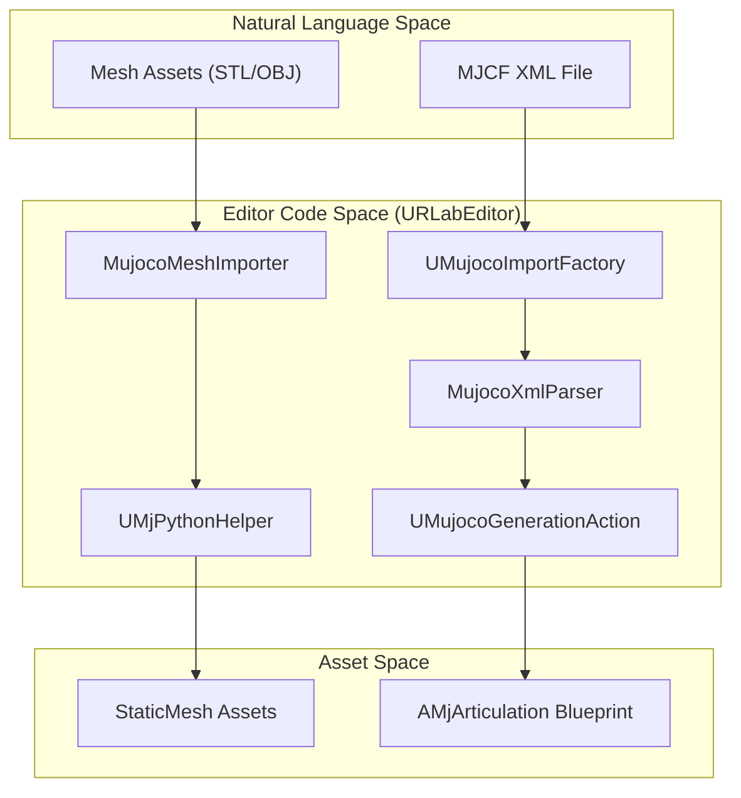
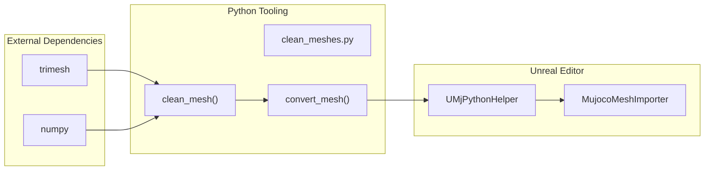

# URLab 编辑器

编辑器（[URLabEditor](https://github.com/OpenHUTB/hutb/tree/hutb/Unreal/CarlaUE4/Plugins/UnrealRoboticsLab/Source/URLabEditor)）模块提供了将 MuJoCo 的 MJCF XML 定义与虚幻引擎的参与者（Actor）和组件（Component）系统相桥接所需的专用工具。该模块负责处理资源导入流程、网格预处理以及编辑器端的自定义设置，使用户能够在虚幻编辑器环境中管理复杂的机器人资源。

编辑工具的主要目标是自动将层次化的 XML 机器人描述转换为功能性的 [AMjArticulation](https://github.com/OpenHUTB/hutb/blob/f49dd4dd8c0effaa4a07b81a4a53248682fe7e5c/Unreal/CarlaUE4/Plugins/UnrealRoboticsLab/Source/URLab/Public/MuJoCo/Core/MjPhysicsEngine.h#L34) 蓝图，该蓝图包含物理就绪的组件和优化的几何体。

## 系统概述：从MJCF到蓝图

下图展示了从原始 MJCF 文件到虚幻编辑器中生成机器人的高层流程。

### MJCF 导入管线

导入流程是一个多阶段的过程，当将 .xml 文件拖入虚幻内容浏览器时，该流程即开始。[UMujocoImportFactory](https://github.com/OpenHUTB/hutb/blob/f49dd4dd8c0effaa4a07b81a4a53248682fe7e5c/Unreal/CarlaUE4/Plugins/UnrealRoboticsLab/Source/URLabEditor/Private/MujocoImportFactory.cpp#L38) 会拦截此操作，并协调多个专用类将 MuJoCo 场景图重建为虚幻引擎的参与者。

* XML 解析：[MujocoXmlParser](https://github.com/OpenHUTB/hutb/blob/hutb/Unreal/CarlaUE4/Plugins/UnrealRoboticsLab/Source/URLabEditor/Private/MujocoXmlParser.cpp) 读取 MJCF 结构，并将 MuJoCo 元素（物体、关节、几何体）映射到其对应的UMjComponent子类。

* 网格处理：由于 MuJoCo 经常使用可能未针对虚幻引擎优化的 **STL**（立体光刻、Stereolithography：描述三角面片组成的 3D 模型表面）或 OBJ 文件，因此 [MujocoMeshImporter](https://github.com/OpenHUTB/hutb/blob/hutb/Unreal/CarlaUE4/Plugins/UnrealRoboticsLab/Source/URLabEditor/Private/MujocoMeshImporter.cpp) （由 [UMjPythonHelper](https://github.com/OpenHUTB/hutb/blob/hutb/Unreal/CarlaUE4/Plugins/UnrealRoboticsLab/Source/URLabEditor/Private/MjPythonHelper.cpp) 支持）负责将其转换为 **GLB** 格式，并进行三角网格清理。

* 蓝图生成：[UMujocoGenerationAction](https://github.com/OpenHUTB/hutb/blob/hutb/Unreal/CarlaUE4/Plugins/UnrealRoboticsLab/Source/URLabEditor/Private/MujocoGenerationAction.cpp) 接收解析后的组件树，并通过编程方式构建一个从 [AMjArticulation](https://github.com/OpenHUTB/hutb/blob/f49dd4dd8c0effaa4a07b81a4a53248682fe7e5c/Unreal/CarlaUE4/Plugins/UnrealRoboticsLab/Source/URLab/Public/MuJoCo/Core/MjPhysicsEngine.h#L34) 派生的蓝图类。

有关这些类和数据映射逻辑的详细介绍，请参阅 **[MJCF导入管线](../guides/mujoco_import.md)** 。

---

### 编辑器自定义设置与Python助手

为了满足机器人仿真领域的独特需求，编辑器模块包含了多个用户界面（UI）和后端扩展。

- **自定义细节面板**：[UMjGeomDetailCustomization](https://github.com/OpenHUTB/hutb/blob/hutb/Unreal/CarlaUE4/Plugins/UnrealRoboticsLab/Source/URLabEditor/Private/MjComponentDetailCustomizations.cpp) 几何组件提供了一个定制界面，允许用户可视化特定于 MuJoCo 的属性（如摩擦力 `friction` 或 `solimp`），这些属性不属于标准虚幻引擎静态网格组件（`UStaticMeshComponent`）属性的一部分。
- **Python 集成**：[UMjPythonHelper](https://github.com/OpenHUTB/hutb/blob/hutb/Unreal/CarlaUE4/Plugins/UnrealRoboticsLab/Source/URLabEditor/Private/MjPythonHelper.cpp) 负责管理绑定的 Python 脚本（如 [clean_meshes.py](https://github.com/OpenHUTB/hutb/blob/hutb/Unreal/CarlaUE4/Plugins/UnrealRoboticsLab/Scripts/clean_meshes.py)）。它确保编辑器能够获取如 trimesh 和 numpy 等依赖库，以便进行自动网格清理和凸分解。
- **模块结构**: [URLabEditor](https://github.com/OpenHUTB/hutb/tree/hutb/Unreal/CarlaUE4/Plugins/UnrealRoboticsLab/Source/URLabEditor) 模块与运行时 [URLab](https://github.com/OpenHUTB/hutb/tree/hutb/Unreal/CarlaUE4/Plugins/UnrealRoboticsLab/Source/URLab) 模块严格分离，以确保仅供编辑器使用的依赖项（如 [UnrealEd](https://github.com/OpenHUTB/hutb/blob/hutb/Unreal/CarlaUE4/Plugins/Converters/SimReady/Source/SimReadyUSD/Private/SimReadyUSDImporterHelper.cpp#L7) 或 [KismetCompiler](https://github.com/OpenHUTB/engine/tree/hutb/Engine/Source/Editor/KismetCompiler/Public/KismetCompiler.h#L13) ）不会包含在已发布的版本中。

---

### 关键编辑工具与脚本

该存储库包含一个 [Scripts/](https://github.com/OpenHUTB/hutb/tree/hutb/Unreal/CarlaUE4/Plugins/UnrealRoboticsLab/Scripts) 目录，其中包含支持编辑器管线的独立工具。

| 脚本 | 目的 | 代码参考 |
| --- | --- | --- |
| [clean_meshes.py](https://github.com/OpenHUTB/hutb/blob/hutb/Unreal/CarlaUE4/Plugins/UnrealRoboticsLab/Scripts/clean_meshes.py) | 将网格转换为 GLB 格式，并修复 Unreal 中的方向（Z轴向上）。 | [Scripts/clean_meshes.py48-61](https://github.com/OpenHUTB/hutb/blob/hutb/Unreal/CarlaUE4/Plugins/UnrealRoboticsLab/Scripts/clean_meshes.py#L48-L61) |
| [generate_subclasses.py](https://github.com/OpenHUTB/hutb/blob/hutb/Unreal/CarlaUE4/Plugins/UnrealRoboticsLab/Scripts/generate_subclasses.py) | 为新的 MuJoCo 组件类型构建 C++ 类框架。 | [Scripts/generate_subclasses.py37-83](https://github.com/OpenHUTB/hutb/blob/f49dd4dd8c0effaa4a07b81a4a53248682fe7e5c/Unreal/CarlaUE4/Plugins/UnrealRoboticsLab/Scripts/generate_subclasses.py#L37-L83) |

**代码实体映射：网格清理流程**

