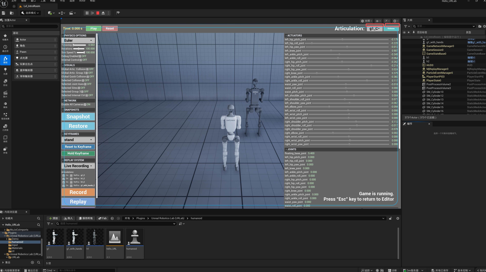
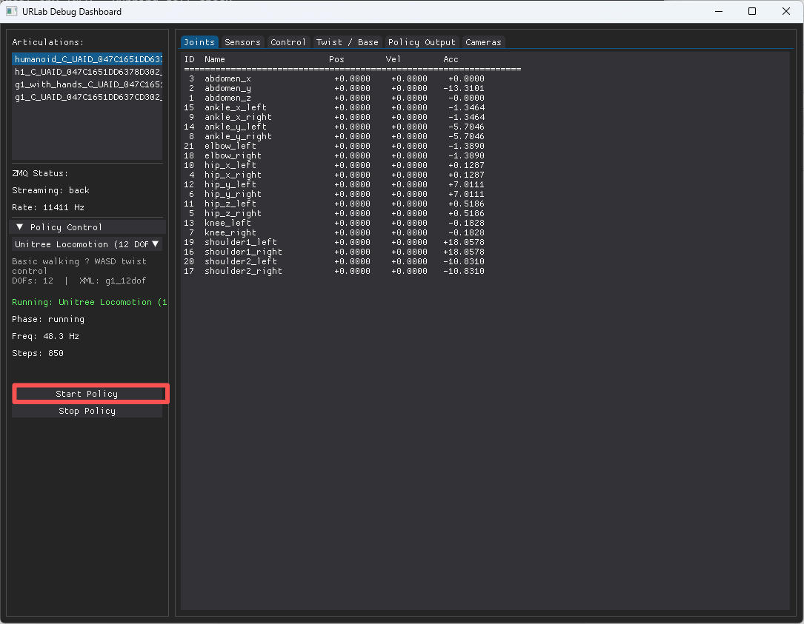

# 入门

## 先决条件

- **虚幻引擎 5.7+：** C++插件代码和第三方库应该可以在早期的 UE5 版本上编译，但内置的`.uasset`文件（UI组件、材质、输入映射）是在5.7版本中序列化的，因此不向下兼容。核心模拟功能在旧版本上仍然可以运行，但仪表盘UI和一些编辑器功能将会缺失。如果确实需要支持旧版本，我们可以考虑提供兼容的资源。
- **Windows 10/11：**Linux 还在实验阶段。
- **MuJoCo 3.7+：**集成在 `third_party/` 目录中（从源代码构建）。
- **C++ 工程:** 此插件包含源代码，无法在仅使用蓝图的项目中使用。
- **Visual Studio 2022** (带有 "Game development with C++" 工作负载)。
- Python 3.11+ (可选，用于外部策略控制)
- [**uv**](https://github.com/astral-sh/uv)：可选，用于 Python 依赖管理

## 安装

 **⚠️ 重要提示：** 这是一个 C++ 插件。您**必须**使用 C++ 项目。如果您的项目仅包含蓝图，请在开始之前通过*Tools > New C++ Class*添加一个空的 C++ 类。

1. 将插件仓库克隆到你的虚幻引擎项目 `Plugins/` 目录中：
   ```bash
   cd "YourProject/Plugins"
   git clone https://github.com/URLab-Sim/UnrealRoboticsLab.git
   ```
2. 构建第三方依赖项（一次）。在启动引擎之前，您必须先获取并安装 MuJoCo 所需的依赖项。请打开 **PowerShell**，然后运行以下命令：
   ```bash
   cd UnrealRoboticsLab/third_party
   .\build_all.ps1
   ```
   Windows 的预编译二进制文件包含在 `third_party/install/`（MuJoCo、libzmq、CoACD）中。
   *(如果您在此处遇到编译器栈溢出错误，请参阅下面的 [故障排除](#troubleshooting) 部分。*
3. （不需要）**注册该模块：** 打开您的主机项目（新建HelloWorld项目，新建空项目会编译报错）的 `.Build.cs` 文件（例如，`Source/YourProject/YourProject.Build.cs`），并将`"UnrealRoboticsLab"`添加到您的`PublicDependencyModuleNames`中：
   ```csharp
   PublicDependencyModuleNames.AddRange(new string[] { "Core", "CoreUObject", "Engine", "InputCore", "UnrealRoboticsLab" });
   ```

4. （不需要，双击.uproject文件即可提示编译）**编译：** 右键点击您的`.uproject`文件，选择**Generate Visual Studio project files**，然后打开解决方案并在您的集成开发环境中**构建**您的项目。

5. **显示资产：** 在虚幻内容浏览器中，点击 **设置(Settings)**（齿轮图标）并勾选 **显示插件内容(Show Plugin Content)**。此操作是查看用户界面组件和插件资源所必需的。

6. **(可选) C++ 集成：** 如果您想在自己的 C++ 代码中直接使用 URLab 类型（例如，`#include "MuJoCo/Core/AMjManager.h"`, 强制转换为 `AMjArticulation*`），请将 `"URLab"` 添加到项目的 `.Build.cs` 文件中：
   ```csharp
   PublicDependencyModuleNames.AddRange(new string[] { "Core", "CoreUObject", "Engine", "InputCore", "URLab" });
   ```
   如果您仅通过编辑器、蓝图或 ZMQ 使用插件，则**无需执行此操作**。

7. **（可选）Python 桥接：** 配套的 [urlab_bridge](https://github.com/URLab-Sim/urlab_bridge) 软件包提供用于外部控制、强化学习策略部署和 ROS 2 桥接的 Python 中间件。请参阅其 [urlab_bridge 文档](./guides/urlab_bridge.md) 以获取设置说明。
   ```bash
   # 已移到 urlab_bridge 仓库
   cd UnrealRoboticsLab/urlab_bridge
   pip install uv
   uv sync
   ```

8. 有关编辑和构建铰链的说明，请参阅 [铰链构建器指南](guides/articulation_builder.md) 。


## 导入你的第一个机器人

### 来自 MJCF XML

1. 获取机器人 XML（例如，来自 [MuJoCo Menagerie](https://github.com/google-deepmind/mujoco_menagerie) ）。
2. 将 XML 文件（比如：人形机器人[mujoco_menagerie\unitree_g1\g1_with_hands.xml](https://github.com/google-deepmind/mujoco_menagerie/tree/main/unitree_g1) ，肌肉骨骼人解析不完全）拖入虚幻引擎内容浏览器。首次导入时，编辑器会提示安装所需的 Python 包（`trimesh`、`numpy`、`scipy`）——这些包默认已安装在虚幻引擎自带的 Python 环境中，因此无需额外设置。您也可以根据需要选择其他 Python 解释器。
3. 蓝图会自动生成，其中包含所有关节、实体、执行器和传感器等组件。

### 快速转换（静态网格）

1. 在关卡中放置静态网格体对象（家具、道具等）。
2. 给每个参与者添加一个 `MjQuickConvertComponent`。
3. 设置为 **动态(Dynamic)** 表示物理碰撞，设置为 **静态(Static)** 表示固定碰撞。
4. 启用 `ComplexMeshRequired` 非凸形状（使用 CoACD 分解）。

## 场景设置

1. 在你的关卡中放置一个 `MjManager` 参与者（**必须**每个关卡一个）。 
2. 将导入的机器人蓝图放置在关卡中。
3. 点击播放（Play）——物理模拟自动开始。
4. MjSimulate 小部件将显示（如果管理器中 `bAutoCreateSimulateWidget` 已启用）。



## 控制机器人

### 从仪表盘

* 使用 MjSimulate 小部件中的执行器滑块来移动关节。
* 将控制源设置为 UI（在管理器上或每关节），以使用仪表板滑块而不是 ZMQ。 


### 来自 Python (ZMQ)

1. `cd` 进入 `urlab_bridge/`.
2. 安装：`uv sync` (或者 `pip install -e .`)。或者
   ```shell
   pip install zmq numpy dearpygui
   # 安装 RoboJuDo
   cd RoboJuDo
   pip install torch --index-url https://download.pytorch.org/whl/cpu
   pip install -e .
   ```
3. 运行策略：`python src/run.py --policy unitree_12dof`
4. 或者使用图形用户界面：`python src/run.py --ui`
5. 选择您的铰链（Articulation）和策略（Policy），点击开始（Start Policy）。




### 从蓝图

```cpp
// 设置执行器控制值
MyArticulation->SetActuatorControl("left_hip", 0.5f);

// 读取关节状态
float Angle = MyArticulation->GetJointAngle("left_knee");

// 读取传感器数据
float Touch = MyArticulation->GetSensorScalar("foot_contact");
TArray<float> Force = MyArticulation->GetSensorReading("wrist_force");
```

所有的功能都是可调用的蓝图`BlueprintCallable`.

## 调式可视化

有关完整的 PIE 叠加层（接触力、碰撞线框、关节轴、约束岛、实例/语义分割和肌肉/肌腱管）以及驱动它们的快捷键，请参阅 [调试可视化指南](./guides/debug_visualization.md)。

请参阅 [快捷键](guides/blueprint_reference.md#hotkeys) 了解键盘快捷键。

## 后续步骤

- [特性](features.md) -- 完整功能参考
- [MJCF 导入](guides/mujoco_import.md) -- 导入管道详情
- [蓝图参考](guides/blueprint_reference.md) -- 所有蓝图可调用函数和快捷键
- [ZMQ 网络](guides/zmq_networking.md) -- 协议、主题和 Python 示例
- [策略桥接](guides/policy_bridge.md) -- 强化学习策略部署
- [开发者工具](guides/developer_tools.md) -- 模式跟踪、 XML 调试、构建/测试技能


## 故障排除

### 构建错误：MSVC 栈溢出（错误代码：0xC00000FD）
如果 `build_all.ps1` 脚本因错误代码 `-1073741571` 而失败，这表明您的编译器在处理 MuJoCo 复杂的传感器模板时已耗尽了内部内存。

* **解决方法：** 将 Visual Studio 更新至最新版本（**VS 2022 (17.10+)** 或以上版本）或 **VS 2025**（这是 MuJoCo CI 的参考版本）。
* **应变方法：** 通过运行以下命令强制设置更大的栈大小：`cmake -B build ... -DCMAKE_CXX_FLAGS="/F10000000"`
* **相关Issues**：[github的Issue](https://github.com/URLab-Sim/UnrealRoboticsLab/issues/5) ，报错信息：

   ```text
   error MSB6006: “CL.exe”已退出，代码为 -1073741571。 [D:\work\donghaiwang\UnrealRoboticsLab\third_party\MuJoCo\src\build\plugin\sensor\sensor.vcxproj]
   ```
   未解决，暂时使用下载的发行版发到`UnrealRoboticsLab\third_party\install\MuJoCo`目录下


### UI：“模拟”仪表盘未显示
UI 与上下文相关，需要满足特定条件：

* 确保关卡中存在 `MjManager` 参与者。
* 在 `MjManager` 设置中，确认 `bAutoCreateSimulateWidget` 已启用。 
* 确保您已按照安装指南中的 **"显示资产(Show Assets)"** 步骤操作，以使引擎能够访问 UI 小部件。


### 旧版UE：内容资源无法加载

捆绑的 `.uasset` 文件（UI 组件、材质、输入映射）是用 UE 5.7 保存的，无法在早期版本中加载。C++ 插件代码可以编译，核心仿真也能运行，但仪表盘 UI 和一些编辑器功能会缺失。

我们强烈建议您升级到 UE 5.7，因为这是我们唯一测试和支持的版本。如果无法升级，并且您同时安装了 UE 5.7 和旧版本，您可以通过复制粘贴的方式重新创建资源：

1. 在 **UE 5.7** 中打开插件项目，并打开您需要的控件/材质/输入资产。
2. 在编辑器图表中选择所有节点（Ctrl+A），然后复制（Ctrl+C）。
3. 在**旧版本的 UE** 中，创建一个相同类型的新资源（例如，一个父级为 `MjSimulateWidget` 的控件蓝图）。
4. 粘贴（Ctrl+V）——节点和层级结构将跨版本迁移。
5. 保存新资源。现在它与您的引擎版本兼容了。 

此方法适用于 UMG 控件蓝图、材质图表和输入映射资产。


### 仿真：机器人处于静态状态

* **控制源：**检查 `MjManager` 或 `MjArticulation` 的**控制源**是否设置为 **UI**。如果设置为 **ZMQ**，则 UI 滑块将被忽略。
* **物理状态：** 确保 `MjManager` 未暂停，并且机器人组件设置中未将其设置为`静态(Static)`。 
