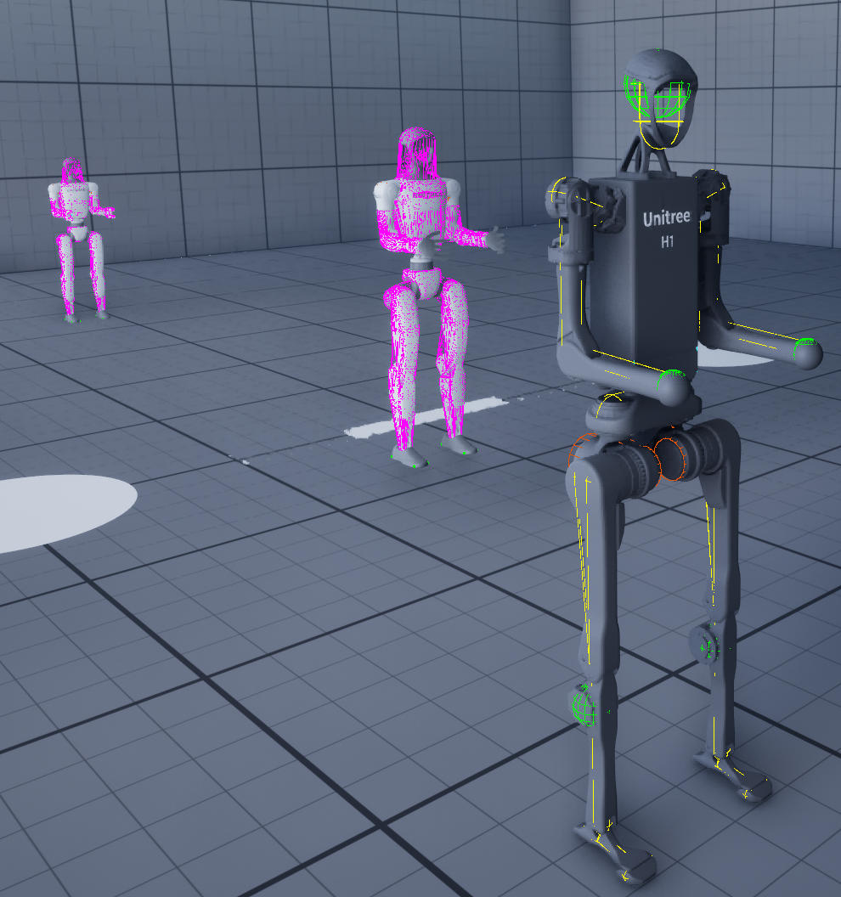
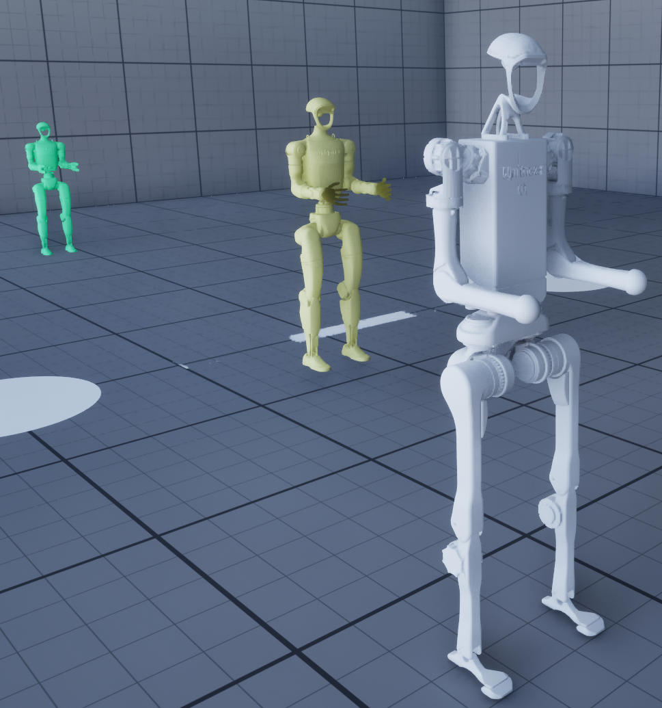

# 调试可视化

用于在 PIE 期间检查 MuJoCo 仿真的运行时叠加层。所有切换开关均位于 `UMjDebugVisualizer`（由 `AAMjManager` 自动创建）上，并由 `UMjInputHandler` 中的数字行热键驱动。可在 Manager Actor 的“详细信息(Details panel)”面板中实时调整公开的属性。

---

## 快捷键

| 键 | 切换                                            | 目的 |
|-----|---------------------------------------------------|---------|
| `1` | 接触力箭头                              | 每个有效接触点处都有黄色箭头，箭头大小按法向力的大小缩放。  |
| `2` | 铰链视觉网格可见性               | 隐藏导入的视觉网格（保留碰撞/调试叠加层）。 |
| `3` | 关节碰撞线框图                 | 铰链上每个碰撞几何体的洋红色线框图。 |
| `4` | 关节轴 + 极限弧                           | 每个关节处均有彩色箭头，指示轴线方向和当前/极限角度。 |
| `5` | 快速转换碰撞线框图                | 与第 `3` 步相同，但适用于通过 `UMjQuickConvertComponent` 生成的道具。 |
| `6` | 循环体着色器叠加                         | **Off → Island → 实例分割 → 语义分割Semantic Segmentation → Off.** 见下文。 |
| `7` | 肌腱/肌肉光滑管状渲染               | 肌腱路径上分布着网状管，其粗细和颜色由肌肉激活决定。见下图。 |
| `P` | 暂停(Pause)/恢复物理线程                   | |
| `R` | 重置(Reset)仿真状态                            | |
| `O` | 切换轨道和关键帧相机                 | |
| `F` | 解雇所有 `AMjImpulseLauncher` 参与者              | |
| `Shift+F1` | 弹出控制界面，但模拟继续              | |
| `Esc` | 退出模拟              | |

按`3`显示`关节碰撞线框图`

按`4`显示`关节轴 + 极限弧`

按 `6` 显示`循环体着色器叠加`

---

## 刚体着色器叠加（按键 `6`）

循环切换三种模式以及“关闭”模式。重绘所有铰链图元几何体、所有导入的网格几何体以及所有 `UMjQuickConvertComponent` 参与者的静态网格组件。首次应用时会缓存原始材质，并在模式返回“关闭”或 PIE 结束时恢复。

### Island

根据**约束岛(constraint island)**（通过活动接触、关节限制、相等约束或摩擦损失相互连接的物体组）为每个物体着色。实现方式与 MuJoCo 的原生可视化工具 (`engine_vis_visualize.c::addGeomGeoms`) 完全一致：

- 通过 `body_weldid` → `body_dofadr` 查找刚体的第一个自由度。
- 读取 `mjData.dof_island[dof]`；如果 ≥ 0，则物体位于活动岛屿中，seed = `island_dofadr[island]`。
- 如果为 `-1` 且启用了睡眠模式，则回退到 `tree_dofadr[dof_treeid[dof]]`（对于睡眠树，可以选择通过 `mj_sleepCycle` 传递，以便相互重叠的物体簇共享一种颜色）。
- Seed 通过 Halton 序列（基数 7/3/5）生成 HSV 颜色，与上游逐字节匹配。

没有自由度的刚体（世界物体worldbody、焊接到世界的物体）显示为中性灰色。

### 实例分割

每个刚体都会获得一个独特的 Halton 键控色调，该色调由关节类哈希值和刚体 ID 混合而成。这对于从 `USceneCapture2D` 或 `UMjCamera` 生成像素级精确的身体分割掩膜非常有用——因为叠加层绘制的是真实材质，所以它会在任何标准渲染通道中显示出来。

### 语义分割

属于同一铰链*类*（而非同一实例）的刚体共享一个色调。两个从 BP_Humanoid 实例化的蓝图都显示为同一种颜色；而 `BP_KitchenTable` 则显示为另一种颜色。对于快速转换道具，色调以参与者上的第一个静态网格资源为键控对象，因此共享同一网格的道具会被分组在一起。

### 睡眠模式调节

与模式无关。当 `bModulateBySleep` 开启（默认）时，睡眠状态下的物体会变暗并降低饱和度——`V *= SleepValueScale`（默认 0.35），`S *= SleepSaturationScale`（默认 0.9）。与上游 MuJoCo 的行为一致；默认值比上游略微激进，因此在虚幻引擎的 PBR 光照下效果清晰可见。

如果需要更强的睡眠效果（降低 `SleepValueScale`）或想要完全灰色的睡眠物体（将 `SleepSaturationScale` 降至 0），可以在“细节(Details)”面板中实时调整这两个比例。

### 渲染方式

每个绘制的网格体对应一个 `UMaterialInstanceDynamic`，父级为 `/Engine/BasicShapes/BasicShapeMaterial`。在 `BeginPlay` 事件中，可视化工具会探测该材质中名为 `Color` / `BaseColor` / `Tint` 的矢量参数，并使用第一个匹配项。没有插件自带的 `.uasset` 材质——可在不同的虚幻引擎版本之间兼容。

---

## 肌腱/肌肉渲染（键 `7`）

将每个`<spatial>` / `<fixed>`肌腱渲染为光滑的管状结构。对于肌肉致动器（dyntype `mjDYN_MUSCLE`，肌腱传输），管状结构的粗细和颜色均实时跟踪肌肉的激活状态。

### 视觉编码

| 信号          | 视觉                                                             |
|-----------------|--------------------------------------------------------------------|
| 肌肉激活 (0–1) | 半径缩放范围从 `0.5 倍`  （松弛状态）到 `2.0 倍`（完全收缩状态）。颜色缩放范围从深蓝色到亮红色。 |
| 肌腱长度有限（无肌肉驱动） | 相同颜色/半径插值，由`(ten_length − range_lo) / (range_hi − range_lo)`驱动 |
| 中性肌腱（无肌肉，无限制）  | 中等紫色，半径为标称值。 |

每个肌腱段的颜色区分是真实存在的：每个肌腱段都拥有自己的 `UMaterialInstanceDynamic`（通过 `UPrimitiveComponent::CreateDynamicMaterialInstance` 创建），因此同一只手臂上的两块肌肉的颜色会截然不同。

### 路径构建

每条肌腱的路径都取自 `mjData.wrap_xpos` / `wrap_obj` / `ten_wrapadr` / `ten_wrapnum`——这是 MuJoCo 的运动学后肌腱路径，包括肌腱与包裹几何体相切的切点。可视化工具：

1. 按照 MuJoCo 自身的渲染器（`engine_vis_visualize.c::addSpatialTendonGeoms`）的方式，遍历连续的包裹索引，并跳过滑轮端点（`wrap_obj == -2`）。
2. 当两个连续的包裹点共享相同的几何体 ID 时（例如，圆柱体或球体包裹），会沿着围绕几何体世界位置的球面插值，使用 `TendonArcSubdivisions`（默认值为 6）中间点细分弦长——这样肌腱就会*围绕*几何体弯曲，而不是像 MuJoCo 自身的查看器那样直接跳跃。 
3. 对每个内部包裹点的切线方向进行平均，从而在各段之间生成 C1 连续连接。

### 渲染方式

一组 `USplineMeshComponent` 沿每个线段对 `/Engine/BasicShapes/Cylinder.Cylinder` 进行变形。圆柱体初始半径为 50 厘米，因此 `TendonTubeRadius` 通过 `scale = radius_cm / 50` 转换为引擎比例。组件采用惰性创建，逐帧重复使用，并在肌腱数量减少时隐藏（而非销毁）。

无物理效果、无碰撞、无阴影投射，且在视口中不可选择。

### Tuning

| 属性                 | 默认值 | 笔记 |
|--------------------------|---------|-------|
| `TendonTubeRadius`       | 0.25 厘米 | 标称管半径。肌肉激活程度最高可达 2 倍。 |
| `TendonArcSubdivisions`  | 6       | 每个几何体环绕弧的中间点数。降至 0 可实现 MuJoCo 的扁平弦线外观。  |

---

## 相机交互（已知问题）

由于快捷键 6 的叠加层会替换实际 `UStaticMeshComponents` 上的真实材质，因此任何渲染关卡的工具（例如 `USceneCaptureComponent2D`、`UMjCamera` 和截图工具）都会捕获叠加层，而不是底层场景。该叠加层本质上是一个视口调试工具。

对于需要始终输出纯 RGB、深度或分割图像（无论视口状态如何）的持续摄像机流，请改用每个摄像机的捕获模式——参见 [相机捕获模式](camera_capture_modes.md)。这些模式与快捷键 6 无关：实例分割摄像机 `InstanceSegmentation` 即使在视口叠加层关闭时也会输出遮罩，而真实相机 `Real` 即使在视口显示孤岛时也会输出逼真的 RGB 图像。

如果您需要在通过 `UMjCamera` 捕获 RGB 的同时激活热键 6 叠加层，请在捕获窗口之前将叠加层关闭（按 `6` 直到关闭）。

---

## 实现参考

- 热键调度 — [MjInputHandler.cpp](../../Source/URLab/Private/MuJoCo/Input/MjInputHandler.cpp)
- 快照捕获（物理线程） — [MjDebugVisualizer.cpp:`CaptureDebugData`](../../Source/URLab/Private/MuJoCo/Core/MjDebugVisualizer.cpp)
- 霍尔顿岛颜色辅助函数 — [MjColor.cpp](../../Source/URLab/Private/MuJoCo/Utils/MjColor.cpp) (与 MuJoCo 上游完全匹配，并由 `URLab.Color.*` 自动化测试覆盖)
- 上游参考 — MuJoCo 的 [`engine_vis_visualize.c`](https://github.com/google-deepmind/mujoco/blob/main/src/engine/engine_vis_visualize.c)
