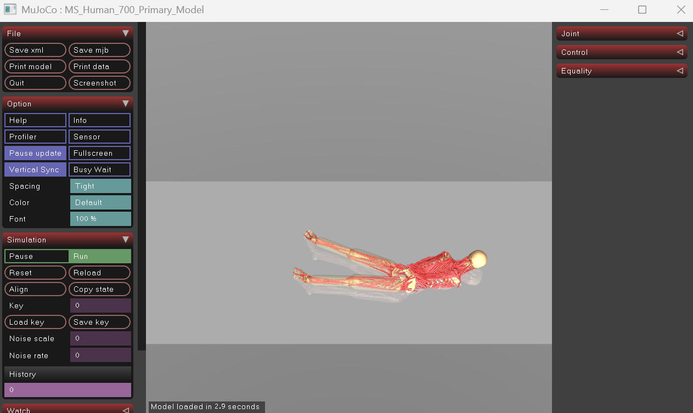

# 全身肌肉骨骼模型 [MS-Human-700](https://lnsgroup.cc/research/MS-Human/)

MS-Human-700 模型代表了人体全身肌肉骨骼系统，其特点包括：

* 90个身体节段
* 206个关节
* 700个肌腱单元
* 解剖学上合理的参数
* MuJoCo 整合

该模型能够模拟全身动力学以及与各种设备的交互，使其适用于具身智能、机器人和生物力学领域的研究。

## 运行

1.下载并加载模型
```shell
# 克隆模型仓库
git clone https://github.com/LNSGroup/MS-Human-700.git
# 使用mujoco打卡模型
mujoco/bin/simulate.exe  MS-Human-700/MS-Human-700.xml
```




## DynSyn

1.安装
```shell
git clone https://github.com/OpenHUTB/DynSyn.git
cd DynSyn

conda create -n hutb_3.9 python=3.9
conda activate hutb_3.9
pip install poetry
poetry install
```

2.运行
```shell
# 生成 DynSyn 到 log 文件夹下
python dynsyn/dynsyn.py -f configs/DynSynGen/dynsyn.yaml -e myoLegWalk
# 训练
python dynsyn/sb3_runner/runner.py -f configs/DynSyn/myowalk.json

```


## [Qflex 控制](https://lnsgroup.cc/research/Qflex/)


Qflex 一种可扩展且高效的在线强化学习（RL）方法[@wei2026scalable]，用于高维动态系统的连续控制。此类系统通常面临诸多挑战，严重阻碍高效学习：

* 高维性：状态-动作空间的大小随维度迅速增长，导致显著的“维度灾难”效应；
* 过度驱动：在执行器数量远大于自由度的情况下，多个动作序列可能产生无法区分的运动学特征，但内部力和成本却可能不同。

```shell
git clone --recurse-submodules https://github.com/LNSGroup/Qflex.git
cd Qflex
conda activate hutb_3.12
# 
python scripts/train.py  --alg qflex --env MS700Locomotion-v1 --seed 100 --total_step 50000000 --num_vec_envs 224 --hidden_dim 1024 --diffusion_hidden_dim 1024 --record_video
```

报错：[No module named 'relax.spinlock'](https://github.com/LNSGroup/Qflex/issues/1)


