# 虚幻机器人实验室：一款具备先进物理和渲染技术的高保真机器人模拟器

从左到右，该模拟框架生成的照片级渲染示例，分别展示了 Unitree Go1 四足机器人、Skydio X2 四旋翼飞行器和 Unitree B1-Z1 四足移动机械臂在正常（上排）和不利（下排）视觉条件下的情况。

| Unitree Go1 四足机器人 | Skydio X2 四旋翼飞行器 | Unitree B1-Z1 四足移动机械臂 |
|:---:|:---:|:---:|
| 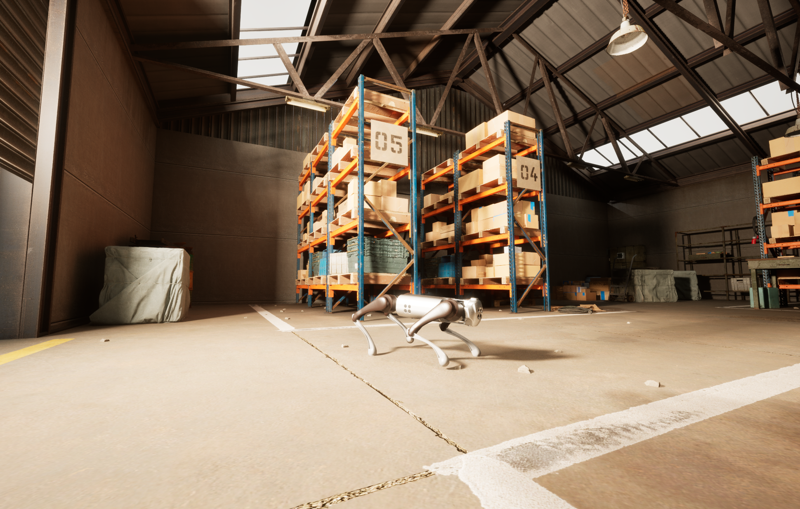 | 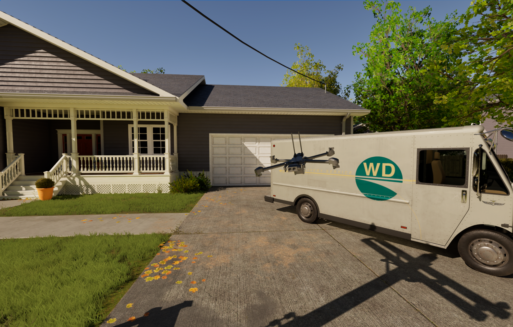 | 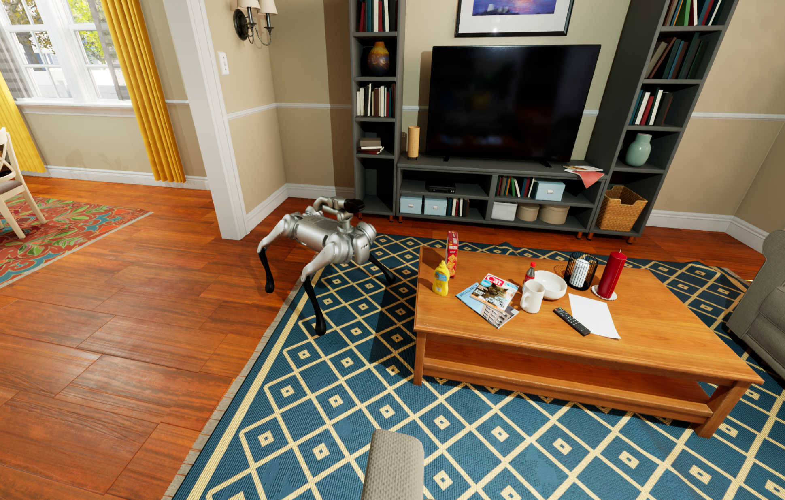 |
| Go1 正常视觉条件 | X2 正常视觉条件 | Unitree B1-Z1 正常视觉条件 |
| 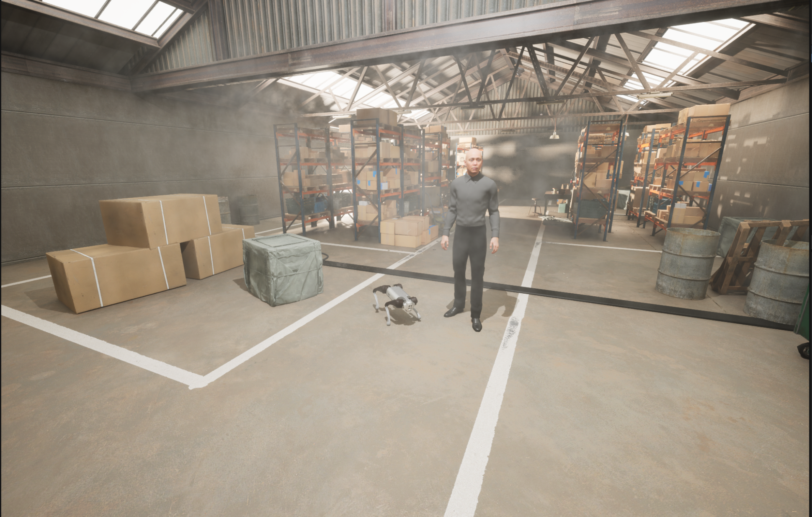 | 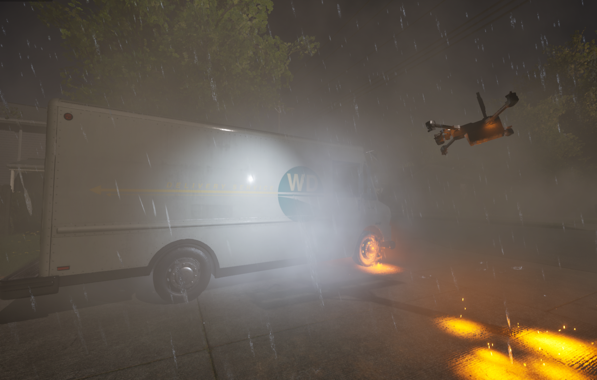 | 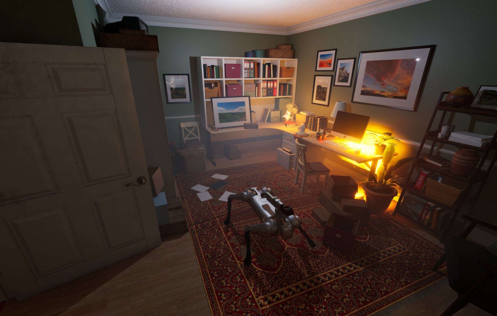 |
| Go1 不利视觉条件 | X2 不利视觉条件 | Unitree B1-Z1 不利视觉条件 |

## 概述

该模拟器（URL）集成了 MuJoCo 和虚幻引擎，提供了一个能够高度模拟真实世界交互的综合仿真环境。只需添加相应的 MuJoCo XML 描述和相关的虚幻引擎资源，即可轻松集成机器人。该系统支持标准机器人配置和传感器，包括相机、惯性测量单元 (IMU) 和力传感器，确保了广泛的兼容性。整个系统如下图所示。该系统由外部组件和内部模拟器组成。系统包含一个模块化的**模拟管理器（SimManager）**，用于管理由**基准测试 (Benchmark)**、**回放 (Replay)** 和**场景生成 (SceneGen)** 模块组成的子模块。它管理所有对虚幻引擎数据的引用，并以虚幻引擎插件的形式开发，可以添加到任何项目中。

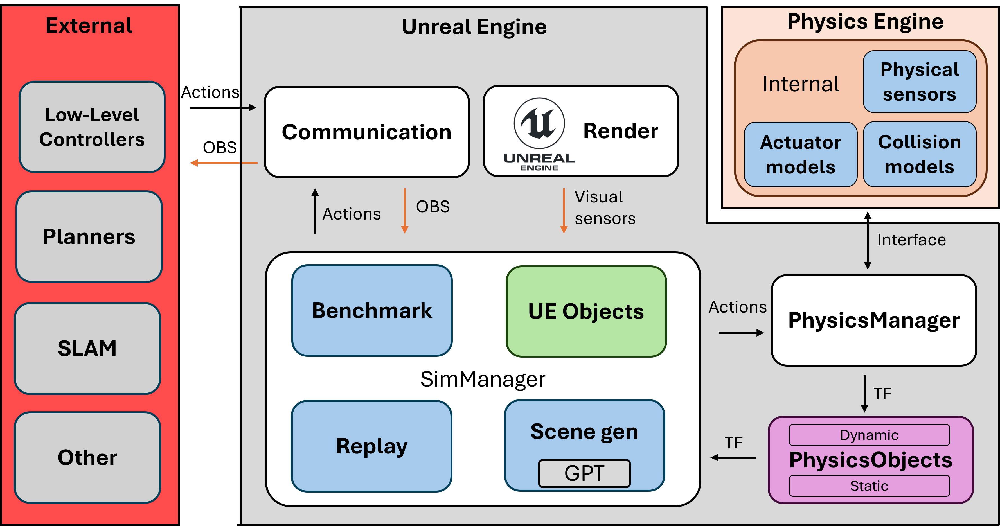

在通信方面，该模拟器利用 ROS 实现与现有机器人框架的无缝交互。此外，我们正在探索通过 ZeroMQ [@zmq] 实现更快速的自定义通信方法，以提高实时性能。我们将仿真环境视为真实世界的替代，从而有助于在真实场景中测试和验证机器人行为和感知系统。

## 物理管理器

我们的系统将 MuJoCo 和 CoACD [@wei2022coacd] 集成到虚幻引擎 (UE) 中，以实现精确的物理模拟和网格分解。这些系统目前已编译到 UE 项目中，并扩展了一个自定义接口。为了表示场景中的对象，我们引入了一种中间表示形式，称为**物理对象PhysicsObject**，它封装了几何信息和状态信息。这使我们能够在 UE 和 MuJoCo 之间高效地管理和转换场景元素，同时确保转换和动态交互的正确同步。

场景中的对象被分类为预定义的类型。具体来说，资源被标记为以下类别之一：`EP STATIC`、`EP STATIC COMPLEX`、`EP DYNAMIC`、`EP DYNAMIC COMPLEX` 和 `EP PRIMITIVE (TYPE)`。静态对象在整个模拟过程中保持不变，而动态对象则会被主动跟踪，其变换在 UE 中异步更新。**简单**动态对象和**复杂**动态对象的区别决定了对象是否需要经过 CoACD 的凸分解。CoACD 将网格分解为一系列凸包，而常规的 mujoco 编译每个对象仅生成一个凸包。这使得 CoACD 能够表示非凸几何体，并且得到了 MuJoCo [mujoco] 的推荐。此分类记录在相应的 **PhysicsObject** 中，以指导后续处理。资源分类完成后，基于网格的资源将导出为 OBJ 文件，以确保与 MuJoCo 兼容。此外，如果场景中存在地形，则会对其进行扫描并转换为高度场，以便在模拟中使用。此过程在地形上应用自定义碰撞通道，然后利用自动生成的边界框，执行多线程光线投射来确定要使用的高度。该边界框将光线投射限制在预定义分辨率的范围内。这避免了扫描整个地形。下图展示了此过程的输出。之所以选择这种方法，是因为地形可能非常大，用户可能不希望为了物理模拟而转换整个地形。它的另一个优点是能够在高度场本身中对小型杂物和装饰物进行建模。此过程使得 MuJoCo 能够无缝重建大规模地形，并保留精确物理交互所需的关键环境特征。

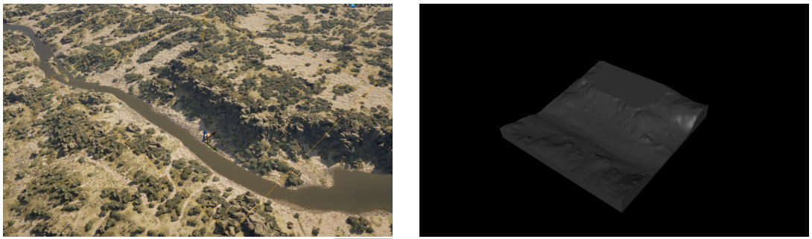

完成资产处理后，系统会自动生成一个 XML 场景描述文件来初始化 MuJoCo。该 XML 文件封装了所有相关的对象数据，包括网格文件引用、物理属性和层级关系。系统会特别关注在 MuJoCo 环境中检测到的机器人资产，并将其映射回相应的 UE 实体。在此过程中，XML 中指定的摄像头和传感器会在 UE 中实例化，以确保两个环境的一致性。传感器元素在 MuJoCo 中以站点的形式呈现，从而可以在物理模拟中进行精确放置和交互。

物理模拟以异步方式运行，在独立的执行线程中运行以最大程度地提高性能。变换更新也在 UE 内部的专用异步线程中进行管理，以保持与MuJoCo的实时同步。MuJoCo中施加的外部力可以传播到UE实体，从而实现模拟与渲染环境之间的双向交互。UE物理引擎仍然可以用于MuJoCo未管理的对象。

为了提高计算效率，仿真运行之间保持不变的资源会被缓存，从而避免不必要的重复计算和冗余的文件导出。这种缓存机制确保静态元素不会产生额外的处理开销，使系统能够专注于需要持续状态更新的动态实体。最终的 XML 场景描述以及自动生成的网格资源，使得可以直接在 MuJoCo 中作为独立仿真运行。我们还提供了一个辅助脚本来简化此过程，以便在需要时可以独立于 UE 使用相同的环境。

## 基准测试

该基准测试系统可自动记录和管理整个仿真过程中的评估指标。其核心由 `MetricManager` 和 `BaseMetric` 类组成，提供了一个结构化且可扩展的框架来跟踪性能指标。

`BaseMetric` 类定义了所有指标的基本接口，它封装了一个二维浮点数组，用于存储时间序列数据。该类提供了一些基本方法，包括初始化、重置以及将数据导出为 CSV 格式。这些方法确保每个指标实现都遵循一致的生命周期，从而简化了将新指标集成到系统中的过程。派生指标可以重写这些基础方法来实现特定领域的逻辑，同时仍然可以受益于结构化的数据存储和导出机制。

指标管理器 `MetricManager` 负责自动发现和注册所有指标实现。它通过扫描相应的类定义动态填充可用指标列表，从而实现模块化和可扩展的指标跟踪。用户可以通过专用用户界面启用或禁用特定指标，确保能够灵活地为特定实验选择相关的性能指标。

默认情况下，系统跟踪核心指标，包括：`距离目标点的距离（DistanceToGoal）`，用于跟踪实体到预定义目标位置的剩余距离；`碰撞（Collisions）`，用于记录与障碍物或其他实体的接触事件；`到达目标点的时间（TimeToGoal）`，用于测量到达目的地所需的时间；以及`全局姿态（GlobalPose）`，用于记录实体随时间变化的绝对位置和方向。

所有指标均按离散时间间隔记录，并自动以 CSV 文件格式保存到指定的实验文件夹中，确保结果井然有序且易于访问。该系统还具有宽限期（延迟数据记录 \( n \) 秒）和超时（在 \( n \) 秒后终止记录）功能，从而提高模拟运行的效率和可重复性。

## 场景生成

我们的模拟器包含一个实验性的场景生成模块，该模块主要针对室内环境设计，并利用了 OpenAI 的 ChatGPT [@chapGPT] API。当存在一个 ASceneGenerator Actor 实例并为其分配了 RoomType 时，系统会根据指定的场景类型自动生成对象位置（下图）。该模块使用包含可用资源列表的结构化提示查询 ChatGPT，并接收一个 JSON 格式的响应，其中指定了对象位置。然后解析这些位置信息，并在环境中实例化相应的资源。

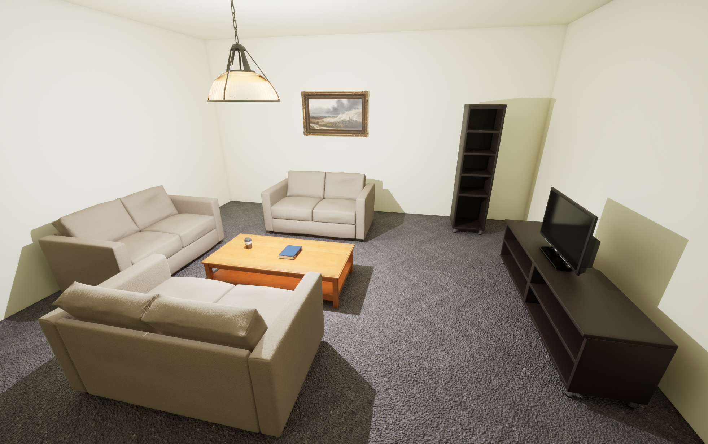

为了确保空间连贯性，系统利用虚幻引擎的物理引擎检测重叠物体。如果出现重叠，迭代优化循环会将反馈信息传递给 ChatGPT，以便更新物体放置建议，直至所有碰撞问题解决或达到预设的迭代次数上限。这种方法能够高效地生成无碰撞场景，从而构建出多样化且结构化的环境，适用于机器人实验。

## 回放

该系统具备传感器和人体姿态数据的自动记录和回放机制，可实现高效的数据采集和实验。它使用自定义结构体仅跟踪关键信息（姿态数据、传感器读数和时间戳）并将其存储在队列中，以最大限度地减少开销并实现精确的序列重现。数据流通过单独的 JSON 文件进行管理，所有文件均可在运行时动态保存和加载。通过将回放数据发布到与实时数据相同的 ROS 主题上，该系统可与现有流程无缝集成。这使得研究人员只需采集一次数据，即可在视觉上修改过的环境中回放数据，从而支持领域自适应、鲁棒性测试以及用于机器学习和基准测试的数据集增强。

## 扩展功能

该系统利用虚幻引擎先进的渲染和仿真功能，超越了 MuJoCo [@mujoco]、Gazebo [@gazebo] 和 Isaac Sim [@mittal2023orbit] 等传统机器人模拟器。关键功能包括实时全局光照（Lumen）、高精度网格渲染（Nanite）和基于物理的反射，这些功能增强了基于感知的机器人研究。程序动画、NavMesh 导航和内置环境工具能够高效地创建动态仿真，而 Niagara 粒子系统则有助于在恶劣的视觉条件下（例如烟雾、雾）进行测试。此外，打包的独立部署提高了可重复性和可扩展性，克服了传统模拟器的局限性。

## 机器人、控制器和可视化规划器的部署示例

该系统提供了一个统一的框架，使机器人、控制器和规划器能够像在实际部署环境中一样运行。所有组件都通过 ROS 进行通信，确保与外部系统无缝集成。

1. **机器人集成示例**：该框架支持四足动物、四足移动机械臂、无人机和机器人机械臂，从而能够实现多种运动、空中导航和操作的实验设置。

2. **控制器**：该系统包含基于位置和扭矩的关节控制器，以及更高级的控制器，例如 Walk-These-Ways [@margolis2022walktheseways] 和 VBC [@liu2024visual]。无人机使用基于 PID 的控制器，而机械臂则依赖于逆运动学 (IK) 方法，例如 Mink [@Mink]。由于控制器在 ROS 生态系统中运行，因此可以轻松集成新的控制策略。

3. **规划器**：运动规划采用基于学习和基于优化的规划器，例如 ViNT [@ViNT]、GNM [@GMM] 和 NoMAD [@NoMAD]。该框架基于 ROS 的架构确保了与外部规划器的兼容性。

4. **视觉SLAM**：该系统包含 OrbSLAM2 [@OrbSLAM2]、OrbSLAM3 [@OrbSLAM3]和 MASt3R-SLAM [@MASt3R-SLAM]等视觉SLAM技术，可实现实时定位和建图。这些方法直接集成到框架中，从而在模拟环境中实现逼真的感知和建图。

## 仿真与真实世界对比

为了评估图像编码器的仿真视觉输入与真实世界视觉输入之间的一致性，我们采用了梯度类别激活映射（Class Activation Mapping, Grad CAM）、EigenCAM（特征值类别激活映射）、余弦相似度和 KL 散度。这些方法同时评估了空间注意力和特征分布的相似性。

**Grad-CAM** 计算类别得分 \( y^c \) 相对于特征图激活值的梯度：

$$
\alpha_k^c = \frac{1}{Z} \sum_i \sum_j 
\frac{ \partial y^c}{\partial A_{ij}^k}
$$

$$
L^c = \text{ReLU} ( \sum_k \alpha_k^c A^k )
$$

**EigenCAM**通过主成分分析 (Principal Component Analysis, PCA) 生成与类别无关的显著性图。

$$
C = \frac{1}{Z}
\sum_{i,j}
(A_{ij}^k - \mu)
(A_{ij}^k - \mu)^T,
$$

$$
L_\text{EigneCAM} = v_1 A^k
$$

其中 \( \mu \) 为平均激活值，\( v_1 \) 为第一主成分。

**余弦相似度**衡量真实嵌入和模拟嵌入之间的特征对齐程度：

$$
S_\text{cosine}(P, Q) = 
    \frac
    {
        P \cdot Q
    }
    {
        \left|\left| P \right|\right|
        \left|\left| Q \right|\right|
    }
$$
其中 P 和 Q 是特征向量。值越高表示相似度越强。

**KL 散度**量化分布差异：
$$
D_\text{KL} (P||Q) = 
    \sum_i P(i) log \frac{P(i)}{Q(i)}
$$
数值越低表示对齐程度越高。

为了比较基于真实世界数据训练的模型，我们使用了 CLIP [@CLIP] 和 ViNT [@ViNT] 中使用的 EfficientNet-B0 [@EfficientNet] 视觉编码器。首先，我们从真实世界中采集一张图像，并在模拟器中重建该图像。然后，我们使用 Grad-CAM 和 Eigen-CAM 处理这两张图像，生成注意力热图，如下图所示。

| 真实 | 仿真 |
|:---:|:---:|
|  |  |
| 真实图像 | 仿真图像 |
| 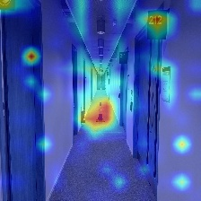 | 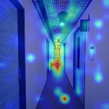 |
| 真实图像上 CLIP 模型的 GradCAM | 仿真图像上 模型的 GradCAM |
| 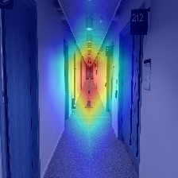 | 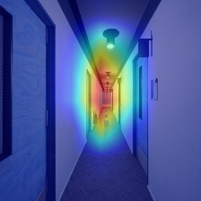 |
| 真实图像上 EficientNet 网络的 GradCAM | 仿真图像上 EficientNet 网络的 GradCAM |

真实世界图像（左）和模拟图像（右）的对比，以及它们对应的 Grad-CAM（CLIP）和 EigenCAM（EfficientNet-B0）热图。高亮显示的类别标签为“锥体”。

在这两种情况下，模型主要关注走廊中央的交通锥以及走廊尽头，这表明真实环境和模拟环境之间保留了最显著的特征。这种一致性表明，无论领域如何，模型都关注相同的高级结构，从而增强了模拟场景在特征表示方面的真实性。注意力模式的相似性也表明，关键对象在不同领域之间仍然可区分，这对于迁移学习和仿真到现实的应用至关重要。

为了进一步量化相似性，我们计算了真实特征分布和模拟特征分布之间的KL散度（0.4679）和余弦相似度（0.7157）。余弦相似度越高，KL散度越低，表明两者之间的吻合度越高。我们并非旨在用完全相同的资源复制真实场景，而是选择在视觉上尽可能接近真实情况的模拟。尽管模拟中的资源与真实环境中的资源有所不同，但我们的研究结果，结合GradCAM和EigenCAM的对比，表明该模拟在视觉上足以满足我们的评估需求。

## 视觉导航和SLAM基准测试

我们对标准方法进行了基准测试，以展示模拟器的真实性。我们使用 GNM [30] 和 ViNT [29] 评估了视觉导航（实验 1），并使用 OrbSLAM2 [32]、OrbSLAM3 [33] 和 MASt3R SLAM [34] 评估了视觉 SLAM（实验 2）。每种方法在每种条件下运行 5 次，并对结果取平均值。两个实验均使用配备机载摄像头的 Unitree Go1 四足机器人和 Walk-These-Ways 底层控制器，以实现逼真的部署。

基准测试在两种不同的环境中进行——仓库和住宅——并设置了三种逆境等级：无、轻微和严重，由人工判断划分。UE 的 Niagara 系统模拟了环境影响（烟雾、雨水、污染、雪），而对于严重逆境，则添加了动态光照和 NPC 移动。首图展示了示例环境，下图展示了不同逆境等级的示例。

| 无逆境 | 小逆境 | 大逆境 |
|:---:|:---:|:---:|
| 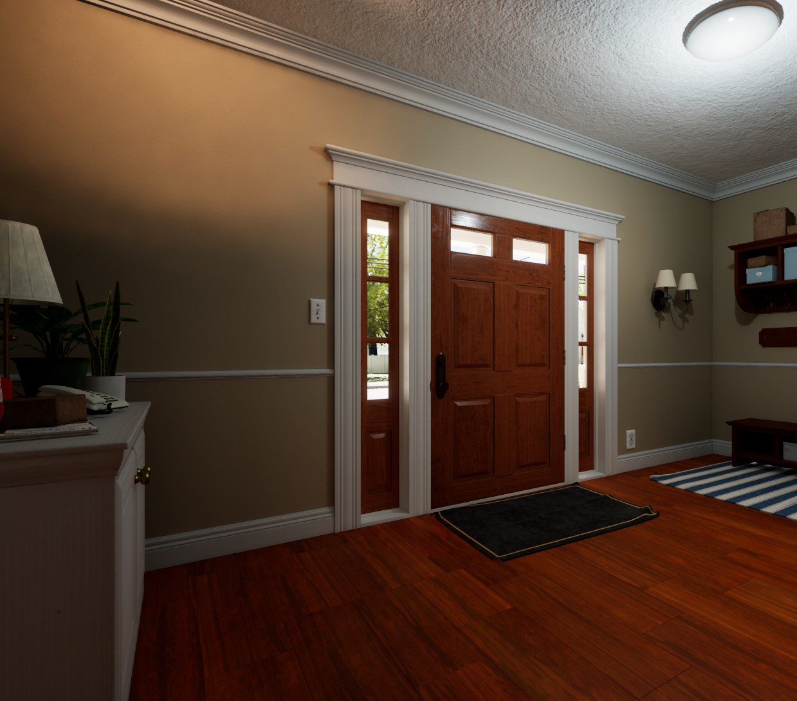 | 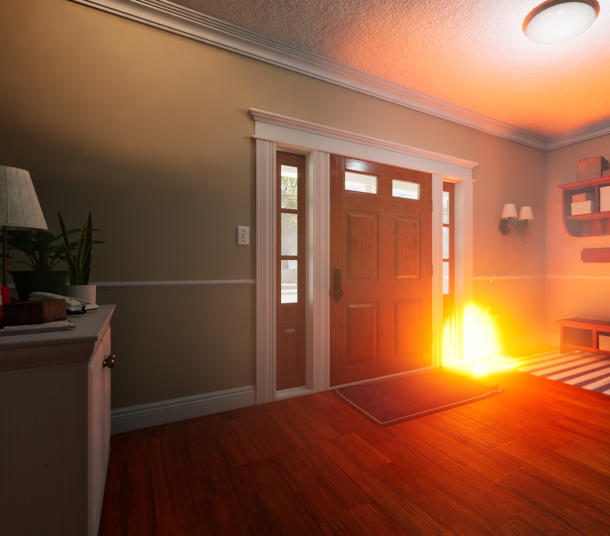 | 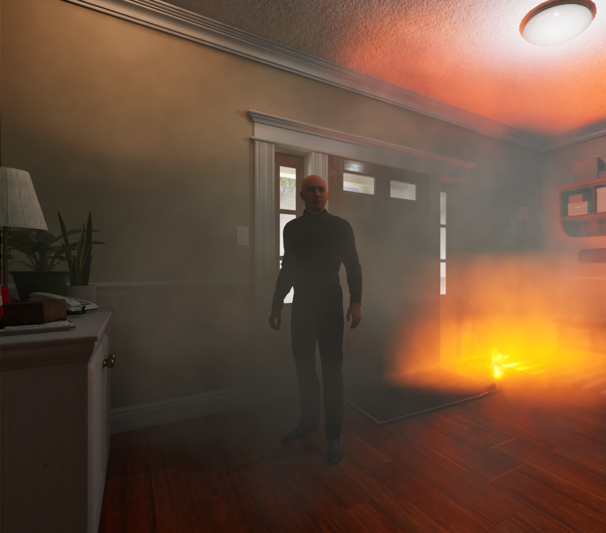 |

**实验 1：视觉导航：**为了进行视觉导航基准测试，机器人在所有环境和逆境级别下均初始化于相同的起始位置。每种方法都使用预先构建的基于图像的拓扑地图，并在固定时间内到达目标。本实验使用了仓库和住宅环境。由于方法未进行微调，而是依赖于作者原始代码库 [31] 中简化的拓扑地图方法，这可能会限制性能 [37]。

基于碰撞的成功率（Success Weighted by Collision, SC）。参考[38]，我们采用 SC 指标：

<!-- TODO：加入测量成功率、总碰撞次数、到达目标所需时间和目标距离 -->
$$
SC = 
    \frac{1}{N}
    \sum_{i=1}^N
    S_i
    \frac{1}{1+c_i},
$$
其中，\( S_i \) 表示第 \( i \) 个轮次的成功指标，\( c_i \) 表示碰撞次数，\( N \) 表示总轮次数。\( SC \) 值越高，表示成功运行中的碰撞越少；\( SC \) 值越低，则表示碰撞频繁或严重。除了 \( SC \) 之外，我们还测量成功率、总碰撞次数、到达目标所需时间和目标距离。

表 I 展示了结果，其中包括考虑碰撞惩罚的加权 \( SC \)。在正常条件下（None），现有方法表现良好，其中 ViNT 通常优于 GNM。在轻微逆境下（Minor），GNM 保持了更高的成功率，但耗时更长，而 ViNT 在成功后完成速度更快。然而，随着环境逆境（例如，障碍物、烟雾、雨水）的增加，两种方法的性能均有所下降，碰撞次数增多，到达目标的时间延长，\( SC \) 值降低。在严重逆境下（Major），两种方法均无法在仓库中成功完成任务，导致 \( SC \) 值为零。这表明，由于训练数据有限，这些模型在极端条件下表现不佳，凸显了在各种高逆境条件下进行训练的必要性，而这些逆境可以在仿真环境中更有效地生成。在仿真环境中创建可控但真实的逆境场景的能力，为提高实际部署中的鲁棒性提供了一条途径。

**实验二：视觉SLAM：**本实验采用回放系统，其中远程操控机器人遵循预先定义的、针对SLAM优化的轨迹。初始运行记录机器人位姿和传感器数据，随后在相同条件下回放，但视觉效果有所不同。之后对每种 SLAM 方法进行评估，并计算性能指标。

**绝对轨迹误差（Absolute Trajectory Error, ATE）**通过计算估计位置 \( \hat{p}_i \) 和真实位置 \( p_i \) 之间的均方根误差 (RMSE) 来衡量估计轨迹的全局精度：

$$
\text{ATE} = 
    \sqrt{
        \frac{1}{n}
        \sum_{i=1}^{n}
        (p_i - \hat{p}_i)^2
    }
$$

**覆盖率**衡量的是估计轨迹长度与真实轨迹长度的比率：

$$
\text{Coverage} = 
    \frac{
        \sum_{i=1}^{n-1} \left|\left| p_{i+1} - p_i \right|\right|
    }
    {
        \sum_{i=1}^{n-1} \left|\left| \hat{p}_{i+1} - p_i \right|\right|
    }
$$

**缩放后的ATE**会根据定位失败情况调整 ATE：
$$
\text{Scaled ATE} 
    = \frac{
        \text{ATE}
    }{
        \text{Coverage}
    }
$$

从表 II 和图 8 可以看出，视觉 SLAM 的性能随着视觉逆境的增加而下降，凸显了其对复杂环境的敏感性。OrbSLAM2 的表现最为糟糕，覆盖范围急剧下降，平均错误率 (ATE) 显著升高，尤其是在仓库环境中。OrbSLAM3 在干净的环境下表现良好，但在逆境条件下性能显著下降，表明其对遮挡、光照变化和动态元素的鲁棒性较差。MASt3R-SLAM 在各种条件下均保持最低的 ATE 和最高的覆盖范围，展现出卓越的抗视觉干扰能力。在严重的视觉逆境下，所有方法的 ATE 均升高，覆盖范围均降低，凸显了在动态或视觉劣化环境中保持可靠的 SLAM 性能所面临的固有挑战。这些基于回放的评估提供了一个可控且可重复的框架，用于评估 SLAM 在不同逆境程度下的鲁棒性，强调了在各种高逆境条件下进行训练和评估的必要性，以提高实际部署的可靠性。

## 参考文献
